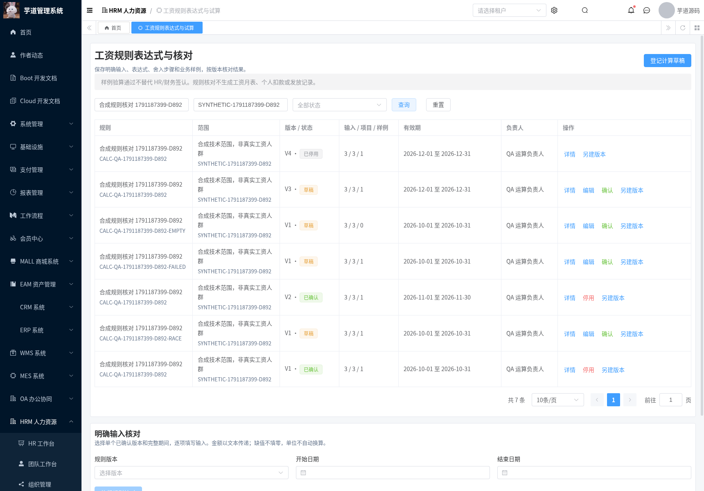
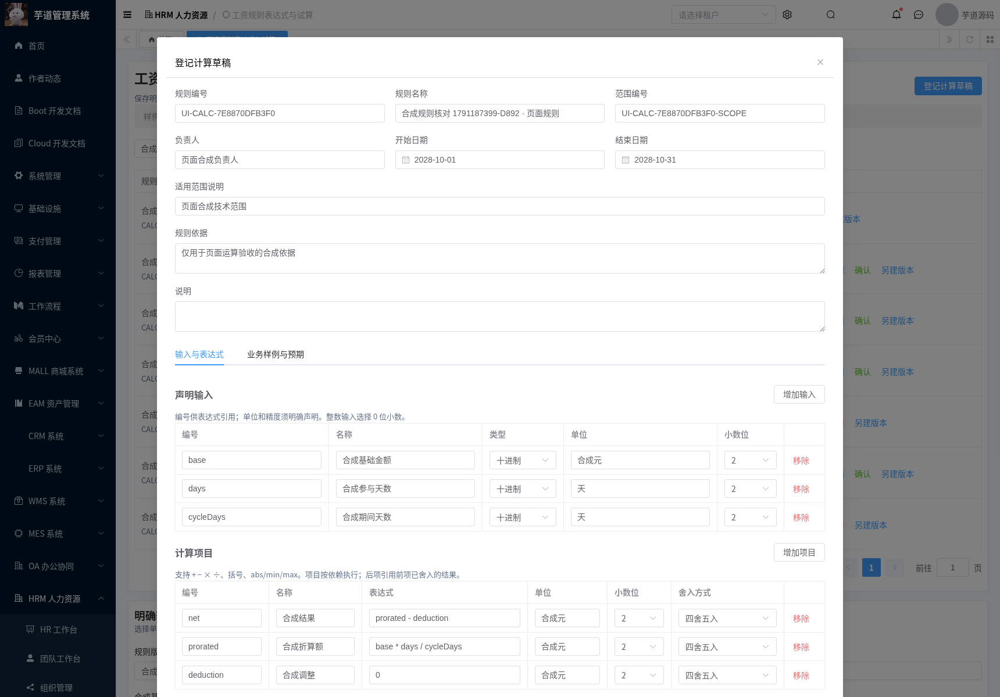
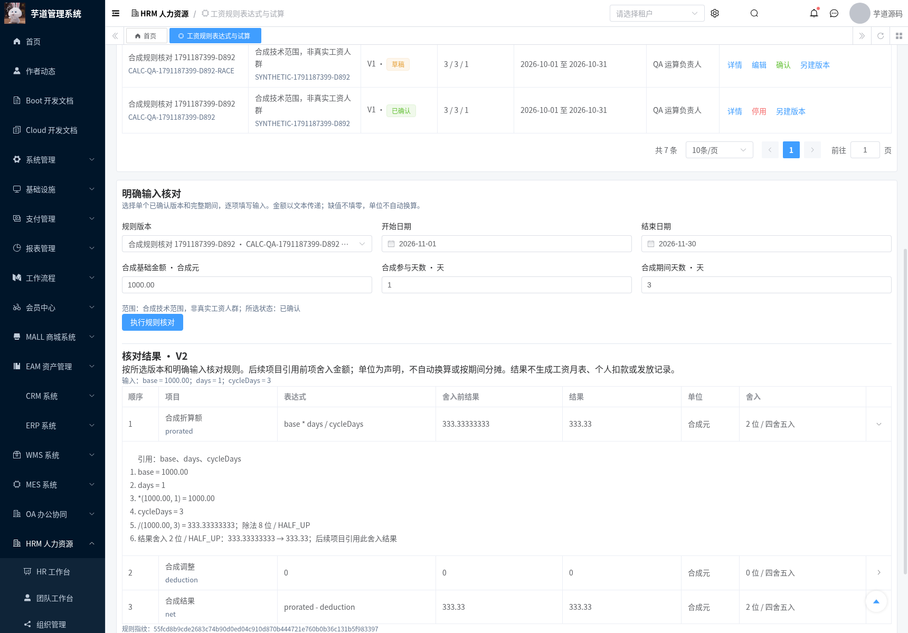
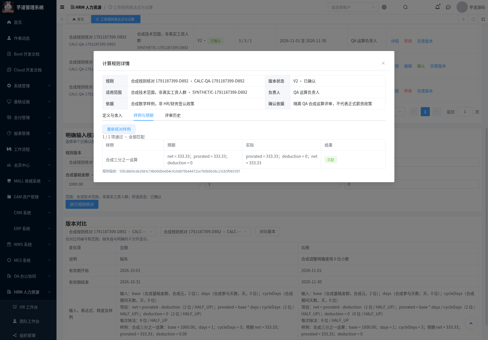
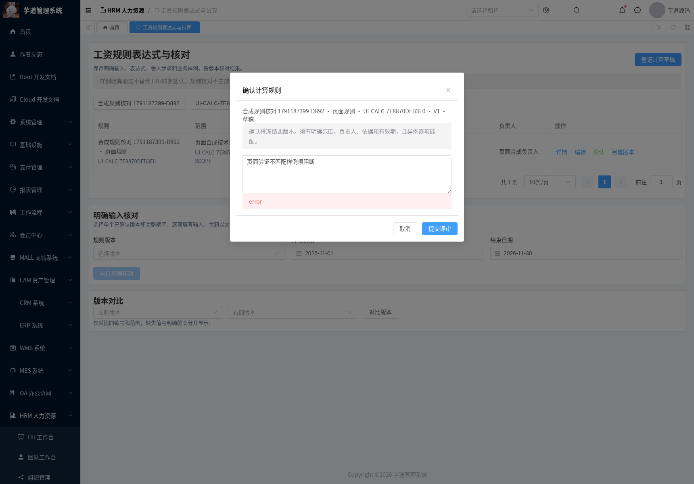
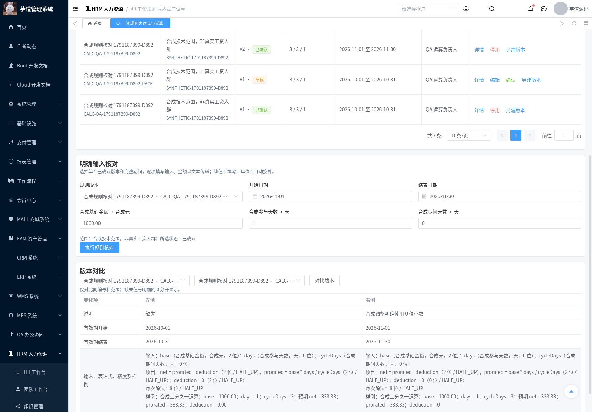
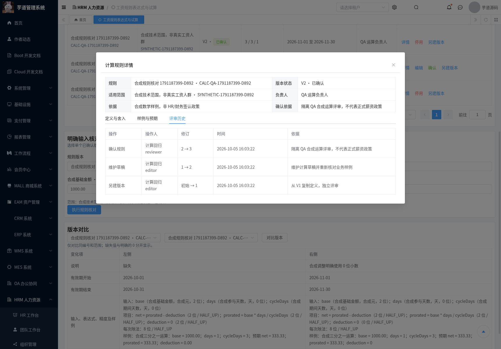
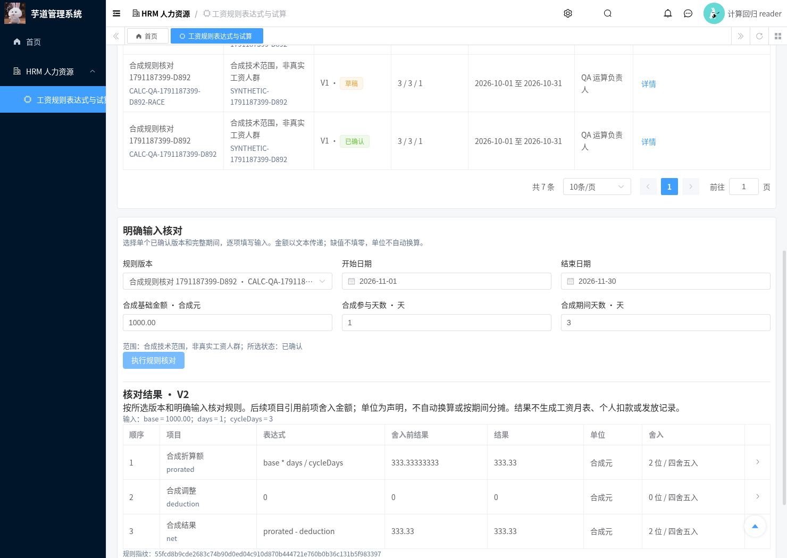
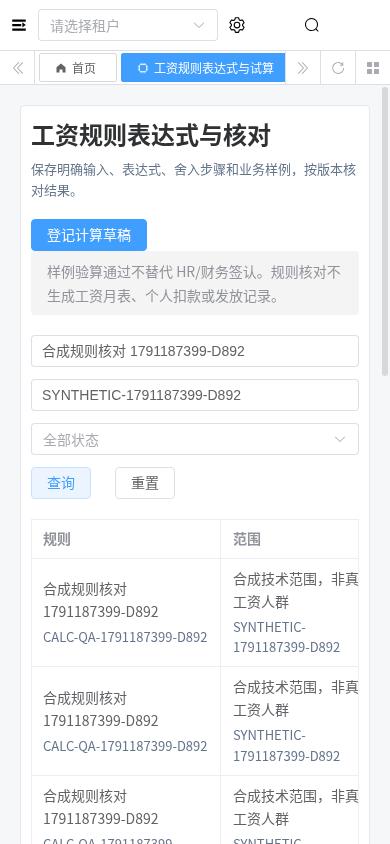

# 工资规则表达式与核对

日期：2026-10-05。既有规则台账保存文字口径，无法执行表达式或逐项核对预期金额。本模块登记明确输入、表达式、单位、精度和样例，按确认版本执行核对，保存依赖顺序、舍入步骤及评审历史。

交付 T-20 / CALC-02 的表达式执行与解释部分。正式人员、工资输入、方案/项目映射、人工调整、工资汇总和审批尚未接入；T-20 仍为部分完成。界面中的“已确认”表示系统内版本评审，不代替 HR/财务对真实政策和金额的签认。

## 使用流程

页面 `/hrm/payroll-calculation`，菜单“工资规则表达式与试算”。

1. 登记规则编号、固定范围编号、名称、负责人、范围说明、依据和有效期。
2. 声明输入及项目编号、单位、小数位；逐项目声明舍入方式。界面不预选精度，含除法的定义还须声明每次除法的精度与舍入。
3. 填写样例输入和全部项目的预期结果。保存时展示实际验算结果；不匹配或没有样例的草稿不能确认。
4. 评审确认后冻结该版本。改变表达式、精度或样例须另建版本，旧版本保留；同编号、范围的已确认期间不得重叠。
5. 明确选择一个已确认版本、开始/结束日期和全部输入，核对结果及计算过程。版本须覆盖整个期间，系统不拼接版本、不推断按日折算，也不换算单位。
6. 对比历史版本，查看规则变化和评审操作人、时间、修订及依据；停用版本保留定义和历史，停止执行。

“载入合成运算样例”需要显式点击并确认，仅替换当前表单的表达式及样例，不填主体、范围、负责人、依据或有效期。整理样例字段时保留匹配字段，新增字段为空，移除旧字段须确认。

## 计算约定

| 项目 | 行为 |
| --- | --- |
| 支持表达式 | 普通十进制常量、输入/项目编号、`+ - * /`、括号、一元正负及 `abs` / `min` / `max` |
| 输入 | `INTEGER` 或 `DECIMAL`，小数位 0～8；整数声明为 0 位且不接受小数文本 |
| 金额传递 | 输入、预期、舍入前及最终结果均为十进制字符串；拒绝 JSON 数值/布尔值转字符串 |
| 精度传递 | 小数位须为 JSON 整数；拒绝小数、布尔及数字字符串转整数 |
| 输入校验 | 所有编号必须完全匹配；输入/项目/样例空项、缺失、空白、null、额外字段、指数、分隔符、超精度和除零报错；明确的 `0` 有效 |
| 依赖 | 拓扑排序；输入和项目编号唯一；未知变量、循环依赖和函数名占用拒绝保存 |
| 舍入 | `HALF_UP` / `HALF_EVEN` / `DOWN` / `UP`；每次除法按声明处理，每项结果按声明处理，后项引用前项舍入后的值 |
| 资源限制 | 最多 32 个输入、32 个项目、20 个样例；表达式 256 字符、128 节点、32 层嵌套；中间值最多 38 位精度、32 位小数 |
| 原始数值 | 普通十进制输入最多 24 位整数、8 位小数、40 字符；不使用浮点数、脚本、SpEL、反射或隐式工资变量 |
| 对账 | 全部项目逐项比较数值，无容差；非法预期不能被记为通过；没有样例不能确认 |
| 解释 | 返回所选版本、期间、规范化输入、表达式、依赖、舍入前结果、最终金额、逐步计算及 SHA-256 定义指纹 |

合成验收例：`base="1000.00"`、`days="1"`、`cycleDays="3"`，`prorated=base*days/cycleDays`，每次除法 8 位 / HALF_UP、该项目结果 2 位 / HALF_UP，得到舍入前 `333.33333333`、金额 `333.33`。`deduction=0` 明确设置 0 位小数，得到 `0`；后项 `net=prorated-deduction` 得到 `333.33`。该例只验证数学执行，不代表不足月或正式工资制度。

## 芋道集成与权限

沿用 `controller → service → dal`、租户、VO/DO/Mapper、`CommonResult` / `PageResult` 和共用资料评审表。新增 `hrm_payroll_calculation_definition`，不修改既有工资、参保月账、工资条或分类核算服务。

接口前缀 `/admin-api/hrm/payroll/calculation-definitions`：`page`、`get`、`create`、`update`、`new-version`、`review`、`cases`、`history`、`preview`、`compare`。

| 入口 | 必需权限 |
| --- | --- |
| 查询、样例、历史、对比、执行核对 | `hrm:payroll:calculation:query` |
| 登记、维护、另建版本 | query **及** `hrm:payroll:calculation:maintain` |
| 确认、停用 | query **及** `hrm:payroll:calculation:review` |

维护和评审分权。所有查询/修改显式校验租户；列表省略完整定义、样例和自由文本依据。接口访问日志不记录请求/响应内容；评审历史保留受权限控制的前后快照。评审人、时间、版本和状态由服务端填写，客户端传入值不能替代。

唯一约束为 `(tenant_id, code, definition_version)`。每次修改锁定系列首版本及目标版本，校验修订号，串行分配新版本及确认有效期；并发首版本注册依赖唯一约束，不能制造重复系列。

MySQL 升级脚本 [20261005-hrm-payroll-rule-calculation.sql](../sql/mysql/upgrade/20261005-hrm-payroll-rule-calculation.sql) 创建表和 query/maintain/review 三项菜单权限，可重复执行，未包含角色授予或演示规则。导航角色还须获授 HRM 父菜单。隔离 QA 中已验证查询/维护/评审、仅维护、仅评审、无授权及租户 999 身份；生产角色由管理员按业务范围分配。

## 回归与复现

| 检查 | 实际结果 |
| --- | --- |
| JDK8 HRM reactor verify | 1626 项，0 失败、0 错误；24 项原有跳过 |
| HRM | 758 项全部执行通过；本模块新增引擎 44 项、服务 16 项 |
| 完整 Vue3 | 固定基准、30 文件增量，生产构建及类型检查通过，包含既有 MES |
| 真实 API | 56 项通过，含 MySQL 并发、权限/租户、JSON 严格类型、依赖/精度、版本与既有表校验值 |
| 浏览器 | 13 项通过，含真实保存、样例阻断、确认、试算、版本维护、停用、只读角色和 390px 手机 |
| 独立 MySQL | 重复迁移、三项权限、已有定义保留、租户/版本唯一、长文本、Unicode 和精确数值字符串通过 |
| 基础回归 | HRM/BPM 两组 API、十项既有查询及匿名工资访问拒绝通过 |

证据保存在 [verification/hrm-payroll-calculation](./verification/hrm-payroll-calculation)。完整前端基准为 `yudaocode/yudao-ui-admin-vue3@0af03a93b6b6300f878e28add69b1c7a9f09ec34`，Vue3 / TypeScript / Element Plus / Vite，Node 24.19.0、pnpm 11.19.0。仓库中的增量目录不能单独安装启动；使用 [apply-vue3-overlay.py](../script/hrm/apply-vue3-overlay.py) 和 [锁文件规范化脚本](../script/hrm/normalize-vue3-lockfile.py) 后冻结安装，先构建生成声明，再做完整类型检查。8GB 环境中，单独执行类型检查，避免与 JVM、Vite 和 Chromium 同时占用内存。

```bash
mvn -B -ntp -Phrm -pl yudao-server -am verify -DskipTests=false -Dmaven.test.skip=false
python3 script/hrm/collect-ci-test-results.py --output ci-backend-tests.json
bash script/hrm/verify-calculation-mysql.sh
python3 script/hrm/verify-calculation-api.py --allow-test-fixtures --output-dir /tmp/calculation-api
python3 script/hrm/verify-calculation-ui.py --allow-test-fixtures --fixture-file /tmp/calculation-api/hrm-calculation-ui-fixture.json --output-dir /tmp/calculation-ui
```

API/UI 仅在获授权的隔离 QA 中执行，默认数据库 `hrm_payroll_collection_20261004b`。API 从环境读取 `HRM_SMOKE_TOKEN`、`HRM_CALC_{READER,EDITOR,REVIEWER,MAINTAINONLY,REVIEWONLY}_TOKEN`、`HRM_UNGRANTED_TOKEN`、`HRM_TENANT_B_TOKEN`；UI 另需 `HRM_REFRESH_TOKEN`、`HRM_CALC_READER_REFRESH_TOKEN`。测试 fixture、登录凭据及运行配置未提交。运行 HRM 必须使用此次 `-Phrm` 生成的 **`yudao-server/target/yudao-server-hrm.jar`**；普通 `yudao-server.jar` 不包含 HRM。

运行副本 `/workspace/.cloud-setup/ruoyi-vue-pro/frontend`，前端 3000，HRM/BPM 后端 48081。原始业务 HTML 的 SHA-256 仍为 `6898065e01c0e38f35bbb09a65184bc385b2e2e10334c1f80bca74b188908839`。未迁移生产库或合并 PR。

## 实际页面截图

全部为 Chromium 操作实际 Vue3 页面后截图，金额和身份为隔离 QA 合成数据。










