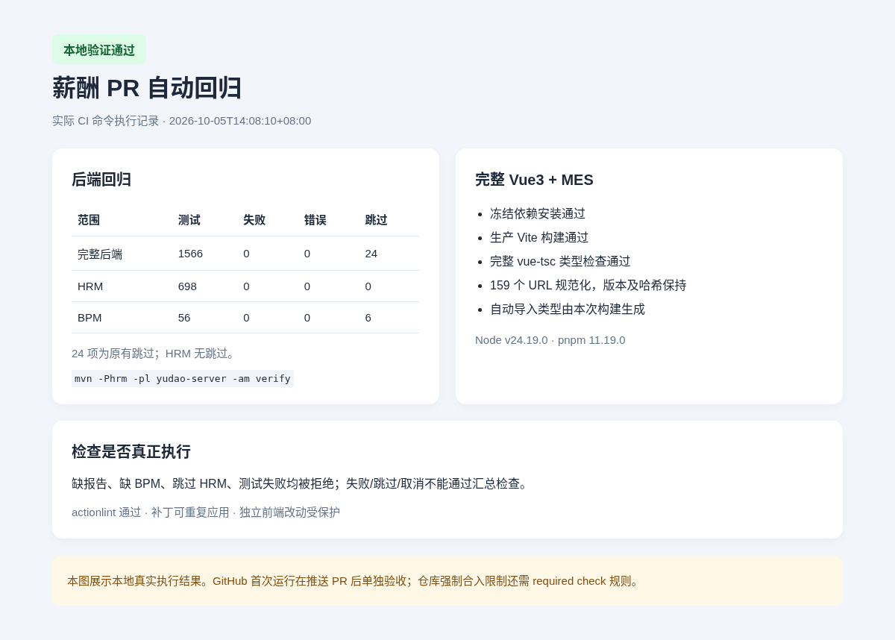

# 薪酬 PR 自动回归

本模块落实路线图 T-08 的 HRM/BPM 后端回归与完整 Vue3 前端构建：此前后端仅在 master push 时跳过测试打包，前端工作流指向不存在的 `yudao-ui-admin`。现在任意目标分支的 PR（包括堆叠 PR）都执行同一套测试和构建，并保留运行证据。

## 触发与结果

[工作流](../.github/workflows/maven.yml) 在 PR 创建、更新、重新打开或转为待评审、master push、merge queue 及手工触发时运行。草稿 PR 同样执行；不使用路径过滤，避免修改迁移、权限、源码或构建配置后漏检。新的单一工作流替代旧 Maven 和旧前端工作流。

三个检查：

- `Backend HRM tests`：JDK 8，完整 `-Phrm` server reactor，显式启用测试。
- `Vue3 typecheck and build`：完整固定 Vue3 基准叠加当前 PR 源码，包含 MES，执行类型检查和生产构建。
- `Payroll CI`：前两项都成功才通过；失败、跳过或取消均不能产生成功结果。

要由 GitHub 强制限制合入，仓库保护规则需要将 `Payroll CI` 配置为 required check，并检查对应集成分支。本次代码提供该稳定检查名和失败逻辑；仅有工作流不等于仓库已启用强制保护规则。

## 后端执行

```bash
mvn -B -ntp -Phrm -pl yudao-server -am verify -DskipTests=false -Dmaven.test.skip=false
python3 script/hrm/collect-ci-test-results.py --output ci-backend-tests.json
```

[报告收集器](../script/hrm/collect-ci-test-results.py) 读取本次 Surefire XML：没有报告、HRM/BPM 没有实际执行测试、HRM 存在跳过、任何失败或错误，都使检查失败。BPM/其他模块的原有跳过单独列出，不冒充执行通过。

后端上传 XML、JSON 汇总，保留 14 天。JUnit 测试使用既有隔离 H2/嵌入式 Redis，不连接现有工资数据库。本次没有把实际服务的 API、浏览器或 MySQL 迁移脚本冒充成已经在 GitHub 持续执行；完整端到端覆盖仍按 T-51 后续补齐。

## 前端执行

完整基准仓库为 `yudaocode/yudao-ui-admin-vue3`，固定提交 `0af03a93b6b6300f878e28add69b1c7a9f09ec34`；Node 24.19.0、pnpm 11.19.0。后端仓库中的前端目录是增量，不直接在该目录安装依赖。

```bash
python3 script/hrm/apply-vue3-overlay.py /path/to/complete-vue3
python3 script/hrm/normalize-vue3-lockfile.py /path/to/complete-vue3
cd /path/to/complete-vue3
pnpm install --frozen-lockfile --registry=https://registry.npmjs.org
NODE_OPTIONS=--max-old-space-size=4096 pnpm exec vite build --mode prod
NODE_OPTIONS=--max-old-space-size=6144 pnpm exec vue-tsc --noEmit
```

[锁文件规范化](../script/hrm/normalize-vue3-lockfile.py) 只允许固定基准或已经规范化的锁文件，将 159 个镜像 tarball 地址替换为官方 registry。其他字节不变：依赖版本、完整性哈希和依赖图保持原值。不同基准或独立锁文件改动会被拒绝，不关闭 pnpm 校验。

安装使用冻结锁文件，缓存 pnpm store。生产构建先生成本次源码的自动导入/组件类型声明，再做完整类型检查，不依赖开发服务器或旧声明缓存；两步都成功才上传产物。构建与类型检查顺序执行，分配不同内存上限；前后端使用独立 runner。前端上传实际 `dist-prod` 与构建 JSON，保留 14 天，包含已明确限定到产物目录的隐藏父路径。

## 验证证据

本地执行同一套命令，从新的 Git worktree 安装完整前端，已验证：

- 后端 1566 项，0 失败、0 错误，24 项原有跳过；HRM 698 项全部执行通过；BPM 56 项，6 项原有跳过。
- 完整 Vue3/MES 生产构建和生成声明后的完整类型检查通过；冻结安装通过，159 个 URL 替换之外的锁文件字节不变。
- actionlint 1.7.7 通过；五组 gate 成功/失败/跳过/取消组合正确；报告收集器拒绝缺报告、未启用 BPM、跳过 HRM 和失败测试。
- 已应用旧兼容补丁的前端可以升级，并可重复应用；独立 Vite/锁文件改动不会被覆盖。

证据：[后端报告](./verification/hrm-payroll-ci/backend-tests.json)、[本地验证及工作流指纹](./verification/hrm-payroll-ci/local-checks.json)。截图展示实际本地执行结果，GitHub 的实际运行状态在推送后通过 PR Checks/Actions 验收并记录在 PR 说明中。



本模块不改变工资业务规则或原始原型，不计作完成正式工资试算、审批或发放。
