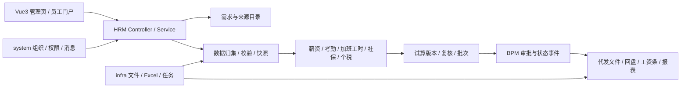
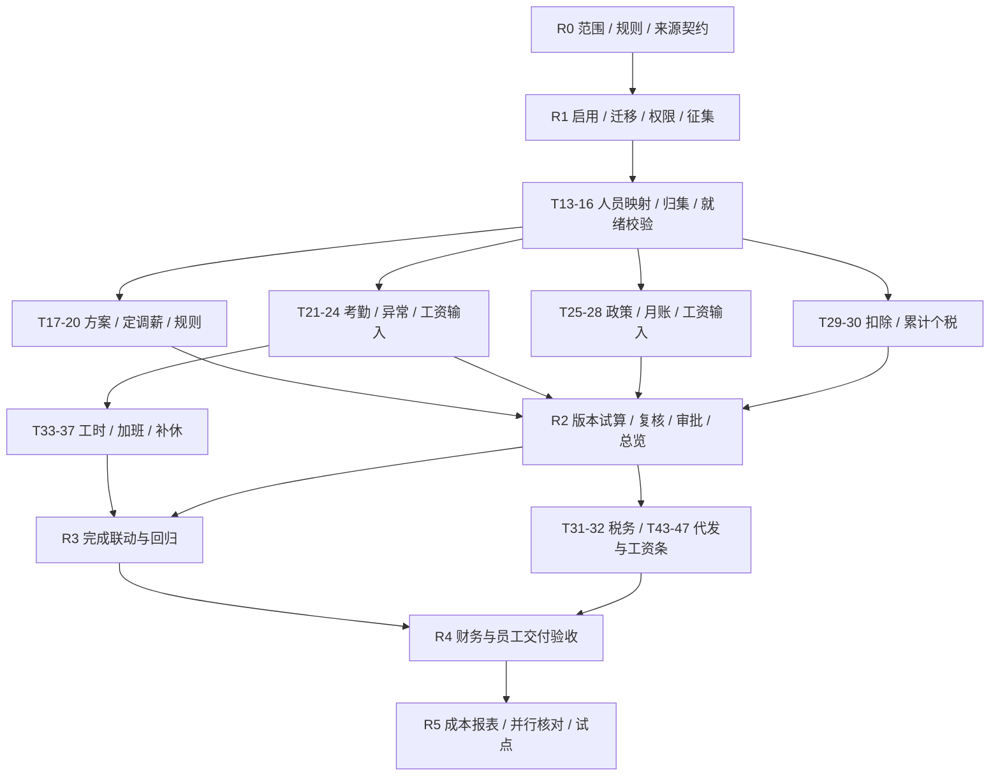

# HRM 薪酬管理开发任务与实现路线图

| 项目 | 内容 |
| --- | --- |
| 版本 / 日期 | v0.1 / 2026-10-04 |
| 需求依据 | [HRM 薪酬管理 PRD](./hrm-payroll-prd.md)、[业务原始 HTML](./薪酬管理模块原型.html) |
| 文档状态 | 技术实施建议；业务规则、范围与排期尚待确认 |
| 后端基线 | `waitforcopilot/ruoyi-vue-pro`，应用源码提交 `1697112f1164b206aeb031493980f5cb3a6e2cd5`；本分支此前仅增加需求文档和原型 |
| 前端参考基线 | 独立仓库 `yudaocode/yudao-ui-admin-vue3`，提交 `0af03a93b6b6300f878e28add69b1c7a9f09ec34`；正式交付仓库在 T-04 确定 |
| 拆分结果 | 52 项任务，覆盖 PRD 附录 A 的 43 个候选功能点及 COL-01～03，分六阶段交付 |

实施顺序建议：先让 HRM/BPM、业务表、权限和需求征集可用，再把输入归集、核算和审批做成可追溯的闭环，随后完成加班工时、银行回盘、工资条、报表及业务试点。复用现有 HRM 的对象、核算服务和页面，按缺口扩展，保持芋道模块化单体结构。

本文来自静态源码核对，没有执行 HRM 模块启用、生产数据库迁移或业务核算。任务中的验收条件是后续研发必须取得的证据，不代表能力已经上线。原型的示例金额、优先级和确认状态不作为真实规则或范围结论。

## 1. 现有架构与复用边界

### 1.1 应用基础

| 方面 | 核对结果 | 对实施的影响 |
| --- | --- | --- |
| 后端 | Java 8、Spring Boot 2.7.18、MyBatis Plus 3.5.17；`controller → service → dal` 分层 | 新功能放入 `yudao-module-hrm`，沿用 VO、DO、Mapper、Service、`CommonResult` / `PageResult` 与异常码机制 |
| 模块启用 | [根 pom.xml](../pom.xml) 的 HRM/BPM module 与 [server pom.xml](../yudao-server/pom.xml) 的对应依赖被注释 | T-05 先完成构建和装配；默认 system/infra 启动成功不能证明 HRM 可运行 |
| 工作流依赖 | [HRM pom.xml](../yudao-module-hrm/pom.xml) 直接依赖 BPM；已有请假使用 BPM API 和状态事件；Flowable 6.8.0 | 一并启用 BPM，复用流程 API、事件监听及待办；不要为薪资另造审批引擎 |
| 数据库 | [主库 SQL](../sql/mysql/ruoyi-vue-pro.sql) 有 48 个建表语句，其中无 `hrm_*` / `bpm_*`；HRM 有 50 个 DO，[测试 SQL](../yudao-module-hrm/src/test/resources/sql/create_tables.sql) 有 50 张 HRM 表 | 测试 SQL 是 H2 写法，须校对后编制 MySQL 增量迁移；BPM 应用表与 Flowable 引擎表分别盘点 |
| 流程配置 | [application.yaml](../yudao-server/src/main/resources/application.yaml) 中 Flowable 自动建表开启、自动部署流程定义关闭 | 准备明确的引擎建表策略和流程模型发布步骤；不能假定开启依赖就会有可用审批流程 |
| 前端 | Vue 3、TypeScript、Element Plus、Vite；正式 Vue3 项目在独立仓库 | 后端仓库的 [Vue3 目录](../yudao-ui/yudao-ui-admin-vue3/README.md) 仅有入口说明和少量 MES 文件，不能当作完整前端交付目录 |
| 租户与权限 | 框架提供租户 SQL 拦截、部门数据权限、按钮权限；HRM 控制器已有 `@PreAuthorize` | 保留租户隔离并验证自定义查询；新增主体/薪资数据范围、服务端校验和敏感字段权限，不能只控制菜单 |
| 审计与集成 | 已有 `@LogRecord`、Excel、文件、任务和 system 站内信/邮件/短信能力 | 共用基础设施；核算快照保存在受控业务表，普通操作日志不写薪资、证件和账户明文 |

前端现有 HRM 页面与 API 已在参考仓库核对，包括 `src/views/hrm/salary/month-record`、`salary/employee-info`、`salary/slip`、`attendance/month`、`insurance/month-record` 和 `portal/salary/slip`。云环境当前运行副本位于 `/workspace/.cloud-setup/ruoyi-vue-pro/frontend`，仅作为本次分析依据。后续前端变更须进入可写的正式仓库或受控目录，并记录对应提交，不能只留在临时运行副本。

### 1.2 业务能力核对

| 领域 | 现有能力 / 源码依据 | 本次主要扩展 |
| --- | --- | --- |
| 薪酬方案与档案 | [HrmSalaryOptionDO](../yudao-module-hrm/src/main/java/cn/iocoder/yudao/module/hrm/dal/dataobject/salary/config/HrmSalaryOptionDO.java)、薪资组、计税规则、定薪/调薪记录；[薪资档案服务](../yudao-module-hrm/src/main/java/cn/iocoder/yudao/module/hrm/service/salary/employee/HrmSalaryEmployeeInfoServiceImpl.java) 已按周期内每日生效工资加权 | 薪级薪档、绩效/补贴来源、审批、方案版本和历史对比；现有自然日加权口径需业务确认 |
| 工资核算 | [月度工资服务](../yudao-module-hrm/src/main/java/cn/iocoder/yudao/module/hrm/service/salary/monthrecord/HrmSalaryMonthRecordServiceImpl.java) 有导入、考勤/社保同步选项、汇总、锁定可编辑工资表；[员工核算服务](../yudao-module-hrm/src/main/java/cn/iocoder/yudao/module/hrm/service/salary/monthrecord/HrmSalaryMonthEmployeeRecordServiceImpl.java) 使用 BigDecimal、工资项分类计算、调整重算 | 输入质量、公式规则版本、批次版本、金额来源、差异复核；扩展现有服务，补充自动计算规则 |
| 核算准备检查 | 已有 `/hrm/salary/month-record/payroll-readiness`，主要统计缺薪资组、未定薪和人员异动 | 增加考勤/加班/工时/缴费/税务的完整性、截止时间、确认状态和阻断原因；校验必须落实到执行接口 |
| 数据缺失处理 | 当前核算会筛掉未分配薪资组的员工；部分路径缺考勤时使用薪资组默认天数，缺员工社保明细时填零；按工号导入的 map 可能覆盖重复行 | 显式显示漏算人员与缺口；必需数据缺失不得静默按零或标准出勤处理；重复行与未知工号须返回错误清单 |
| 考勤 | [统计服务](../yudao-module-hrm/src/main/java/cn/iocoder/yudao/module/hrm/service/attendance/statistics/HrmAttendanceStatisticsServiceImpl.java) 有日/月、班次、打卡、批准请假、跨日等计算；请假已接 BPM | 扩展出差、外出、补卡、异常闭环及工资周期映射；现有工资同步的加班费、请假扣款等仍填零，不能视为完整联动 |
| 社保公积金 | [方案项目](../yudao-module-hrm/src/main/java/cn/iocoder/yudao/module/hrm/dal/dataobject/insurance/config/HrmInsuranceSchemeProjectDO.java) 有基数、个人/单位比例金额；已有人员档案和月账 | 增加本地政策版本、上下限、生效期、年度调基、外部账单对账；个人扣款与单位成本分别归集 |
| 参保标准来源 | [标准查询服务](../yudao-module-hrm/src/main/java/cn/iocoder/yudao/module/hrm/service/insurance/config/HrmInsuranceStandardServiceImpl.java) 当前请求第三方网站、缓存结果，失败返回空列表 | 外部查询仅作为候选参考；正式核算使用有出处、确认人和有效期的本地政策快照，外部服务失败不改变历史结果 |
| 个税 | 员工核算服务已有累计预扣、上月累计承接、周期重置；已有相关单元测试 | 核实纳税主体、年度、历史累计及缺口；补充专项扣除采集、申报/完税资料导出、年终奖策略及规则版本 |
| 工资条 | [发送服务](../yudao-module-hrm/src/main/java/cn/iocoder/yudao/module/hrm/service/salary/slip/HrmSalarySlipSendRecordServiceImpl.java) 有模板快照、后台账号过滤；[员工门户](../yudao-module-hrm/src/main/java/cn/iocoder/yudao/module/hrm/controller/admin/portal/salary/HrmPortalSalarySlipController.java) 按登录用户绑定员工限定本人 | 发布门槛、版本与撤回、重复发布控制、渠道结果和异议闭环；现有“非未核算即可发送”不等于已审批或银行付款成功 |
| 生命周期 | [工资表状态枚举](../yudao-module-hrm/src/main/java/cn/iocoder/yudao/module/hrm/enums/salary/monthrecord/HrmSalaryMonthRecordStatusEnum.java) 为 5 未核算、10 已归档、11 已核算；创建下月会归档上月 | 保留计算状态兼容性，新增业务批次/审批/付款状态与校验；不能把“已核算”解释成“已付款”，也不能以创建下月绕过归档门槛 |
| 新增领域 | 当前 HRM 未发现独立加班、员工工时制度/周期结算、需求征集、银行回盘和薪酬成本分摊的完整模块 | 补充领域对象、接口、页面及数据契约；已有考勤排班和基础报表能力继续复用 |

## 2. 目标设计与实施约束

### 2.1 模块与代码落点

后端延续 `cn.iocoder.yudao.module.hrm` 的命名和分层。现有 `salary/config`、`salary/employee`、`salary/monthrecord`、`salary/slip`、`attendance`、`insurance` 优先扩展。新增征集、来源归集、加班、工时、付款对账、报表子领域，分别提供 Controller/VO、Service、DO/Mapper 和必要的流程监听。接口沿用 `/admin-api/hrm/**` 与现有权限命名；前端保留现有薪资与门户路由，用菜单配置整合 PRD 的 10 个视图。

system 负责用户、组织、角色与消息；BPM 负责审批；infra/框架负责文件、导入导出和任务调度。财务数据通过模块 API 或确认的数据契约进入 HRM，HRM 不直接查询其他模块的内部 Mapper。无需为本范围拆微服务或升级 Java/Spring Boot 主版本。

### 2.2 数据与状态设计

以下为逻辑模型建议，最终表名、字段、索引在对应任务中评审并迁移。

| 逻辑对象 | 复用 / 建议新增 | 核心约束 |
| --- | --- | --- |
| 需求、评审、基线 | 新增 `hrm_payroll_requirement`、来源关联与评审/基线版本记录 | 43 个原型功能以稳定编号登记；初始状态均待确认；功能确认与数据就绪分开 |
| 来源目录与归集批次 | 新增来源契约、归集批次、行级错误、人员/外部编号映射 | 按租户、来源系统、来源单号及版本去重；记录模板版本、期间、单位、负责人和截止时间 |
| 规则与政策版本 | 关联已有薪资组/项目/计税规则/社保方案，新增版本及有效期记录 | 历史输入、规则和结果快照可复现；税务与社保参数带确认依据，不依赖运行时抓取 |
| 工资业务批次 | 建议新增 `hrm_payroll_batch`，关联已有月度工资表 | 分开维护计算状态、审批状态、付款状态和发布状态；操作绑定核算版本 |
| 核算版本与明细来源 | 复用月度工资表及员工结果，新增输入/结果版本、来源引用、调整与差异记录 | 当前结果只是一个可定位版本；重算不覆盖历史证据；批次总额与明细一致 |
| 工时、加班与补休 | 新增员工制度有效期、结算周期、核定加班、补休额度及使用流水 | 保留审批/打卡依据；同一时段不得重复认定；同一补偿不得同时计薪与消耗补休 |
| 付款与渠道记录 | 新增代发文件版本、付款明细、回盘批次；扩展工资条版本与渠道结果 | 文件生成不代表已付款；成功付款不得重复重发；发布和投递分别幂等 |
| 成本与预算 | 新增分摊规则/结果及已确认预算数据，关联核算版本 | 历史组织快照；分摊合计回到员工成本；缺分母不伪造人效指标 |

必须处理的兼容性：

1. 现有工资表按年月创建/查询，不能自动支持一个租户内多主体或同月补发多批次。Q-01/Q-02 确认后，T-13/T-38 同步调整主体维度、查询、唯一约束、上下月承接和旧记录映射；仅增加关联表不能解决限制。若首期只做单主体，接口明确约束适用范围。
2. 累计个税按经确认的纳税主体、员工、税务年度维护，不能因换部门或方案错误清零，也不能把未核算、未确认的历史数据直接当作已扣税。
3. 框架租户不等于业务法人主体。新增表按框架要求维护 `tenant_id`；明确全局模板与租户业务表的边界，验证手写 SQL、任务和导出的隔离性。
4. 当前部分业务表无部门列，不能只注册员工表的数据权限就认为工资结果已受限。列表、按 ID 详情、批量更新、导出、审批和后台任务都校验员工/批次授权范围。
5. 核算保留现有锁和事务，再增加版本号、操作幂等键及唯一约束。外部文件/消息失败按独立结果记录处理，重试不得重复计算、付款或发布。

### 2.3 公式与可追溯原则

T-20 在现有工资项分类计算上增加有类型、依赖和版本的规则层。首期建议覆盖经确认的固定项、比例项、考勤扣款、加班、绩效和税前/税后调整；如要求自由公式，在 T-01/T-02 明确范围，使用受限表达式并校验循环依赖、缺变量、除零和舍入。每个结果保留输入值、来源、规则版本和计算步骤。规则和倍率由 HR/财务确认，原型数字不能直接转成默认业务参数。

## 3. 开发任务清单

任务 ID 为 T-01～T-52。R0～R5 为第 5 节的阶段。依赖指完成验收的前置条件，契约明确后可提前开展页面或适配开发。主责是建议角色，实际负责人由团队分配。每项功能任务同时包含必要的后端接口、前端交互、迁移/权限与对应测试；验收样例的预期金额和时长来自 T-02。

### 3.1 范围、架构基础与需求征集

| ID / 阶段 | 任务与交付物 | PRD / 数据源 | 前置任务 | 建议主责 | 验收条件 |
| --- | --- | --- | --- | --- | --- |
| T-01 / R0 | 明确首期范围、主体/人群、暂缓项、规则负责人和版本；保留完整候选需求清单 | Q-01、Q-13、Q-19；43 功能点 + COL-01～03 | 无 | 产品 + HR/财务 | 每项标记纳入/暂缓及原因；确认人明确；预设“工时异议”经核实后记录真实结论 |
| T-02 / R0 | 建立规则台账与业务样例：期间、入离职、月中调薪、扣款、倍率、补休、社保、税务、精度、生命周期 | Q-02～08、Q-10～12、Q-14～18 | T-01 | HR + 财务 | 适用范围、有效期、依据与预期值可追溯；未决规则明确阻塞的任务，不能以开发默认值替代 |
| T-03 / R0 | 确定 DS-01～12 数据契约与来源负责人：实际系统、唯一键、字段、单位、模板/API、刷新/截止和错误处理 | DS-01～12；Q-09、Q-15、Q-16、Q-18 | T-01 | IT + 来源负责人 | 每个首期必需来源至少有字段映射与脱敏样本；无来源项标待补齐或暂缓 |
| T-04 / R1 | 固定前端交付方式：可写独立仓库或受控合入；对齐前后端版本、保留 MES 扩展，形成环境与构建说明 | PRD §8；Q-12 | T-01 | 前端 + 运维 | 从正式版本检出可安装/构建；记录前端提交与后端提交；临时副本之外可重现 |
| T-05 / R1 | 启用根模块 HRM/BPM 与 server 依赖，校验扫描、配置、任务和 BPM API 装配 | PRD §8；COL、CALC-01、ATT-02 | T-01 | 后端 | HRM/BPM 编译及依赖检查通过；提供启动配置与待验证 API 清单；数据库就绪后的启动与回归在 T-08 验收 |
| T-06 / R1 | 编制 MySQL 增量建表/升级：50 个 HRM DO 对齐、BPM 应用表清单、Flowable 表/版本、字典/模板/菜单/流程种子 | PRD §8；DS-01、DS-05、DS-06 | T-05 | 后端 + DBA | 空库初始化和已有库升级均通过；租户/金额类型/JSON/索引正确；种子无重复；有备份、迁移校验与回退步骤；H2 SQL 不直接当 MySQL 执行 |
| T-07 / R1 | 制定角色与字段授权，补充 HRM 主体/部门/员工数据权限和按 ID 校验；区分查看、调整、核算、审批、导出、发布 | PRD §3、§7；Q-12 | T-01、T-05、T-06 | 后端 + 产品 | 至少两租户、两部门、本人/他人和无薪资授权管理员验证；列表/详情/导出/批量请求均不能越权 |
| T-08 / R1 | 建立 HRM/BPM 测试与构建流水线、可重建开发数据和基线回归结果 | PRD §7～9 | T-04、T-05、T-06、T-07 | QA + 后端/前端 | 数据库就绪后完成启动，HRM/BPM API与菜单可访问；现有 HRM 单测、相关 BPM 和 system/infra 回归有结果；前端类型/构建检查通过；失败有处置记录而非跳过 |
| T-09 / R1 | 建立需求/来源目录与基线模型，登记 43 功能点、COL-01～03、DS-01～12，提供查询/维护接口 | COL-01；DS-08 | T-01、T-03、T-06、T-07 | 后端 | 每项唯一编号、原始来源和字段关联可定位；原型静态状态不导入为真实确认 |
| T-10 / R1 | 实现征集总览及 9 个业务页共用征集面板：录入/补充、筛选、负责人、优先级、验收条件和字段映射 | COL-01、COL-03；10 视图；DS-08 | T-04、T-09 | 前端 | 保存后可重新读取；页面与编号互相定位；空态/错误/移动端表单可用；候选业务按钮显示实际可用状态 |
| T-11 / R1 | 实现确认/待确认/异议的权限、状态留痕、未决问题与基线变更记录 | COL-02；DS-08 | T-09、T-10 | 后端 + 产品 | 状态带操作者、时间和依据；异议有责任人；确认后修改会产生新版本及影响记录 |
| T-12 / R1 | 导出版本化评审清单，单独展示数据就绪状态，并支持功能/来源双向追踪 | COL-03、OV-03；DS-08 | T-03、T-10、T-11 | 后端 + 前端 | 导出覆盖全部候选点、来源、范围决定及问题；真实确认进度可核对；“已确认”不会自动视为数据已就绪 |

### 3.2 数据归集、薪酬方案与规则

| ID / 阶段 | 任务与交付物 | PRD / 数据源 | 前置任务 | 建议主责 | 验收条件 |
| --- | --- | --- | --- | --- | --- |
| T-13 / R2 | 统一员工、工号、后台用户和外部编号映射；维护主体、计薪资格、历史组织/入离职快照 | DS-01；Q-01、Q-05 | T-02、T-03、T-06、T-07 | 后端 + HR | 工号不是跨系统全局主键；未知/重复映射被识别；未分组人员显示漏算原因；历史部门不随当前调动改变 |
| T-14 / R2 | 建立受控归集/导入批次、模板版本、预校验、逐行错误、去重/覆盖/新版本策略 | CALC-03、COL-03；DS-01～07、DS-09～12 | T-03、T-06、T-07 | 后端 | 重复工号/源单号、未知员工、错期间和缺金额可定位；不得静默覆盖或填零；重复上传结果可核对 |
| T-15 / R2 | 实现首期来源适配：HRM 直取、确认模板导入、必要外部接口；来源状态、任务结果、重试与影响提示 | OV-03；DS-01～07、DS-09～12 | T-03、T-13、T-14 | 后端 + IT | 同一来源更新不会重复累计；失败保留批次和错误；外部系统的认证、频率与变更契约明确 |
| T-16 / R2 | 扩展核算准备检查为可配置校验：完整性、确认/截止、版本、重复和例外；执行接口统一调用 | OV-03、CALC-03；DS-01～07、DS-09 | T-12、T-13、T-14、T-15 | 后端 | 直接调用核算/提交审批接口也能拦截缺口；明确有效零值与缺数据；允许例外必须有权限、理由和记录 |
| T-17 / R2 | 扩展薪酬方案/薪资组/项目为有适用范围和有效期的版本；方案复制、启用、停用和历史对比 | PLAN-01、PLAN-04；DS-05 | T-02、T-06、T-13 | 后端 + 前端 | 重叠有效期可检测；核算选择明确版本；后续改规则不改变历史记录 |
| T-18 / R2 | 薪级薪档、岗位系数、补贴标准批量维护；接入已确认的绩效结果并映射工资项 | PLAN-02、PLAN-01；DS-09 | T-03、T-14、T-17 | 后端 + 前端 | 导入冲突、缺职级/系数被识别；绩效周期和生效版本匹配；有业务预期样例 |
| T-19 / R2 | 扩展定薪/调薪记录，接 BPM 审批与生效任务；复核现有每日加权，处理追溯与补发依据 | PLAN-03；DS-01、DS-03、DS-05 | T-02、T-05、T-13、T-17 | 后端 + HR | 未批准记录不进入正式核算；审批重复回调不重复生效；月中调薪/撤销/追溯按样例验证，不改写已冻结版本 |
| T-20 / R2 | 扩展工资规则计算层、依赖排序、舍入策略和计算解释；保留现有分类计算与可编辑项约束 | CALC-02、PLAN-01；DS-05、DS-09 | T-02、T-17、T-18、T-19 | 后端 + 财务 | 项目输入/规则/结果可追溯；非法公式、循环/缺变量/除零有错误；调整重算与汇总一致；精度按规则样例验证 |

### 3.3 考勤、社保与个税

| ID / 阶段 | 任务与交付物 | PRD / 数据源 | 前置任务 | 建议主责 | 验收条件 |
| --- | --- | --- | --- | --- | --- |
| T-21 / R2 | 扩展日/月考勤归集，统一班次、跨日、时区、截止时间与工资起止日，验证迟到/早退/旷工规则 | ATT-01、ATT-03、HOUR-05；DS-02、DS-04 | T-02、T-13、T-15 | 后端 | 月度统计与非自然月工资周期可对账；跨夜、休息日、入离职覆盖；时长/天数单位明确 |
| T-22 / R2 | 在已有请假/BPM 基础上关联出差、外出、补卡等来源单据，标准化批准、撤销和有效时段 | ATT-02；DS-02、DS-03 | T-03、T-05、T-21 | 后端 + IT | 来源单号和打卡可定位；撤销/驳回不会产生有效豁免；重复/重叠时间按规则处理 |
| T-23 / R2 | 考勤异常工单、提醒、人工核定与反馈闭环；补正记录标记工资影响和责任人 | ATT-04、OV-04；DS-02、DS-03 | T-07、T-21、T-22 | 后端 + 前端 | 原记录、补正、操作人和理由均保留；未结异常显示影响范围；冻结版本变更须走规定流程 |
| T-24 / R2 | 生成已确认考勤扣款/折算工资输入，完成请假扣款与缺勤等薪酬联动 | ATT-05、CALC-02、HOUR-04；DS-02、DS-05 | T-20、T-21、T-22、T-23 | 后端 + 财务 | 不再以占位零值充当请假结算；扣款在应发/实发中只计算一次；补正重算可解释差异 |
| T-25 / R2 | 建立城市/项目/有效期的本地缴费政策版本、基数上下限、比例与确认依据；外部查询作为候选输入 | INS-02；DS-06 | T-02、T-14、T-15 | 后端 + HR | 官方/业务依据可定位；参数缺失阻断；外部标准网站不可用仍可按已确认版本核算 |
| T-26 / R2 | 扩展参保档案与基数申报、年度调基、城市变更、入离职及补缴规则 | INS-01；DS-01、DS-06 | T-13、T-25 | 后端 + 前端 | 按有效期和上下限校验；调基前后差异可查看；补缴不混入普通月账而丢失期间依据 |
| T-27 / R2 | 月度缴费账与外部缴费明细对账，展示人员/项目/金额差异与处理状态 | INS-05；DS-06 | T-14、T-25、T-26 | 后端 + 财务 | 账期、来源和台账可追踪；重复账单不重复累计；待核实差异显示是否阻断核算 |
| T-28 / R2 | 社保个人扣款、单位缴费进入工资及成本输入，使用被确认的月账快照 | INS-03、INS-04、CALC-02；DS-05、DS-06 | T-20、T-27 | 后端 | 不以缺个人明细填零；个人/单位金额分别汇总；社保期与工资期的配置偏移按样例核对 |
| T-29 / R2 | 专项附加扣除采集/同步，维护主体/员工/年度累计收入、扣除及已扣税期初资料与变更版本 | TAX-02、TAX-01；DS-07 | T-02、T-13、T-14、T-15 | 后端 + 财务 | 期初缺口、换主体、断月和重复导入能识别；数据有授权来源；无历史记录不能自动证明累计为零 |
| T-30 / R2 | 复核并扩展已有累计预扣，区分已确认税务累计和试算数据；处理跨年、补发、精度及退税调整边界 | TAX-01、CALC-02；DS-05～07 | T-20、T-28、T-29 | 后端 + 财务 | 财务确认的逐月/跨年样例一致；前期变更后可定位影响；现有“12月至11月”配置的适用性另行确认，不当作默认年度政策 |
| T-31 / R4 | 生成确认模板的个税申报资料；接入已确认的完税资料并独立导出，记录版本与来源 | TAX-04；DS-07 | T-14、T-30、T-39 | 后端 + 财务 | 申报、试算和完税状态不混淆；导出可回到员工/批次；生成文件不改变申报或完税状态 |
| T-32 / R4 | 年终奖单独计税/并入综合所得的经确认策略、年度有效期及输入结果追溯 | TAX-05；DS-05、DS-07；Q-17 | T-02、T-20、T-29、T-30 | 后端 + 财务 | 适用范围/年度规则和选择依据明确；与普通工资不重复计税；边界样例经财务核对 |

### 3.4 工时与加班

| ID / 阶段 | 任务与交付物 | PRD / 数据源 | 前置任务 | 建议主责 | 验收条件 |
| --- | --- | --- | --- | --- | --- |
| T-33 / R3 | 员工标准/综合/不定时工时制度档案，维护适用依据、有效期、结算周期及排班关系 | HOUR-01；DS-01、DS-04；Q-14、Q-19 | T-02、T-13、T-21 | 后端 + HR | 制度切换无有效期歧义；适用范围和依据明确；原型“有异议”不转为系统默认规则 |
| T-34 / R3 | 综合/不定时周期结算、排班/实际工时核对、工时报表与异常提醒 | HOUR-02、HOUR-03、HOUR-05、OT-02；DS-02、DS-04 | T-21、T-33 | 后端 + 前端 | 跨月周期、跨夜班次、休息/请假时段和差异按样例验证；不把所有超时统一视为加班 |
| T-35 / R3 | 加班申请、BPM 审批、打卡核实与认可时长；关联来源单据和制度 | OT-01；DS-02～04 | T-03、T-05、T-21、T-33 | 后端 + 前端 | 申请时长、实际时长、核定时长分别保存；未批准/撤销单据不计薪；重叠申请可识别 |
| T-36 / R3 | 调休/补休额度和使用流水，关联加班核定、请假与冲回，处理跨期余额 | OT-04；DS-03、DS-04 | T-22、T-35 | 后端 + HR | 额度授予、使用、失效/冲回有流水；重复回调不增发；计薪与补休不能双重补偿 |
| T-37 / R3 | 按制度/日期/有效规则计算时薪与倍率，生成加班/工时工资输入，增加已确认上限提醒 | OT-02、OT-03、OT-05、HOUR-04；DS-02～05 | T-20、T-24、T-34、T-35、T-36 | 后端 + 财务 | 跨期与补休边界有样例；只消费一次有效结算输入；超限提示定位规则与员工；变更会使受影响试算版本待重算 |

### 3.5 工资批次、审批与总览

| ID / 阶段 | 任务与交付物 | PRD / 数据源 | 前置任务 | 建议主责 | 验收条件 |
| --- | --- | --- | --- | --- | --- |
| T-38 / R2 | 引入业务批次生命周期，保留现有计算枚举；补充主体/期间/补发维度、合法迁移与归档门槛 | CALC-01、OV-02；DS-01、DS-05；Q-01、Q-02、Q-06 | T-02、T-16、T-20、T-24、T-28、T-30 | 后端 | 草稿/试算/审批/发放/归档有服务端约束；已核算不等于已付款；创建下月不绕过未结付款/审批；旧年月查询与数据升级有验证 |
| T-39 / R2 | 输入/规则/结果快照、版本重算、人工调整及差异；把现有员工记录和汇总挂接到明确版本 | CALC-02、PLAN-04；DS-01～07、DS-09 | T-38 | 后端 + 前端 | 重复/并发计算不造重复记录；历史版本不丢失；每个金额可定位输入/规则；调整有理由及权限；汇总与明细一致 |
| T-40 / R2 | 工资批次复核/BPM 审批与冻结，处理驳回、撤销、重算失效和版本校验 | CALC-01；DS-05；Q-06 | T-05、T-07、T-39 | 后端 + 财务 | 审批绑定版本；旧审批回调不能批准新结果；重复事件幂等；核算员/审批员的职责规则经确认并执行 |
| T-41 / R2 | 异常拦截、人工核对、金额变动对比和人员/汇总对账；形成审批前核对清单 | CALC-03、OV-04；DS-01～07 | T-23、T-39、T-40 | 后端 + 前端 | 异常未处理或无授权例外不能进入审批/交付；每项差异有责任人、理由和结论 |
| T-42 / R2，R3 补齐工时 | 总览真实 KPI、历史期间/批次查询、来源归集进度和待办；R3 接入新增工时/加班结果 | OV-01～04、HOUR-03；DS-01～07 | T-16、T-38、T-41；R3 增加 T-34、T-37 | 前端 + 后端 | 图表、明细、汇总采用同一主体/期间/版本；未就绪项显示实际状态；可从异常/进度跳到来源 |

### 3.6 财务交付、工资条、报表与上线

| ID / 阶段 | 任务与交付物 | PRD / 数据源 | 前置任务 | 建议主责 | 验收条件 |
| --- | --- | --- | --- | --- | --- |
| T-43 / R4 | 银行代发模板/文件、账户校验、文件版本、授权导出和金额核对 | CALC-04；DS-01、DS-12；Q-16 | T-03、T-13、T-14、T-40、T-41 | 后端 + 财务 | 仅从有效批准/冻结版本生成；账户/总额正确，导出受控有记录；文件生成状态与付款状态分开；银行直连另列范围决定 |
| T-44 / R4 | 银行回盘导入、批次/员工/金额匹配、部分成功/失败处理及剩余款项重试 | CALC-04、CALC-01；DS-12 | T-43 | 后端 + 财务 | 重复/未知/金额不符回盘被识别；成功金额对账；部分失败不重复支付成功人员；付款状态由可信依据更新 |
| T-45 / R4 | 扩展模板快照与本人工资条：版本化生成/发布/撤回，校验批准及经确认的付款/发布时间门槛 | CALC-05、TAX-03；DS-05、DS-11 | T-07、T-39、T-40、T-44 | 后端 + 前端 | 员工仅见本人获准发布版本；重复发布不造重复工资条；更正版本可追踪；历史发放记录删除/撤回受控 |
| T-46 / R4 | 在已有站内信上接经确认的邮件/短信渠道，记录投递状态、重试、去重与模板权限 | TAX-03；DS-11 | T-15、T-45 | 后端 + IT | 渠道失败不回滚工资结果；重试不重复发布；收件人与员工一致；消息中的明文字段按批准模板控制 |
| T-47 / R4 | 员工工资条异议/反馈、HR 处理和更正通知，关联工资版本及处理记录 | PRD §3、Q-10；DS-11 | T-23、T-45 | 后端 + 前端 | 本人可提交和查询；HR 按权限处理；异议不会直接改已发布金额，变更走核定流程 |
| T-48 / R5 | 部门/成本中心/项目分摊规则及结果，连接单位缴费、历史组织和核算版本 | RPT-01、INS-04；DS-01、DS-06、DS-10 | T-03、T-28、T-37、T-39、T-44 | 后端 + 财务 | 比例/尾差受控；员工成本、分摊总额、单位缴费与工资批次一致；无映射项显式提示 |
| T-49 / R5 | 营收/编制/预算来源与版本、人均/成本率、预算实际对比 | RPT-02、RPT-04；DS-10 | T-03、T-14、T-48 | 后端 + 财务 | 缺少或为零分母不展示伪造比例；预算和实际口径/期间一致；来源和预算版本可定位 |
| T-50 / R5 | 薪酬结构多维分析、报表指标字典、导出模板与范围校验 | RPT-03、RPT-05；DS-05、DS-06、DS-10 | T-07、T-42、T-48、T-49 | 前端 + 后端 | 图表/报表/导出可回到同版明细；维度和口径说明可查；导出有授权与审计 |
| T-51 / R5 | 端到端回归、权限/幂等/精度/流程乱序、迁移兼容、性能及失败恢复测试 | PRD §7、§9.2/9.3；Q-12 | T-08、T-12、T-31、T-32、T-37、T-40、T-44、T-45、T-46、T-47、T-50 | QA + 全团队 | 通过第 6 节场景；按确认规模验证耗时/并发；核算、渠道和文件故障能恢复；首期暂缓项有明确排除依据 |
| T-52 / R5 | 业务并行试算、差异签认、试点上线、监控/操作手册及回退演练 | PRD §9；DS-01～12 | T-51 | HR/财务 + 运维 | 至少两个代表性工资周期并行核对，含历史回放或试点；差异关闭或批准处置；明确生产版本、负责人和上线/回退条件 |

T-47 是 PRD 中员工异议场景的正式实现建议。其余业务任务均有原型候选需求对应。首期取舍由 T-01 记录；暂缓任务保留编号和依赖，不以删除候选需求的方式缩小范围。

## 4. PRD 覆盖与业务决策门槛

### 4.1 逐项功能追踪

| PRD 编号 | 主实现任务 | 交付阶段 |
| --- | --- | --- |
| OV-01 | T-42、T-48、T-50 | R2 基础汇总，R5 成本口径 |
| OV-02 | T-38、T-42 | R2 |
| OV-03 | T-12、T-16、T-42 | R1/R2，R3 加班工时补齐 |
| OV-04 | T-23、T-41、T-42 | R2 |
| PLAN-01 | T-17、T-18、T-20 | R2 |
| PLAN-02 | T-18 | R2 |
| PLAN-03 | T-19 | R2 |
| PLAN-04 | T-17、T-39 | R2 |
| CALC-01 | T-38、T-40、T-44 | R2/R4 |
| CALC-02 | T-20、T-24、T-28、T-30、T-37、T-39 | R2/R3 |
| CALC-03 | T-14、T-16、T-41 | R2 |
| CALC-04 | T-43、T-44 | R4 |
| CALC-05 | T-45 | R4 |
| TAX-01 | T-29、T-30 | R2 |
| TAX-02 | T-29 | R2 |
| TAX-03 | T-45、T-46 | R4 |
| TAX-04 | T-31 | R4 |
| TAX-05 | T-32 | R4 |
| ATT-01 | T-21 | R2 |
| ATT-02 | T-22 | R2 |
| ATT-03 | T-21、T-23、T-24 | R2 |
| ATT-04 | T-23 | R2 |
| ATT-05 | T-24 | R2 |
| OT-01 | T-35 | R3 |
| OT-02 | T-34、T-37 | R3 |
| OT-03 | T-37 | R3 |
| OT-04 | T-36 | R3 |
| OT-05 | T-37 | R3 |
| HOUR-01 | T-33 | R3 |
| HOUR-02 | T-34 | R3 |
| HOUR-03 | T-34、T-42 | R3 |
| HOUR-04 | T-24、T-37 | R2/R3 |
| HOUR-05 | T-21、T-34 | R2/R3 |
| INS-01 | T-26 | R2 |
| INS-02 | T-25 | R2 |
| INS-03 | T-28 | R2 |
| INS-04 | T-28、T-48 | R2/R5 |
| INS-05 | T-27 | R2 |
| RPT-01 | T-48 | R5 |
| RPT-02 | T-49 | R5 |
| RPT-03 | T-50 | R5 |
| RPT-04 | T-49 | R5 |
| RPT-05 | T-50 | R5 |
| COL-01 | T-09、T-10 | R1 |
| COL-02 | T-11 | R1 |
| COL-03 | T-03、T-10、T-12 | R0/R1 |

12 组来源均已分派：DS-01→T-13，DS-02→T-21，DS-03→T-22/T-35，DS-04→T-33/T-34，DS-05→T-17，DS-06→T-25/T-27，DS-07→T-29，DS-08→T-09～12，DS-09→T-18，DS-10→T-48/T-49，DS-11→T-45/T-46，DS-12→T-43/T-44。T-14/T-15 提供各来源共用的归集机制，不能代替各领域的业务校验。

### 4.2 未决问题应在哪一步解决

| PRD 问题 | 影响 | 需要形成的结论 / 最迟门槛 |
| --- | --- | --- |
| Q-01、Q-02、Q-13 | 主体、人员、期间/补发、首期范围 | R0 确认；决定 T-13/T-38 的数据模型与兼容迁移 |
| Q-03、Q-05、Q-11、Q-15 | 薪资/绩效、生效折算、考勤扣款、金额精度 | 进入对应 R2 核算任务前提供公式与预期样例 |
| Q-06、Q-12 | 审批冻结/反核算、权限、导出、保留期、规模 | R1 前确认权限，R2 前确认状态规则；R5 前取得性能目标与留存方案 |
| Q-07、Q-08 | 社保政策和税务累计 | T-25/T-29 前提供实际政策/历史资料与确认依据 |
| Q-09 | 实际系统、键/字段、接口/模板、截止/负责人 | R0 完成首期必需来源契约，R2 接入前取得样本 |
| Q-04、Q-14、Q-19 | 加班、补休、工时制度及原型异议真实性 | R3 规则实现前确认；若暂缓，则说明首期如何取得经确认的输入与适用人群 |
| Q-10、Q-16、Q-17 | 工资条、银行文件/回盘、年终奖年度政策 | R4 前确认渠道、发布时点、模板及失败/撤回规则；银行直连单列决定 |
| Q-18 | 成本分摊、预算、营收、编制口径 | R5 前取得来源及口径；缺数据时仅交付有依据的指标 |

规则未决时可以继续开发框架、契约与界面，但对应真实核算、审批或交付必须停在门槛前。未决问题不要求现在逐条询问用户，先由 T-01～03 形成可评审的范围、规则和数据清单。

## 5. 实现路线图

### 5.1 六阶段交付

| 阶段 | 主要任务 | 可评审产物 | 出阶段门槛 | 参考持续时间 |
| --- | --- | --- | --- | --- |
| R0：范围与规则 | T-01～03 | 需求范围、规则台账、样例、12 组来源契约及未决问题 | 首期范围有负责人；必需规则/来源缺口及影响可见 | 1 周 |
| R1：架构基础与征集 | T-04～12 | 可启动的 HRM/BPM、MySQL 迁移、权限基线；真实保存/确认/导出的征集功能 | 从检出到启动可重现；43 点及来源可追踪；已有 HRM 回归有结论 | 1～2 周 |
| R2：工资试算闭环 | T-13～30、T-38～42 | 经确认输入→方案/考勤/社保/税务→版本试算→差异复核→审批；基础总览 | 样例逐项对账；缺口阻断、权限、快照与审批版本校验通过 | 3～4 周 |
| R3：加班与工时 | T-33～37，补齐 T-42 | 制度/排班核对、周期结算、加班审批、补休、工资联动 | 规则与制度适用依据确认；无重复时段/双重补偿；接入试算闭环 | 2～3 周 |
| R4：财务与员工交付 | T-31～32、T-43～47 | 申报/完税资料、年终奖策略、代发文件/回盘、工资条/渠道/异议 | 可信付款对账；发布门槛与重发幂等；失败恢复可验证 | 2～3 周 |
| R5：报表与试点 | T-48～52 | 成本分摊、预算/人效、报表；并行试算证据、运维手册与试点发布包 | 数据/金额/报表对账，安全性能恢复检查通过，业务差异签认 | 2～3 周 |

时间仅供资源规划：假设 2 名后端、1 名前端、1 名 QA，产品协调及 HR/财务持续参与，已有标准数据源可用，包含集成与回归。六阶段顺序实施约 11～16 周；等待政策、外部接口、银行模板或实际工资周期的时间另计。自由公式、银行直连、大规模历史迁移和额外法人口径须单独估算。R0 完成、R1 获得基线运行结果后再细化每项工时与正式排期。

### 5.2 依赖与并行安排

并行开发以第 3 节的实际依赖为准：R1 中前端仓库固定、构建启用和迁移盘点可并行；R2 中考勤与社保可按契约独立开展，个税结果依赖方案及个人缴费输入；R3 的制度/加班设计及 R4 的文件模板设计可提前开展。涉及薪资的正式审批与交付，必须使用已完成联动、校验和复核的有效版本。图中的分组表示工作流，不表示组内任务没有依赖。

### 5.3 建议发布边界

- **V0.1（R1）需求征集版**：真实需求维护、确认、来源登记和版本导出；业务原始 HTML 继续保留用于来源核对。
- **V0.2（R2）试算 MVP**：面向明确的试点主体/人群，已有薪资、考勤、社保、累计个税可追溯，完成试算与审批验证。加班/工时未完成时只允许使用经确认的结算输入，且记录来源和适用边界；不能以占位零值替代。此里程碑用于并行试算，真实付款及正式工资条按 R4 门槛推进。
- **V1.0（R3～R5）试点正式版**：纳入首期的加班/工时、财务交付及报表完成；至少两个代表性工资周期核对通过，再按批准范围发布。

若 T-01 明确暂缓年终奖、多渠道或复杂工时等候选需求，对应任务、覆盖记录和范围决定都保留。T-51/T-52 按批准范围验收；不能用阶段完成的名义默认暂缓项已经具备业务能力。

## 6. 验证与上线证据

每项任务完成时验证其具体风险，复用现有 HRM 服务测试；集成过程中重点验证实际链路，不为简单字段改动堆叠重复测试。

| 场景 | 必须取得的证据 | 关联任务 |
| --- | --- | --- |
| 空库/已有库、HRM+BPM 启动与流程模型部署 | MySQL 迁移日志、对象/索引核对、构建与 API/菜单访问结果；已有数据映射和回退演练 | T-05～08、T-38 |
| 缺薪资组、缺考勤/社保/累计数据、重复或未知工号 | 页面与直接接口均报告受影响人员/来源；缺值与零值区分；授权例外有记录 | T-13～16、T-29、T-41 |
| 入离职、月中调薪、非自然月、跨夜、请假/补卡、年度调基 | 经 HR/财务确认的输入与逐项预期金额/工时，核算明细与汇总对账 | T-19～30 |
| 工时跨周期、加班驳回/撤销、补休消费/冲回 | 审批/打卡/结算关联证据，无重复计薪、重复额度或双重补偿 | T-33～37 |
| 累计个税、断月/跨年、补发、年终奖、历史税额变更 | 纳税主体/年度/来源版本正确；财务逐月核对；不能把试算作为已扣/已完税数据 | T-29～32 |
| 并发核算、重复导入、审批乱序/重放、冻结后修改 | 唯一业务结果，历史快照不变；旧版本审批不能批准新结果；失败恢复与差异记录 | T-14、T-19、T-38～41 |
| 回盘部分失败、重复回盘、未知记录、金额不符 | 文件/明细/可信回盘对账；成功款不重复重试；错误有处理流程 | T-43～44 |
| 本人/他人工资条、重复发布、撤回、更正、渠道失败 | 服务端范围验证、发布版本与可见字段、幂等投递和更正记录 | T-07、T-45～47 |
| 多租户/部门、按 ID/批量/导出/任务、敏感字段与日志 | 角色矩阵逐路径验证，无明文越权或日志泄漏；历史数据按授权范围可查 | T-07、T-08、T-51 |
| 成本分摊尾差、缺营收/人数、预算切版、组织变动 | 报表追到员工成本；总额一致；缺分母有真实状态；数据/模板版本明确 | T-48～50 |
| 确认规模下的核算、分页/导出、任务/渠道故障 | Q-12 目标对应的测量结果、任务重试与恢复步骤、监控与操作手册 | T-51～52 |

最终交付包包含：前后端提交及对应 PR、增量 SQL 与迁移记录、字典/菜单/流程版本、来源契约与模板、经确认的规则与样例、测试/并行核对结果、操作/监控/回退说明、尚未完成或暂缓的需求清单。研发开始可先领取 T-01～08；数据库和权限基线具备后推进征集功能，再按依赖进入核算领域。
