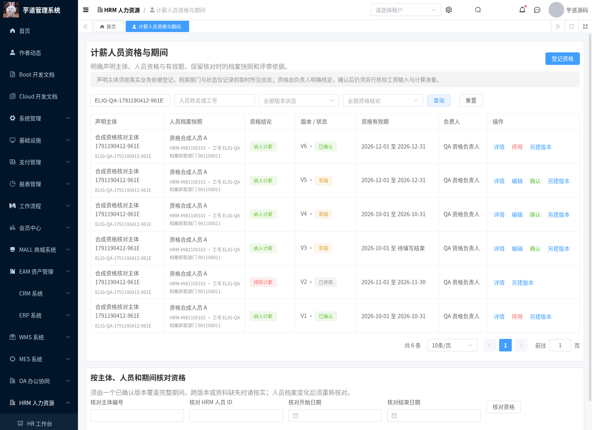
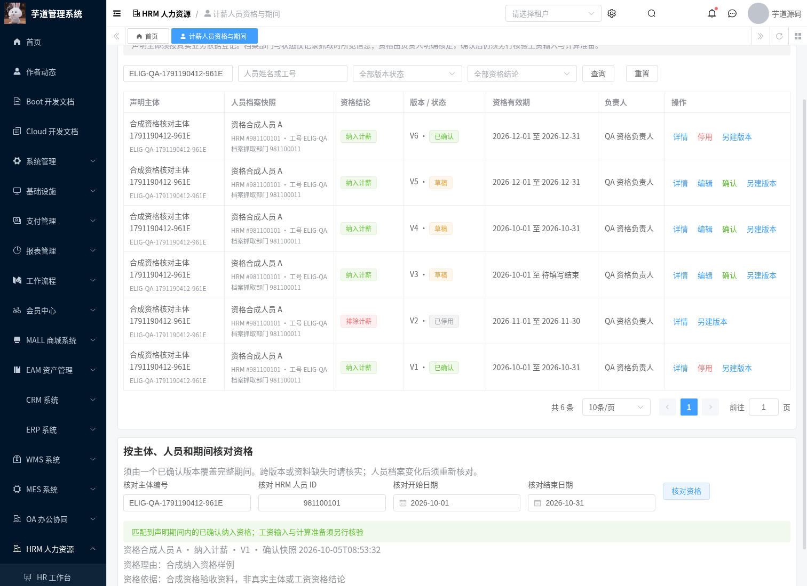

# 计薪人员资格与期间

本模块实现 T-13 的资格登记与期间核对工具，并为 T-16 提供明确的人员资格结果。原有编号映射只能回答“来源编号对应谁”；新增资格版本明确回答“哪位 HRM 人员，在声明主体及有效期内被负责人纳入或排除计薪”。资格与在职状态、工号映射、工资输入和工资计算结果分别维护。

主体编号、主体名称、资格结论、理由和有效期均须由负责人根据实际依据填写。声明主体不是框架租户，也不是已完成校验的法人主体目录。当前及抓取部门用于数据权限与资料核对，不能解释成历史任职、历史主体归属或成本分摊结论。T-13 仍为部分完成；正式主体和期间口径仍依赖 PRD 的 Q-01/Q-02。

## 版本与确认

- 固定身份为租户、声明主体编号、HRM 人员 ID；同一身份的版本由服务端顺序分配。重名或重复工号不参与匹配。
- 新登记是草稿，可以暂缺资格结论及依据。确认必须明确 `INCLUDED`（纳入）或 `EXCLUDED`（排除），并填写负责人、理由、依据、开始和结束日期；结束日期不能为空。
- 同身份已确认版本的有效期包含两端日期，不允许重叠，包括一个版本纳入、另一个版本排除的情况。相邻期间可分别确认。
- 草稿使用修订号防止覆盖他人修改。更新、另建版本及评审按相同顺序锁定系列首版本；人员快照刷新和确认再锁定 HRM 人员行。并发版本不会重号，同期间并发确认至多一个成功。
- 已确认与停用版本不可编辑。另建版本抓取当前档案，保留待核对资料，不继承确认结论与评审人。停用保留历史与审计，但该版本不再参与期间匹配。
- 姓名、工号、部门、绑定用户、入离职时间及状态构成人员快照指纹。保存可携带最近核对指纹；档案变化时保存与确认会拒绝旧快照。界面须主动“核对当前档案”并保存后再评审。

没有从在职状态、入离职日期推断资格的默认逻辑，没有自动折算、计薪日推定或工资写入。

## 期间核对结果

`POST /admin-api/hrm/payroll/employee-eligibilities/lookup` 接收主体编号、HRM 人员 ID、期间开始与结束。必须由一个已确认版本完整覆盖期间，不能自动拼接版本。

| 情况 | matched | issueCode | 含义 |
| --- | --- | --- | --- |
| 唯一已确认纳入版本，当前档案指纹一致 | true | 空 | 声明期间内已核定纳入资格；输入、规则、社保和税务准备仍须另行核验 |
| 唯一已确认排除版本，当前档案指纹一致 | true | EXCLUDED | 明确排除；不代表工资金额为零 |
| 仅草稿、已停用、期间未完整覆盖或无可访问版本 | false | UNRESOLVED_QUALIFICATION | 资格未能核定；不默认纳入或排除 |
| 多个覆盖期间的已确认版本 | false | AMBIGUOUS_QUALIFICATION | 数据异常须核实，不任取版本 |
| 当前档案与确认快照不同 | false | PERSON_CHANGED | 返回受权限保护的确认快照供核对，须重新登记或评审 |
| 当前档案不存在或不可访问 | false | PERSON_UNAVAILABLE | 不确认资格；权限不足与不存在采用相同结果 |

已确认版本详情和审计保留原快照，不因档案变化重写。全数据范围且有 HRM 查询权限的人员可以查看已删除人员的历史资格；期间核对仍要求当前档案存在。此模块未接入旧月工资执行入口，也没有冻结正式核算或历史工资结果。

## 接口与权限

所有接口都要求 `hrm:payroll:eligibility:query` 和 `hrm:employee:query`。登记、更新和另建版本还要求 `hrm:payroll:eligibility:maintain`，确认与停用还要求 `hrm:payroll:eligibility:review`。仅有维护或评审权限不能绕过查询权限读取人员资料。

接口路径为 `/admin-api/hrm/payroll/employee-eligibilities`：`employee`、`page`、`get`、`create`、`update`、`new-version`、`review`、`history`、`lookup`。前端菜单为 `/hrm/payroll-employee-eligibility`。

查询显式限定租户；部门或本人范围同时校验当前档案和抓取快照的组织/用户，防止调动前后互相读取资料。受限范围的审计隐藏历史完整快照和自由文本理由。复用原人员映射的数据权限与指纹生成，不查询手机号、证件号、银行卡或工资金额。请求和响应体不进入接口访问日志。

迁移 [20261005-hrm-payroll-employee-eligibility.sql](../sql/mysql/upgrade/20261005-hrm-payroll-employee-eligibility.sql) 只新增资格表及三个权限菜单，支持重复执行，不授予角色权限、不登记业务资格、不修改既有员工、工资或社保数据。实际部署须执行此前模块迁移，并由管理员按职责分配权限。

## 验证

- 新增 24 项后端测试；原人员映射 20 项回归通过，包含并发、跨租户、部门/本人双重限制、快照变化、空值清除、完整期间、确认重叠和历史证据。
- 完整 HRM server reactor：1,650 项测试，0 失败、0 错误；HRM 782 项全部执行，BPM 56 项；24 项跳过来自原框架/BPM测试，新增模块没有跳过。
- 完整固定 Vue3 基准叠加本仓库源码，包含 MES，执行生产构建和类型检查。基准及冻结安装与 [CI 模块](./hrm-payroll-ci-module.md) 一致。
- [隔离 MySQL 校验脚本](../script/hrm/verify-eligibility-mysql.sh) 在无网络临时容器中执行两遍迁移，验证菜单不重复、原快照保留、租户/主体/人员/版本唯一约束及中文字符保存。
- 46 项真实资格接口检查、12 项浏览器检查全部通过，另回归 56 项原规则计算接口检查。
- [真实接口回归](../script/hrm/verify-eligibility-api.py) 和 [真实浏览器回归](../script/hrm/verify-eligibility-ui.py) 仅在明确授权的隔离 QA 数据库使用合成资料；凭据从环境变量读取，不进入仓库。覆盖组合权限、实际数据库事务、只读界面、迟到响应、有效期核对和桌面/移动端截图。

验证记录位于 `docs/verification/hrm-payroll-eligibility/`，实际截图位于 `docs/assets/hrm-payroll-eligibility/`，共 8 张。

截图和确认样例中的主体、人员与依据均为测试数据，不是正式业务验收。

## 后续接入

T-16 仍需在同一主体、人员和期间内核对输入契约、批次、方案、规则与政策，并在执行接口落实缺口阻断。T-13 仍需实际法人主体目录、历史任职及主体归属、期间变动规则和旧数据兼容策略。需 HR/财务确认真实主体、首期人员与周期口径，并提供输入与预期金额样例，才可完成正式计薪资格和工资对账验收。
