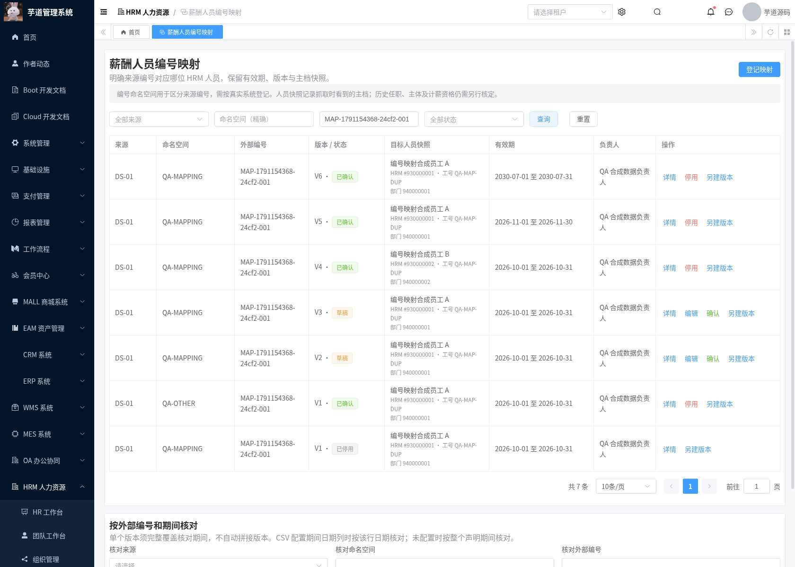
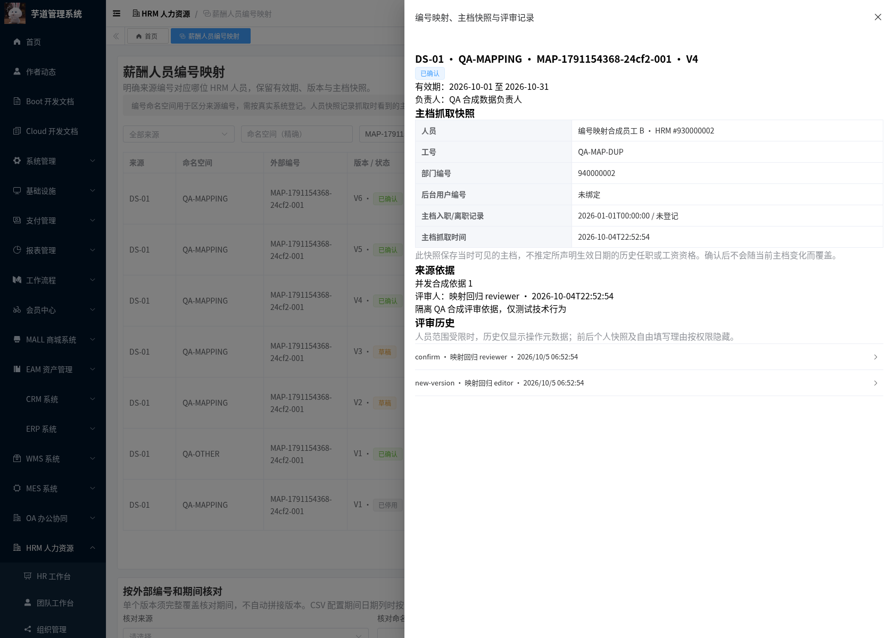
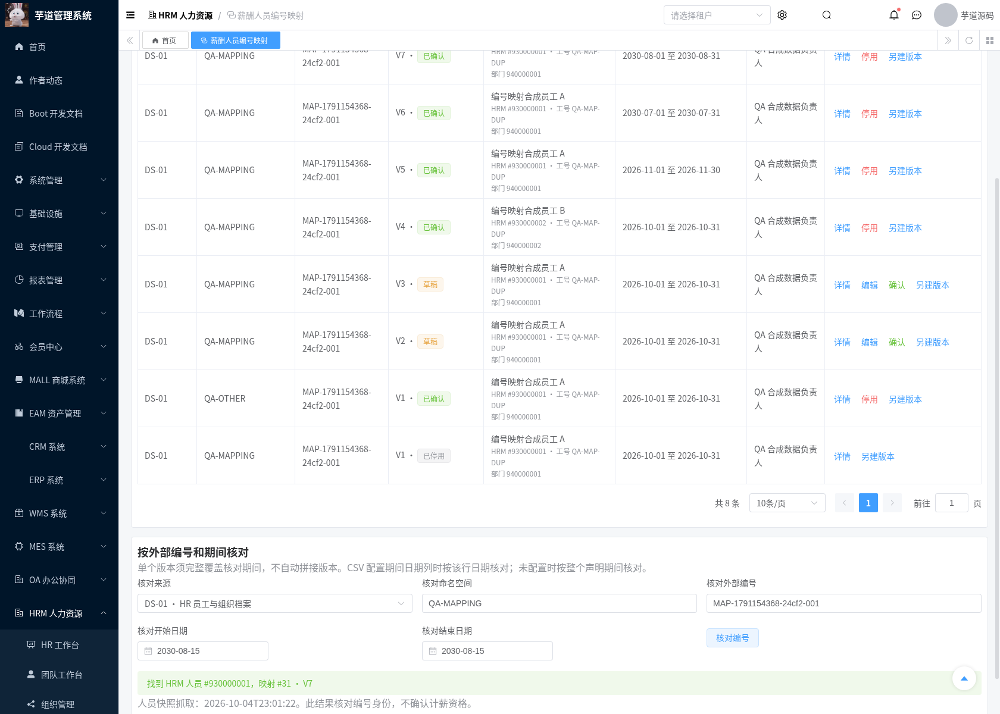
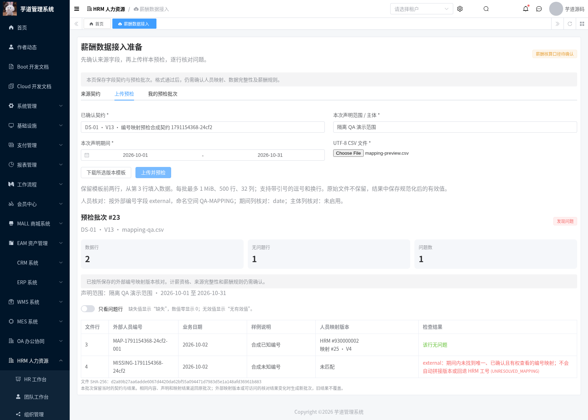
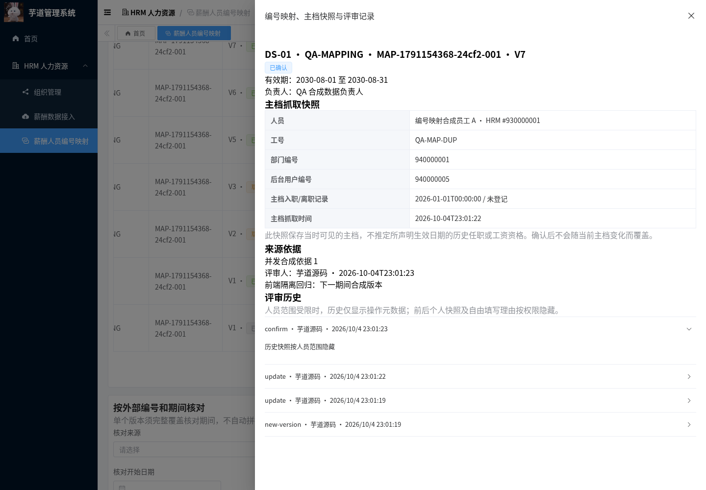
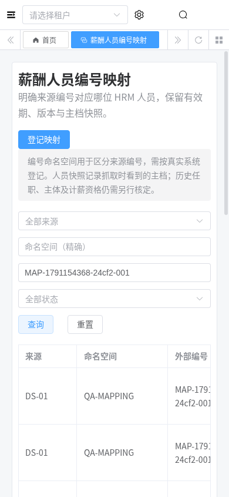

# 薪酬人员编号映射交付记录

日期：2026-10-04。外部来源的人员编号可能与 HRM 工号不同，同一工号也可能对应多位人员。本模块登记来源编号与明确 HRM 人员 ID 的对应关系，经核对后按有效期使用，并在 CSV 预检批次保留所用映射版本。

## 功能及适用边界

页面 `/hrm/payroll-identity`，复用现有 HRM Controller/Service/Mapper、人员主档、部门权限、资料评审表及 Vue3 管理端。新增一张 `hrm_payroll_employee_mapping` 表，不修改现有工资、考勤、社保或税务计算服务。

| 能力 | 行为 |
| --- | --- |
| 编号身份 | 当前租户 + 来源 ID + 稳定编号命名空间 + 外部编号；命名空间由实际来源负责人登记，不自动代表法人主体 |
| 人员选择 | 明确填写 HRM 人员 ID 并查询核对；工号只作为快照展示，重复工号不自动选择最后一人 |
| 编号处理 | 修剪首尾空白，保留大小写及前导零；拒绝控制字符；命名空间为 1～64 位大写英文编号，外部编号最多 128 字符 |
| 草稿维护 | 刷新服务端抓取的姓名、工号、部门/后台用户 ID、入离职记录及状态；来源、命名空间、外部编号固定；可另建版本更换目标人员 |
| 确认 | 必填负责人、来源依据、生效开始及评审证据；确认前重新核对当前主档指纹，变化时要求编辑并重新核对 |
| 有效期 | 闭区间；结束日期可明确留空表示无指定结束；同一编号确认版本不得重叠，次日衔接允许 |
| 历史 | 确认/停用版本不可编辑，不提供物理删除；新版本独立评审，不继承原确认人或结论 |
| 期间核对 | 单个可访问的确认版本须覆盖整个声明区间；缺失、停用、跨版本或无权查看统一返回未匹配，不回退按 HRM 工号查找 |

快照记录**抓取时间所见的人员主档**，确认后不随主档变化覆盖。它不证明映射开始日期当时的历史任职、用工主体或计薪资格。本模块完成 T-13 的外部编号映射/抓取快照部分，尚未完成正式主体、人群、期间资格模型，也不将 T-07 的所有薪资权限标为完成。

## CSV 预检集成

字段契约增加 `externalEmployeeField` 和 `employeeNamespace`，均需明确配置。外部编号字段必须为必填 TEXT，且与直接 HRM 工号模式 `employeeField` 互斥。原有契约和历史预检批次继续兼容。

配置期间日期列时按每行日期核对；未配置时按整个批次声明期间核对，不拼接两个版本。每行成功结果保存映射 ID、版本、目标 HRM ID 和抓取时间，不增加人员姓名、部门或薪资字段。未匹配保留行级问题。

相同文件内容、契约/提交人/声明及可访问的映射结果返回原批次。确认、停用、替换映射或访问范围变化导致核对结果变化时生成新批次，旧批次保留原结果；不覆盖历史。直接 HRM 工号模式继续沿用原批次幂等规则。

格式通过、编号匹配及映射确认均不表示来源数据完整或具备正式核算条件。具体期间、主体、舍入和金额仍须按 PRD 的业务规则核定。

## 权限、租户及并发

新增 `hrm:payroll:identity:query`、`:maintain`、`:review` 三项权限，所有人员/映射接口还要求 `hrm:employee:query`。映射预检要求身份查询及员工查询权限。菜单迁移不授予任何生产角色权限，也不初始化人员或业务结论。

复用 `PermissionApi.getDeptDataPermission` 的全部、部门与本人范围。受限身份必须同时看得到当前人员组织/用户绑定及快照中的组织/用户绑定。列表、分页总数和期间匹配在 SQL 中应用同样范围；本人范围依据 HRM 主档的后台用户绑定，不能由工号推断。空权限结果关闭访问。

受限身份的评审历史仅返回操作人、动作、修订和时间等元数据，所有前后个人快照及自由填写理由隐藏。全部人员范围的身份可在主档删除后查看保留的映射历史、停用版本；新期间匹配仍要求当前人员主档存在。明确租户条件覆盖来源、人员、版本和审计，跨租户按 ID 访问也被阻断。

编号键使用上述身份元组的 SHA-256，唯一索引为租户/编号键/版本。首次登记锁定来源行；版本分配和确认锁定保留的首版本行；修订校验防止旧页面覆盖。人员核对及确认使用人员行锁；已确认期间重叠在同一编号锁下检查。技术日期范围为 MySQL 支持的 1000～9999 年，不据此设定工资周期。批量核对最多 500 条及 5000 个候选版本，超过上限要求缩小区间或拆分。

新接口关闭个人请求/响应访问日志，不接受客户端伪造人员快照、租户或确认人。复验实例关闭 DAL 的 DEBUG SQL 参数日志；不要在真实业务环境打开会输出人员或认证参数的调试日志。

## 检出、初始化及回退

分支 `feat/hrm-payroll-employee-mapping` 基于 `feat/hrm-payroll-preparation-overview`，包含此前文档、原始 HTML 和五个已交付模块。PR 未合并时，`master` 的 `git pull` 不会出现这些新增文件：

```bash
git fetch origin
git switch --track origin/feat/hrm-payroll-employee-mapping
```

按此前 [启动基础](./hrm-foundation-setup.md)、[需求征集](./hrm-payroll-requirements-module.md)、[数据接入](./hrm-payroll-intake-module.md)、[规则台账](./hrm-payroll-rules-module.md) 和 [准备总览](./hrm-payroll-preparation-module.md) 交付记录准备环境；已有这些模块的数据库执行本次增量：

```bash
mysql --default-character-set=utf8mb4 -h localhost -u YOUR_USER -p YOUR_DATABASE \
  < sql/mysql/upgrade/20261004-hrm-payroll-employee-mapping.sql
mvn -B -ntp -Phrm -pl yudao-server -am verify
python3 script/hrm/apply-vue3-overlay.py ../yudao-ui-admin-vue3
```

前端受控增量位于 `yudao-ui/yudao-ui-admin-vue3`；完整前端基准 `yudaocode/yudao-ui-admin-vue3@0af03a93b6b6300f878e28add69b1c7a9f09ec34`，检出/安装步骤见需求征集交付记录。验证实例完整前端 `/workspace/.cloud-setup/ruoyi-vue-pro/frontend`，Vue3/TypeScript/Element Plus/Vite，端口 3000；后端 JDK8、48081，隔离库 `hrm_payroll_collection_20261004b`。没有执行生产升级。原始 HTML 内容保持不变。

应用回退前，先通过本版契约评审接口停用外部编号模式的确认契约，防止旧预检服务忽略新配置后继续处理它们。保留映射表、批次和审计，不删历史；恢复此前应用/前端并移除新增菜单授权。重新升级后，如需启用这些契约，应另建并重新确认版本。

## 回归证据

```bash
bash script/hrm/verify-identity-mysql.sh
python3 script/hrm/verify-identity-api.py --allow-test-fixtures --output-dir /tmp/hrm-identity
python3 script/hrm/verify-identity-ui.py --allow-test-fixtures \
  --fixture-file /tmp/hrm-identity/hrm-identity-ui-fixture.json --output-dir /tmp/hrm-identity-ui
```

API 脚本使用本地独立 QA 数据库和预建合成人员/角色，不能对生产运行。它会创建版本和 CSV 批次，且仅在 `creator=identity-verification` 的固定合成人员 930000003/930000005 上验证主档变化与删除，最后恢复这些合成人员状态。独立 MySQL 脚本新建网络隔离容器，检查迁移重复性、快照保留、唯一约束、编号精确匹配与 Unicode。

测试身份通过环境变量传入，不提交或输出认证凭据：API 需要 `HRM_SMOKE_TOKEN`、`HRM_UNGRANTED_TOKEN`、`HRM_TENANT_B_TOKEN` 及 `HRM_MAPPING_{READER,EDITOR,REVIEWER,DEPT,SELF,NOEMPLOYEE}_TOKEN`。UI 需要管理员、映射只读、映射部门身份的访问及刷新 token；合成角色使用现有授权系统，生产迁移不含这些测试用户或授予操作。

浏览器截图来自真实 MySQL API 和真实 Chromium 操作，使用合成 QA 资料，未编辑、拼接或模拟截图数据。完整结果及图片见本目录的 `verification/hrm-payroll-identity/` 和 `assets/hrm-payroll-identity/`。

| 检查 | 实测结果 |
| --- | --- |
| JDK8 `-Phrm` reactor verify | 1524 项，0 失败、0 错误，24 项原有跳过 |
| HRM | 656 项执行通过；新增人员映射与 CSV 集成 20 项，含实际 HTTP 时间序列化配置 |
| 真实 API/MySQL | 52 项通过；并发登记/维护/评审/版本、期间重叠、主档变化、部门/本人/租户范围、历史与 CSV 幂等复验 |
| Chromium | 14 项通过；真实登记/核对/评审/另建版本/期间冲突、CSV 版本引用、只读/部门权限、390px 布局、无未捕获异常 |
| 原有 CSV 接入 | 46 项真实接口检查、13 项浏览器检查通过 |
| 原有基础 smoke | 13 项通过 |
| 独立 MySQL | 迁移重复执行、已有 Unicode 快照、租户/版本唯一约束、大小写及前导零精确匹配通过 |
| 完整前端 | vue-tsc 零错误，Vite 生产构建通过 |
| 既有薪资表 | 验证前后表数据校验值一致 |

## 实际截图












