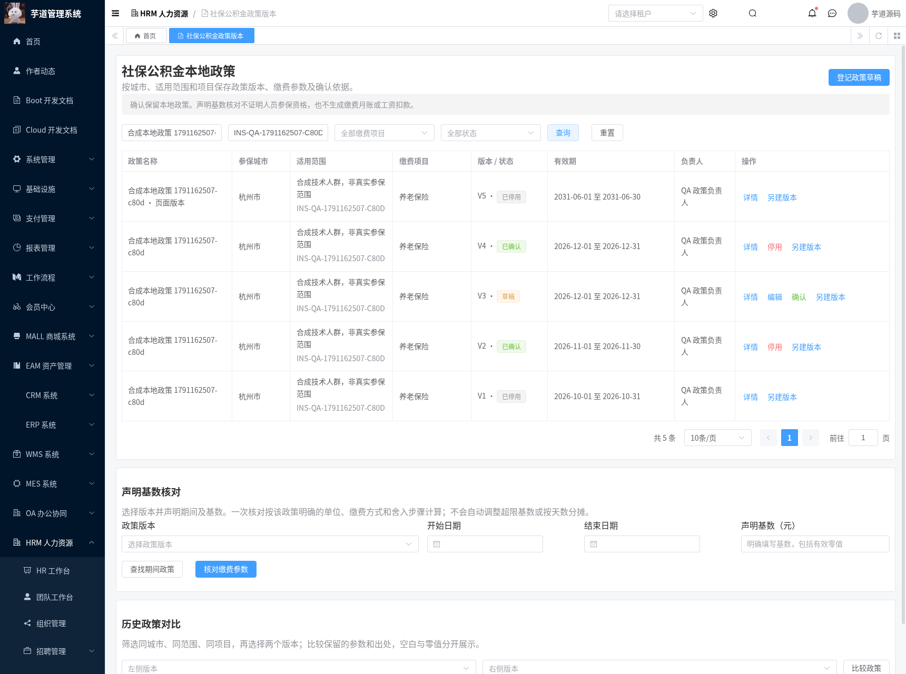
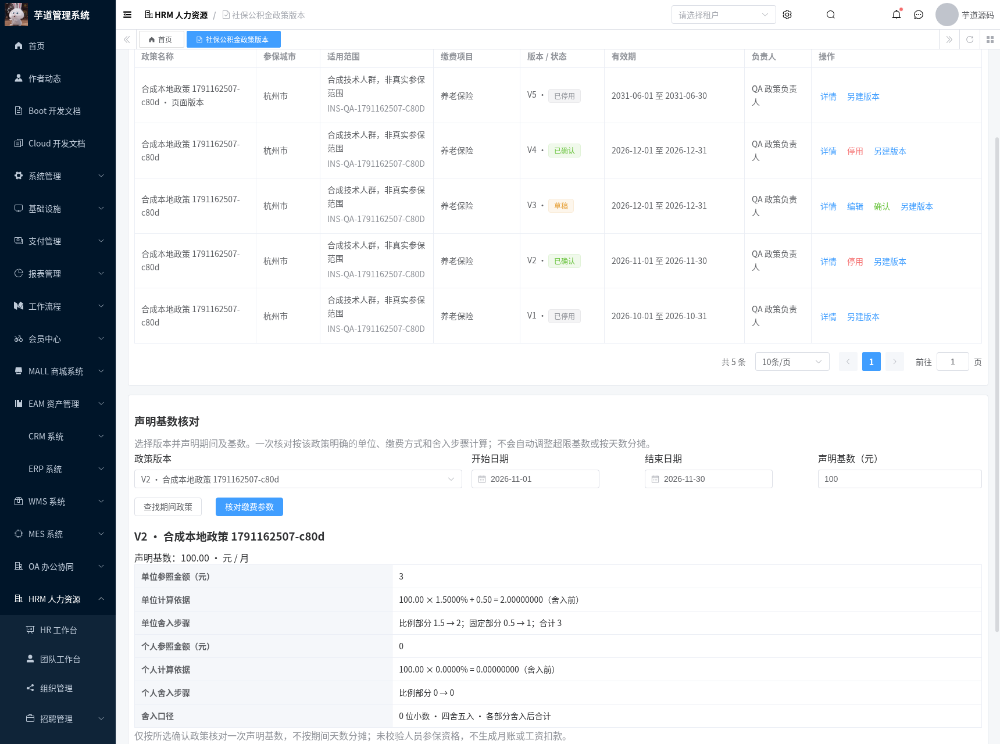
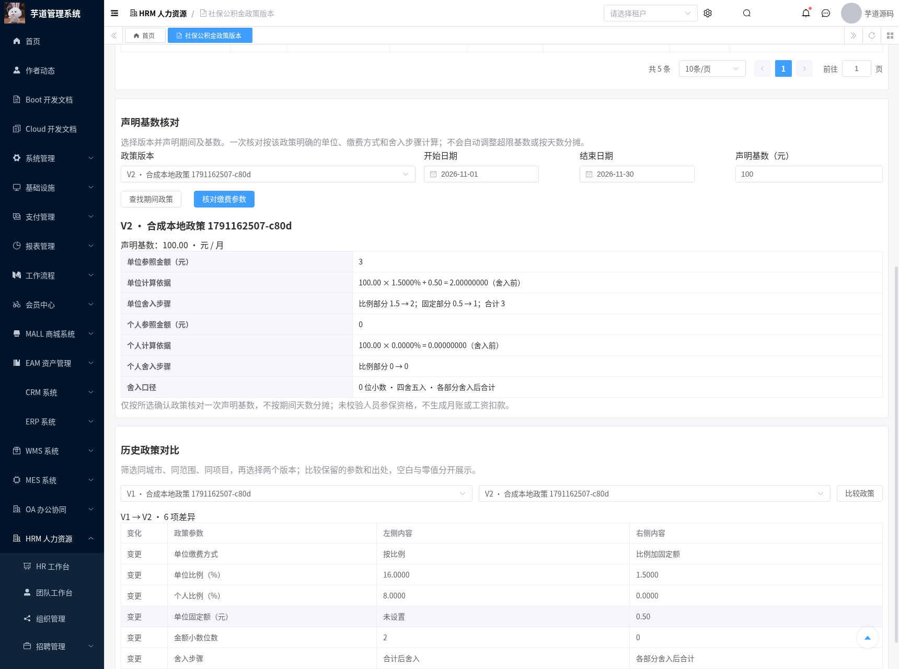
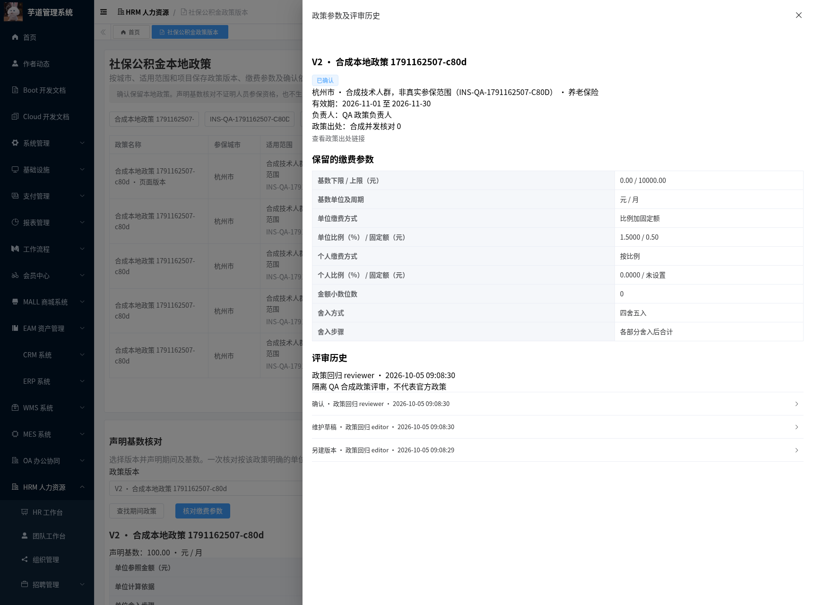
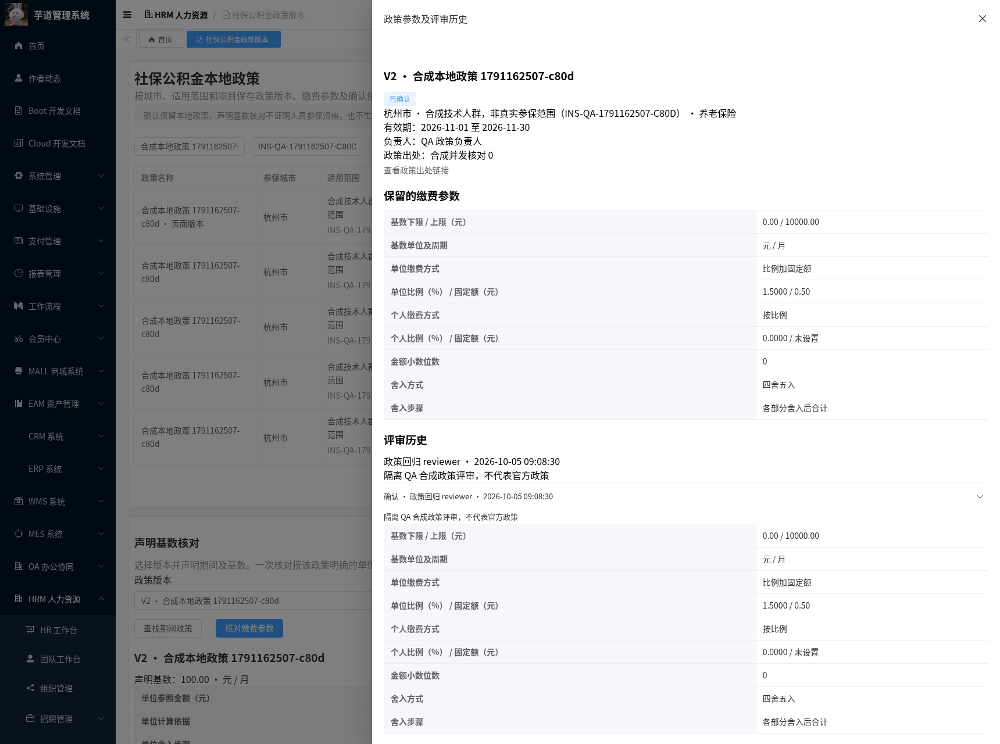
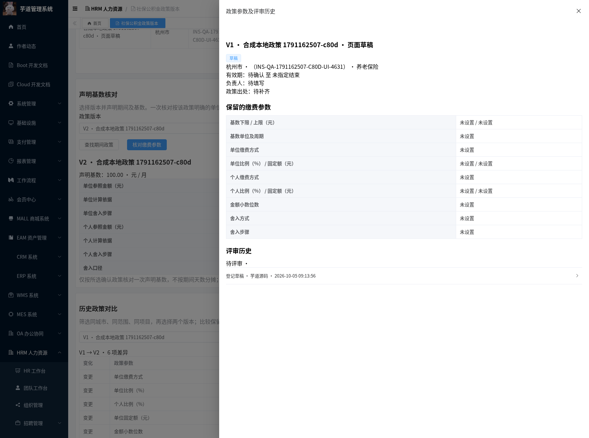
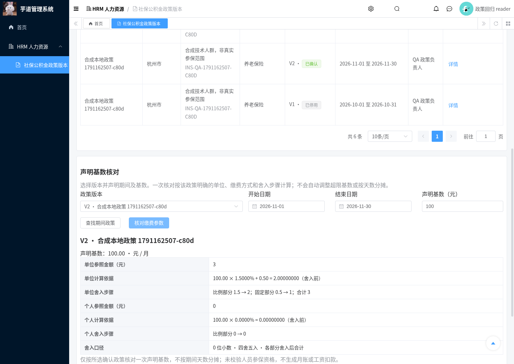

# 本地社保公积金政策交付记录

日期：2026-10-05。现有 HRM 参保方案已有比例和固定额，但缺少带基数上下限、有效期及确认依据的本地政策记录。本模块保存城市、范围和项目的政策版本，并按明确的缴费、精度和舍入参数核对一次声明基数。

## 功能与范围

页面 `/hrm/payroll-insurance-policies`，复用 HRM 分层、地区工具、既有 11 个缴费项目枚举、租户、权限、资料评审及 Vue3 管理端。新增一张 `hrm_payroll_insurance_policy` 表，不改现有参保方案、人员档案、缴费月账或工资计算服务。交付 T-25/INS-02 的本地政策版本及参数核对部分。

| 能力 | 实际行为 |
| --- | --- |
| 稳定身份 | 当前租户 + 城市 ID + 明确的适用范围编号 + 项目类型/编号；区县归属到城市；标准项目编号服务端确定，自定义项目须明确稳定编号 |
| 草稿 | 城市、项目、范围编号及名称必填；其余资料可待补齐，空值不填成零；城市、范围编号、项目身份固定 |
| 政策参数 | 上下限、单位/周期、单位及个人的比例/固定额、金额精度、舍入方式和步骤均明确保存 |
| 确认 | 必填范围说明、负责人、政策出处、开始日期、完整适用参数及评审证据；同一身份确认有效期不得重叠 |
| 另建版本 | 复制所选版本的参数和登记信息，递增版本号，重新记录创建人/时间，清空确认结论；独立编辑和评审 |
| 历史及停用 | 确认/停用版本不可编辑；停用保留参数和审计，不提供删除接口 |
| 期间选择 | 根据同系列任意保留版本查找单个完整覆盖声明期间的确认版本，不拼接相邻版本 |
| 参数核对 | 明确选择一个确认版本、起止日和基数；超限、停用、未确认或期间不符阻断，不自动调整基数 |
| 对比 | 保留版本之间比较参数及出处；空值、零值和零位精度分别显示；评审历史用中文动作及保留参数展示 |

适用范围编号由业务维护，用于区分实际人群、户籍、单位属性或其他缴费分类，不代表法人主体，也不自动证明人员资格。仅检测同一编号范围内的有效期冲突，不推断不同编号的人群是否重叠。个人参保档案、年度调基、补缴、实际缴费对账及工资/成本集成仍属于后续 T-26～28，未标为完成。

政策出处由授权人员核对。可登记 HTTP(S) 文档链接，不允许执行协议或嵌入登录信息；系统不抓取链接、填入原型倍率、检查其官方真实性或随网页更新覆盖历史。查询和核对使用已保留的本地参数，不依赖第三方标准网站正常返回。

## 参数及计算契约

金额和基数以元填写，比例为百分数，例如 8 表示 8%。输入金额最多 10 位整数、2 位小数；比例 0～100，最多 4 位小数；最终金额精度需明确选择 0～4 位。金额从输入、存储到 HTTP 响应均使用十进制数/字符串，前端不以浮点数计算缴费。

单位及个人分别明确选择：

- 按比例：声明基数 × 比例 ÷ 100；不填写固定额。
- 固定金额：采用明确填写的固定额；不填写比例。
- 比例加固定额：声明基数 × 比例 ÷ 100 + 固定额；两项都必填。

缺失的适用参数阻止确认，合法零值必须明确填写；不存在统一默认金额精度、倍率或舍入。基数上下限包含端点，超限直接返回错误，不截断到上下限。单位/周期可明确为元/月、元/年或一次声明。

舍入方式支持四舍五入、四舍六入五成双、向零及远离零。步骤须明确选择合计后舍入或各部分先舍入再合计。例如合成样例：基数 100、比例 1.5%、固定额 0.50、零位精度、四舍五入，合计后舍入为 2，各部分先舍入后合计为 3。**该例仅验证数学与程序行为，不是任何地区的真实政策。**

参数核对保留舍入前金额、表达式、逐项舍入步骤、所选政策 ID/版本及口径。例如页面明确显示“比例部分 1.5 → 2；固定部分 0.5 → 1；合计 3”，解释为何分项舍入与原始合计不同。按一次声明基数计算，不根据期间长度增加次数或按天分摊，不检查人员参保资格，不生成缴费月账、工资扣款或成本记录。本版本支持上述三类缴费表达式，复杂地区公式需另行明确和扩展。正式参数及预期结果仍由 HR/财务提供并核定，不以合成回归通过替代业务验收。

## 权限、租户与并发

新增 `hrm:payroll:insurance-policy:query`、`:maintain`、`:review`；查询允许读取本地政策及核对调用者明确声明的基数，维护和评审独立授权。页面用框架权限函数和 Vue 条件渲染隐藏操作，避免无权按钮被直接移除 DOM 后破坏只读列表刷新；浏览器逐行核对筛选响应与显示范围。本模块未读取旧参保方案或人员信息，政策查询权限不会授予这些旧接口权限。生产迁移不添加测试用户、不授予角色或初始化政策参数。

版本、分页总数、按 ID 详情、修改、评审、复制、对比、期间及核对均显式限定租户。身份元组形成 SHA-256，唯一索引为租户/身份/版本。首次登记由唯一索引约束并发；后续修改、版本分配及确认先锁定保留的首版本，再锁目标版本，核对修订号并在同系列锁下检查期间重叠。加锁查询不附带排序，避免现有租户 SQL 解析器对 `FOR UPDATE` 的重排问题。

闭区间有效期，结束可明确留空；次日衔接允许。技术日期范围 1000～9999 年，不据此定义工资或缴费周期。状态、租户、结构版本、版本号、评审人和时间由服务端维护。含政策/声明金额的接口关闭请求/响应访问日志；运行实例关闭 DAL DEBUG 参数日志。评审时间及历史统一使用框架时间序列化，前端按浏览器时区显示。

## 检出、升级及回退

分支 `feat/hrm-payroll-insurance-policies` 基于 `feat/hrm-payroll-scheme-versions`，包含此前文档、原始 HTML 及七个已交付模块。草稿 PR 未合并时，`master` 的 `git pull` 不会出现这些新增文件：

```bash
git fetch origin
git switch --track origin/feat/hrm-payroll-insurance-policies
```

按此前 [启动基础](./hrm-foundation-setup.md)、[需求征集](./hrm-payroll-requirements-module.md)、[数据接入](./hrm-payroll-intake-module.md)、[规则台账](./hrm-payroll-rules-module.md)、[准备总览](./hrm-payroll-preparation-module.md)、[人员映射](./hrm-payroll-identity-module.md) 和 [方案版本](./hrm-payroll-scheme-module.md) 准备环境。已有这些模块的数据库执行本次增量：

```bash
mysql --default-character-set=utf8mb4 -h localhost -u YOUR_USER -p YOUR_DATABASE \
  < sql/mysql/upgrade/20261005-hrm-payroll-insurance-policies.sql
mvn -B -ntp -Phrm -pl yudao-server -am verify
python3 script/hrm/apply-vue3-overlay.py ../yudao-ui-admin-vue3
```

前端受控增量位于 `yudao-ui/yudao-ui-admin-vue3`，完整基准 `yudaocode/yudao-ui-admin-vue3@0af03a93b6b6300f878e28add69b1c7a9f09ec34`，该增量目录不能单独安装启动。完整运行副本 `/workspace/.cloud-setup/ruoyi-vue-pro/frontend`，Vue3/TypeScript/Element Plus/Vite，3000 端口；JDK8 后端 48081，隔离 MySQL `hrm_payroll_collection_20261004b`。未迁移生产数据库或合并 PR，原始 HTML 未修改。

回退保留政策及评审表，恢复此前应用/前端，移除新增菜单授权；旧缴费及工资服务未引用此表，不需要撤销已有业务记录。

## 回归证据

```bash
bash script/hrm/verify-insurance-mysql.sh
python3 script/hrm/verify-insurance-api.py --allow-test-fixtures --output-dir /tmp/hrm-insurance
python3 script/hrm/verify-insurance-ui.py --allow-test-fixtures \
  --fixture-file /tmp/hrm-insurance/hrm-insurance-ui-fixture.json --output-dir /tmp/hrm-insurance-ui
```

API/UI 仅在预建合成身份的隔离 QA 库运行，API 要求库名以 `hrm_payroll_collection_` 开头。每次新建唯一合成范围和政策，不变更旧参保、人员、月账或工资数据。城市使用框架现有地区 ID，但政策值和范围全部为合成样例，不代表当地标准。浏览器真实操作保存、确认并停用额外合成版本；重复回归保留此前资料和历史。

合成角色：只读仅查询；editor 查询/维护；reviewer 查询/评审；另有无授权和租户 999 身份。导航需同时授予 HRM 父菜单及新查询菜单，不能只授予子权限。合成评审用户 970000003，昵称 `政策回归 reviewer`。测试身份由 QA 配置，生产迁移不包含这些授予操作。

API 从环境读取 `HRM_SMOKE_TOKEN`、`HRM_POLICY_{READER,EDITOR,REVIEWER}_TOKEN`、`HRM_UNGRANTED_TOKEN`、`HRM_TENANT_B_TOKEN`；UI 额外使用管理员及只读的刷新 token。凭据不提交、不打印。独立 MySQL 脚本新建网络隔离容器，重复迁移后检查三项权限、参数保留、租户/身份/版本唯一约束及中文/emoji。

| 检查 | 实测结果 |
| --- | --- |
| JDK8 HRM reactor verify | 1566 项，0 失败、0 错误，24 项原有跳过 |
| HRM | 698 项通过，含新增本地政策 23 项 |
| 真实 API/MySQL | 48 项通过，含精确金额、四种舍入、缺失/零值、并发、有效期、权限、租户及旧表校验值 |
| Chromium | 16 项通过，含真实城市选择、草稿/确认/停用、参数核对/对比、只读、390px 布局；无未捕获异常 |
| 原有基础 smoke | 13 项通过 |
| 独立 MySQL | 重复迁移、权限、历史保留、唯一约束及 Unicode 通过 |
| 完整前端 | vue-tsc 零错误，Vite 生产构建通过；类型检查与后端构建分开执行以控制内存 |

完整结果和原始截图在 `verification/hrm-payroll-insurance/`、`assets/hrm-payroll-insurance/`。截图来自真实 API/MySQL 和 Chromium，未经编辑、拼接或数据模拟；拍摄后会停用部分当时确认的合成版本。

## 实际截图
















