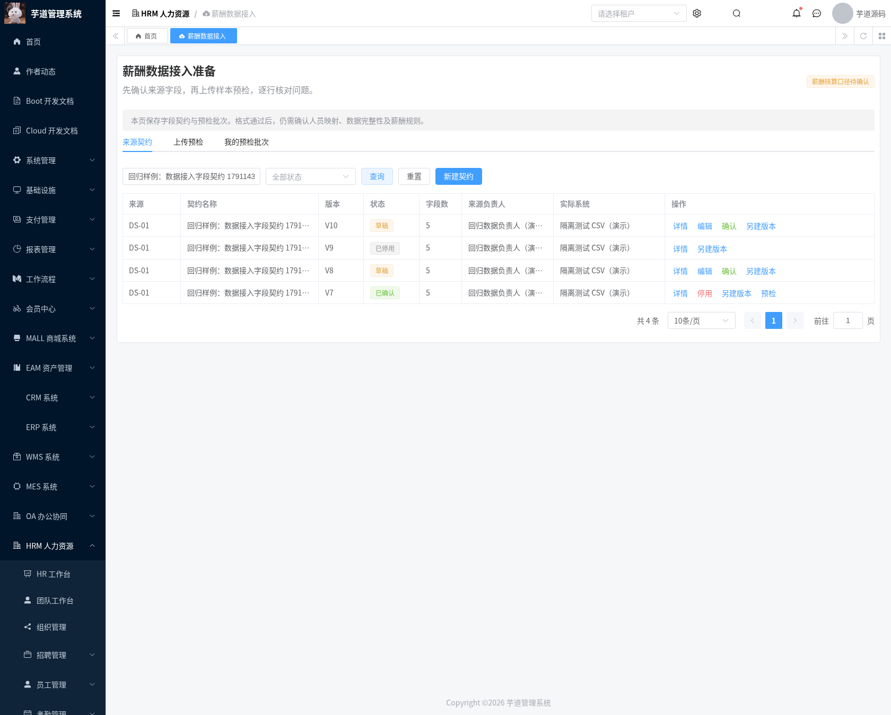
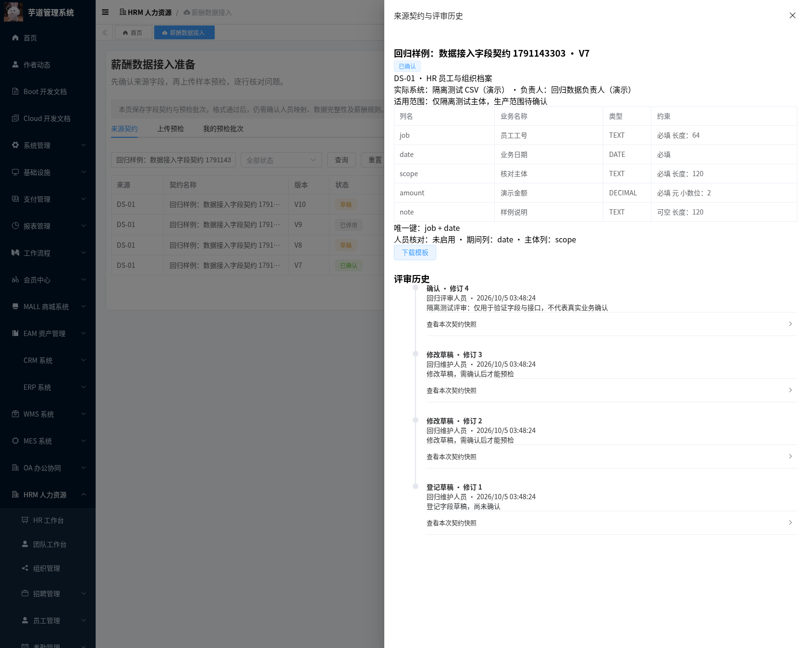
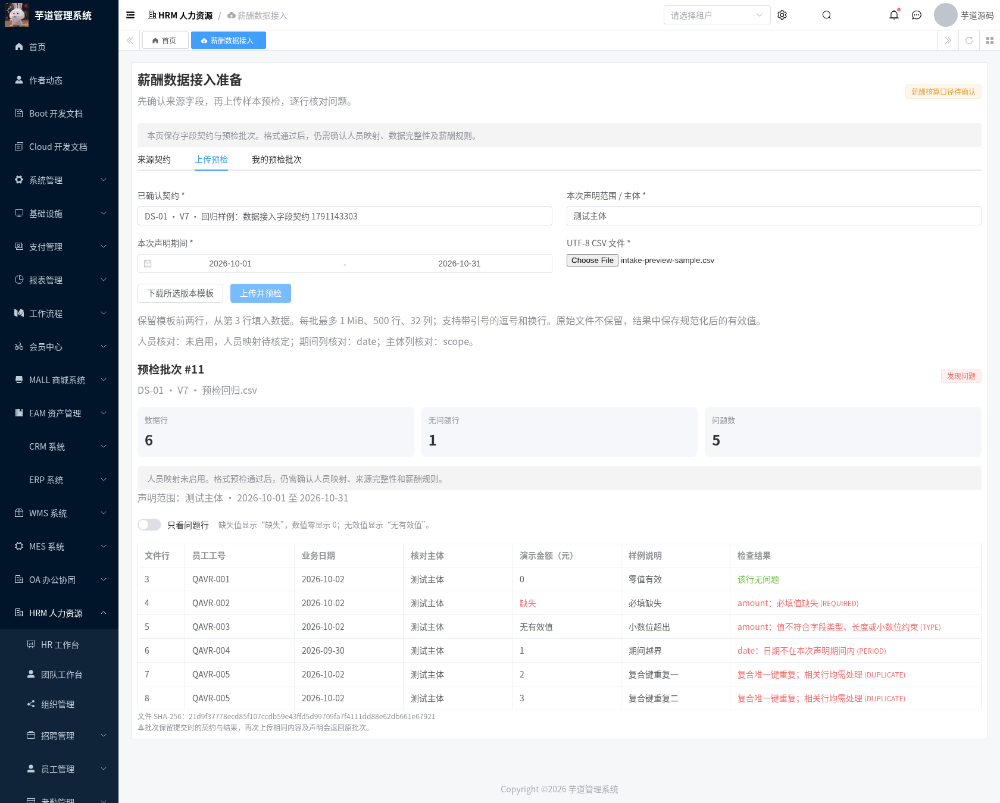
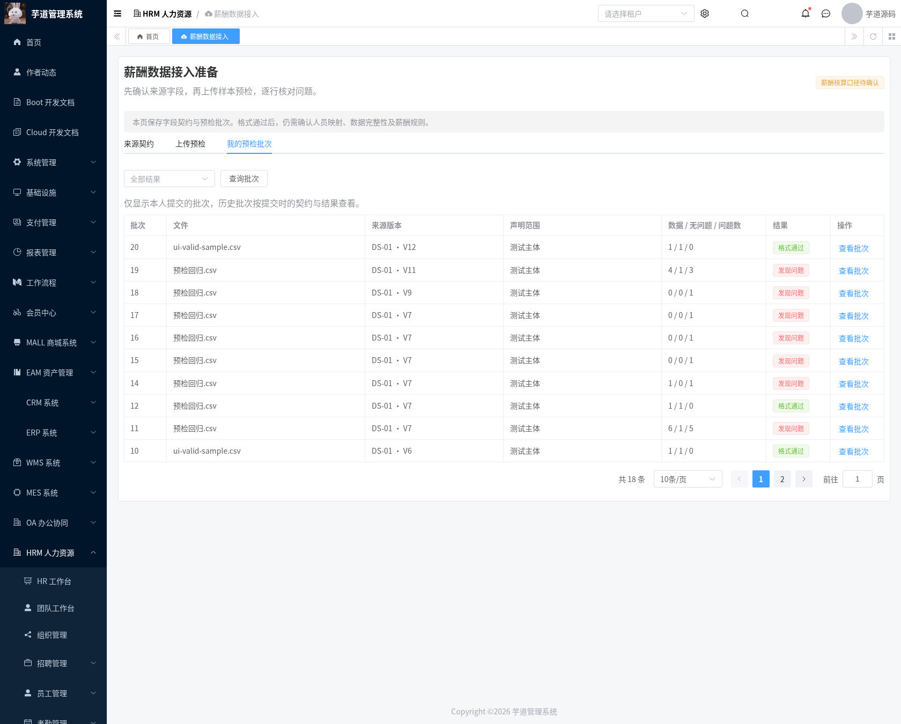
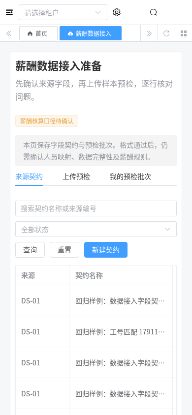
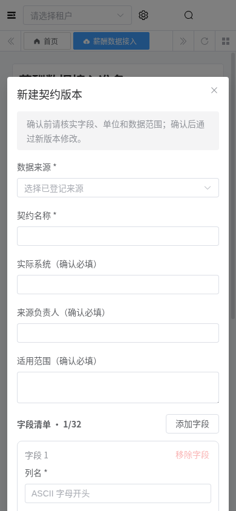

# 薪酬数据接入准备模块交付记录

日期：2026-10-04。基于需求征集模块，完成版本化字段契约、UTF-8 CSV 模板、逐行预检及不可变批次。后端沿用 Java 8 / Spring Boot / MyBatis Plus；前端沿用 Vue 3 / TypeScript / Element Plus / Vite。

## 功能与边界

此模块用于核对来源的结构和样本，覆盖路线图 T-03 / T-14 的准备工具。业务人员登记实际系统、来源负责人、适用范围和字段后，授权评审人填写依据并确认契约。确认只允许该版本接受预检，不会自动确认需求、标记来源完整或触发工资核算。未预置实际工资、倍率、税率或企业主体。

同一来源的契约版本由服务端在来源行锁下连续分配；版本内的草稿修订用于防止并发覆盖。草稿可编辑，确认后字段及元数据不可修改，只能另建草稿版本。停用需评审依据，停用后禁止新预检与模板下载；历史批次仍使用提交时的契约快照。创建、修订、确认、停用的操作者、时间、前后快照写入现有评审表。

每个契约包含 1–32 个字段、1–8 个必填字段组成的复合唯一键。字段类型为文本、整数、小数和日期。确认前，小数必须明确精度与单位，整数必须明确单位，文本必须明确最大长度。期间、主体与 HRM 工号列核对均由契约显式选择；未启用时页面如实显示，声明元数据仍保留。主体声明不等同于框架租户，也不建立正式法人实体。

模板使用 UTF-8 BOM，第一行为 `#hrm-payroll-contract,<契约ID>,<版本>`，第二行为登记列名，从第三行填写数据。列顺序可调整，列名集合须完整且无重复。单批最多 1 MiB、500 行、32 列；支持引号内的逗号、换行及双引号转义。模板没有伪造的业务金额。

预检将必填缺失与数值零分开处理：缺失显示“缺失”，零显示 `0`；不符合类型的值显示“无有效值”。采用 BigDecimal/BigInteger 校验，拒绝指数格式、公式、超精度或超小数位的数值，不自动舍入。技术精度上限为 18 位、小数位上限 8；日期为真实 `YYYY-MM-DD`。前后空白去除，文本工号保留前导零。复合键重复时所有相关行均标记问题，不保留最后一行覆盖前行。

选择日期校验字段时检查声明期间的闭区间；选择主体字段时与声明范围逐字核对。选择工号字段时要求额外的 `hrm:employee:query` 权限，仅查询当前租户的指定工号，未知或重复主档均返回问题。此处为当前工号核对，**不代替 T-13 的跨系统映射、历史组织快照及期间计薪资格**。

文件结构、编码和模板错误也保存为失败批次；超文件大小、声明期间颠倒等请求错误直接拒绝。原始文件不保留，批次保留文件 SHA-256、上下文、规范化后的有效值、逐行问题及契约快照。完全相同的文件、契约、声明和提交人返回原批次；改变文件内容、契约版本或声明会产生新批次。旧结果不会随主档变化而重新计算。

## 数据与权限

增量迁移：[20261004-hrm-payroll-intake.sql](../sql/mysql/upgrade/20261004-hrm-payroll-intake.sql)，依赖需求征集迁移。新增表：

| 表 | 用途与约束 |
| --- | --- |
| `hrm_payroll_source_contract` | 来源契约；租户、来源和版本唯一；确认后不可编辑 |
| `hrm_payroll_import_batch` | 本人预检批次；租户、提交人和幂等键唯一；快照使用 LONGTEXT |

契约元数据按租户共享给具有查询权限的用户。**批次的列表和详情限定当前提交人，包括具有全部菜单权限的管理员**。手写 ID、加锁及人员查询同时检查租户。普通请求/响应访问日志禁用批次接口的参数与结果；CSV 值不出现在契约评审记录中。批次没有修改、正式接收或删除接口；保留期限及受控清理机制须在真实数据接入前确认。此模块未宣称完成整个 HRM 的部门/员工薪资授权任务 T-07。

接口前缀为 `/admin-api/hrm/payroll/intake`，提供 `sources`、`contracts/page/get/create/update/review/history/template` 和 `batches/preview/page/get`。批次日期以 ISO 字符串输出，避免前端将日期显示为数组。

| 权限 | 功能 |
| --- | --- |
| `hrm:payroll:intake:query` | 页面、来源选项、契约及历史、模板和本人批次 |
| `hrm:payroll:intake:contract` | 新建版本与草稿编辑 |
| `hrm:payroll:intake:confirm` | 确认和停用，必须填写依据 |
| `hrm:payroll:intake:preview` | 上传并保存预检结果 |
| `hrm:employee:query` | 契约启用工号核对时，额外验证人员查询权限 |

迁移仅登记四个菜单/按钮权限项，不自动给生产角色授权。上传人员同时需要查询权限才能读取结果。菜单为 `/hrm/payroll-intake`，组件为 `hrm/payroll/intake/index`。

## 检出、升级与运行

分支 `feat/hrm-payroll-intake` 基于 `feat/hrm-payroll-requirements`，包含此前的 PRD、原始 HTML、启动基础和需求征集代码。PR 尚未合并时，`master` 的 `git pull` 不会出现这些文件：

```bash
git fetch origin
git switch --track origin/feat/hrm-payroll-intake
```

已完成前两模块的数据库只需新增此迁移。新库先按 [启动基础说明](./hrm-foundation-setup.md) 初始化 system/infra、HRM/BPM，再依次应用需求征集与数据接入迁移。不要把带 DROP TABLE 的主库初始化 SQL 用于已有库。

```bash
mysql --default-character-set=utf8mb4 -h localhost -u YOUR_USER -p YOUR_DATABASE \
  < sql/mysql/upgrade/20261004-hrm-payroll-intake.sql
mvn -B -ntp -Phrm -pl yudao-server -am verify
java -jar yudao-server/target/yudao-server-hrm.jar --spring.profiles.active=local
python3 script/hrm/apply-vue3-overlay.py ../yudao-ui-admin-vue3
```

完整前端基准和安装、代理配置见 [需求征集交付记录](./hrm-payroll-requirements-module.md)。后端仓库 Vue3 目录是受控增量，不能单独安装启动。本次完整运行目录为 `/workspace/.cloud-setup/ruoyi-vue-pro/frontend`，前端 3000、后端 48081；仅使用隔离验证库和合成样本，未迁移生产数据。

回退时恢复此前应用/前端并移除新增权限；两张表保留以保证审计与历史恢复。重复迁移不会覆盖已有记录，也不会修复与定义不一致的同名表，应先备份并比对结构。

## 可复现验证

独立 MySQL 检查创建临时 `--network none` 容器，用真实 system_menu 定义校验增量迁移重复执行、四个权限项、租户/版本/提交人唯一约束和大于 65,535 字节的 Unicode 快照。API 与 UI 检查需要显式允许测试样例，只能用于隔离库。

```bash
bash script/hrm/verify-intake-mysql.sh
python3 script/hrm/verify-intake-api.py --allow-test-fixtures --output-dir /tmp/hrm-intake
python3 script/hrm/verify-intake-ui.py --allow-test-fixtures \
  --fixture-file /tmp/hrm-intake/hrm-intake-browser-fixture.json \
  --output-dir /tmp/hrm-intake
```

API 脚本从环境读取六类身份的令牌，名称与征集脚本一致，不打印令牌。租户 1 的 reader 仅查询，editor 查询/维护/预检，reviewer 查询/确认；无授权身份不赋权。租户 999 用户有自身租户权限但没有候选来源。UI 还需要 `HRM_REFRESH_TOKEN`、`HRM_READER_REFRESH_TOKEN`、Python Playwright 和已安装的 Chromium。

工号校验合成主档限定验证库：`920000001 / QAVR-INTAKE-KNOWN` 在租户 1；`920000002` 与 `920000003` 在租户 1 共用 `QAVR-INTAKE-DUP`；`920000004 / QAVR-INTAKE-OTHER` 在租户 999。其余字段不使用真实员工资料。这些是测试前置数据，不是产品初始化数据，迁移文件不插入任何员工。API 脚本每次创建新契约版本，UI 使用该次 fixture 定位版本并创建自己的合成草稿，不覆盖前次结果。

合成员工前置数据可从 [intake-employee-fixtures.sql](../script/hrm/intake-employee-fixtures.sql) 应用到隔离库；保留 ID 如已存在须先检查，脚本不覆盖已有记录。角色通过现有权限管理配置，不使用产品迁移自动授权。

回归结果和实际页面截图随本模块提交到 `docs/verification/hrm-payroll-intake/` 与 `docs/assets/hrm-payroll-intake/`。正式人员映射、来源截止/刷新完整性、真实规则和核算接受步骤仍属于后续任务。

| 检查 | 实测结果 |
| --- | --- |
| JDK 8 `-Phrm` reactor verify | 1481 项，0 失败、0 错误；24 项为原有跳过项 |
| HRM 测试 | 613 项全部执行通过；新增 CSV 与服务层 24 项 |
| MySQL 8.0.46 增量检查 | 两表、重复迁移保留数据、四个权限项、版本/提交人唯一约束、Unicode LONGTEXT 通过 |
| 实际 API / MySQL | 46 项通过，含并发、模板版本、所有权、跨租户、工号异常、冻结结果及 ISO 日期 |
| 原有基础 smoke | 13 项通过 |
| Chromium 页面回归 | 13 项通过，含复制/编辑/评审、真实下载上传、错误筛选、停用后历史、只读权限、移动布局 |
| 完整前端 | vue-tsc 零错误；Vite 生产构建通过 |

浏览器检验发现并修正了批次期间日期的数组展示，服务层序列化断言与实际接口回归已覆盖。截图均为真实浏览器的原始输出，样例标明“回归/演示”，不代表业务正式确认。

## 实际页面截图












