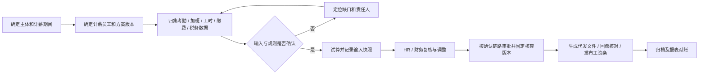

# HRM 薪酬管理与需求征集 PRD

实现进展（2026-10-05）：[PRD 与提交记录审计](./hrm-payroll-delivery-audit.md)保留截至 `9f9da10b04` 的 8 个技术模块及 43 个业务功能 / 52 项任务的历史评估。此后新增[薪酬 CI](./hrm-payroll-ci-module.md)和[规则表达式与核对](./hrm-payroll-calculation-module.md)，提供自动回归、明确输入执行、依赖排序、精度解释与版本对比；T-20 为部分完成，尚未接入正式工资输入及月账。新增[计薪人员资格与期间](./hrm-payroll-eligibility-module.md)提供声明主体/人员的明确纳入与排除、有限有效期、人员快照变化阻断和组合权限核验；T-13 仍为部分完成，正式主体目录与历史归属尚待业务确认。交付尚未合并 master，正式工资业务闭环未完成。2026-10-07 用户授权按行业惯例补充未明确需求，本稿 v0.2 作为研发实施基线；具体企业政策、人员和金额由运行配置及确认记录提供。

| 项目 | 内容 |
| --- | --- |
| 版本 / 日期 | v0.2 / 2026-10-07 |
| 文档状态 | 研发实施基线：用户授权行业惯例推定；实际业务数据和正式政策由运行配置登记 |
| 目标系统 | 芋道 HRM 薪酬管理模块 |
| 配套原型 | [薪酬管理模块原型.html](./薪酬管理模块原型.html)，保留用户上传原文件 |
| 开发任务与路线图 | [基于现有芋道架构的实施建议](./hrm-payroll-development-plan.md)，含任务、依赖、验收及分阶段路线 |
| 需求来源 | 业务人员与豆包的沟通、本次聊天截图、用户上传的原始 HTML 及用户说明 |
| 原始链接 | <https://www.doubao.com/thread/xTzUUSbofAsUSFz1A> |

## 1. 来源、证据与确认边界

### 1.1 业务人员的原始诉求

截图可见的业务提问为：

> 人力资源系统当中，薪酬管理模块，结合相关的管理要素，例如考勤、加班、工时、社保公积金标准等，系统的制作出应用页面，以便以此为模版征集相应的功能需求和数据源需求。

据此，业务明确提出：以薪酬管理应用页面为模板，系统梳理关联业务要素，并征集功能需求与数据源需求。

### 1.2 证据分级

| 来源 | 已知内容 | 本文处理方式 |
| --- | --- | --- |
| S1：截图中的业务原话 | 薪酬管理、考勤、加班、工时、社保公积金标准；页面用于征集功能与数据源需求 | 作为业务目标和范围依据 |
| S2：用户上传的 HTML | 10 个视图、9 个模块征集面板中的 43 个功能点、数据源清单、总览和示例业务数据 | 逐项整理到本 PRD；其预设状态不作为实际评审结论 |
| S3：用户在本次聊天的指令 | 整理并提交 PRD/HTML；逐模块编码、回归、截图、提交；未明确需求按行业惯例推理补充 | 作为交付要求及 v0.2 研发实施授权 |
| S4：当前仓库源码 | 已有 HRM 薪资、考勤、社保、工资条相关对象与控制器 | 作为研发复用线索，不作为上线能力证明 |

本稿已经阅读用户上传的原始 HTML，未取得完整豆包对话。HTML 原样保存在 `docs/薪酬管理模块原型.html`，大小为 65,819 字节，SHA-256 为 `6898065e01c0e38f35bbb09a65184bc385b2e2e10334c1f80bca74b188908839`。原型之外的字段、流程约束、权限与校验按 v0.2 行业惯例补充实施；第 10 节保留原待明确问题及其历史背景，当前可配置推定口径见第 12 节。

原型中的“已确认 / 待确认 / 有异议”、高 / 中优先级、“已梳理 35%”和业务统计均是文件内的预设内容，不能证明业务人员已完成确认。原型中的表单、核算、同步、提交、生成、导出等按钮主要显示演示提示，没有真实业务提交、存储或导出能力。交互边界见第 9 节。

## 2. 产品目标与交付范围

### 2.1 产品目标

让 HR、财务、业务主管与 IT 能够对照页面，逐项确认“需要什么功能、依赖哪些字段、数据从哪里来、按什么口径处理、谁负责确认”，形成可交给研发实施的需求清单。

评审完成标准：

1. 10 个建议视图均能被评审，页面与需求编号可以互相定位。
2. 每个拟纳入实施范围的需求都有功能说明、字段、来源系统、来源负责人、优先级、业务确认状态与验收条件。
3. 核算口径具有适用主体、适用员工、有效期、版本和业务确认依据。
4. 数据未就绪、规则未确认、重复数据等问题能被识别并分配责任人。
5. 征集清单能够导出，作为后续评审和研发排期的输入。

### 2.2 本次交付与未来实施

| 阶段 | 交付内容 | 验收方式 |
| --- | --- | --- |
| 本次文档与原型 | 本 PRD、上传的原始 HTML；10 视图、静态需求清单、示例数据与演示交互 | 核对原文件一致性、页面切换与实际交互；业务对照文档评审 |
| 业务确认 | 数据源负责人确认、规则确认、范围取舍、权限及流程确认 | 完成第 10 节问题清单并形成评审记录 |
| 正式系统实施 | Vue3 / Element Plus 页面、接口、数据接入、真实核算及工资条流程 | 按确认后的需求基线及验收场景实施 |

银行代发文件及回盘、个税申报数据导出、员工工资条及多渠道推送均已出现在原型功能清单中，应作为候选需求保留。接入银行支付、税务申报平台、邮件 / 短信服务和生产数据的具体边界须另行确认；本次 HTML 不执行这些外部操作。

## 3. 角色与核心使用场景

以下角色及职责为建议，授权范围需在业务评审时确认。

| 角色 | 主要任务 | 建议数据范围 |
| --- | --- | --- |
| HR 薪酬专员 | 薪酬方案、计薪人员、考勤与社保对账、工资试算、需求录入 | 获授权的主体、组织及员工 |
| 财务人员 | 金额复核、个税口径、成本报表、核算确认 | 获授权的工资批次与财务字段 |
| 部门主管 | 确认考勤、加班、工时异常及来源 | 本部门或项目 |
| 员工 | 查看本人已发布工资条、提出异议 | 本人工资条；是否提供入口待确认 |
| 系统管理员 / IT | 数据映射、导入、集成、角色配置与审计 | 按授权操作，薪资明文访问单独控制 |
| 需求负责人 | 协调 HR / 财务 / IT 评审、确认范围及优先级 | 需求清单与评审记录 |

核心场景：

1. **功能征集**：评审人员进入模块，对照原型的静态清单确认功能与数据来源；后续正式征集能力应支持录入、补充、状态维护与导出。
2. **月度核算准备**：HR 选主体、期间和计薪人员，检查考勤、加班、工时、薪酬方案、社保及税务数据是否就绪，定位缺口。
3. **核算与复核**：在确认规则下试算，查看每个金额的来源和调整记录；复核后形成版本及工资条。
4. **异常处理**：来源记录缺失、重复或跨期时，展示受影响员工和责任人；补正后重新核算，保留前后版本。

## 4. 信息架构与页面需求

### 4.1 正式系统统一页面约定（评审建议）

- 页头提供主体、薪资期间、部门和人员关键字筛选；筛选影响业务明细及相关统计。
- 表格提供金额单位、工时单位、来源状态与空结果提示；移动端可横向查看宽表。
- 原型中 9 个业务模块均展示“需求征集 · 本模块”面板，第 10 个视图为征集总览。面板为静态内容；以下筛选、编辑、权限和留痕约定是正式系统的评审建议。
- 原型征集状态为：已确认、待确认、有异议；原文件中不能交互修改。正式功能应补充确认人、时间、依据，是否增加评审中 / 暂缓状态由业务确认。
- 数据源单独记录就绪情况，避免将“功能已确认”误认为“数据已可用”。
- 正式系统中的新增、编辑、导出、核算、发布操作须进行权限检查并记录操作者与时间。

### 4.2 模块清单

原型的“高 / 中”是预设优先级，最终需业务确认；本文未据此直接排定研发优先级。附录 A 给出 43 个原型功能点的编号及原文。

| 视图 / 原型锚点 | 功能编号 | 页面内容与候选功能 | 主要数据依赖 | 原型优先级 / 待确认事项 |
| --- | --- | --- | --- | --- |
| 薪酬总览 `#overview` | OV-01～04 | 应发 / 实发 / 法定成本 / 个税、历史期间、归集完成度、核算待办及异常提醒 | DS-01、DS-02、DS-03、DS-04、DS-05、DS-06、DS-07 | 高；汇总与成本口径、就绪及阻断条件 |
| 薪酬方案 `#plan` | PLAN-01～04 | 薪资项目规则、薪级薪档、定薪 / 调薪审批、生效追溯、版本对比 | DS-01、DS-05、DS-09 | 高；职级、绩效、补贴、月中变更及版本 |
| 工资核算 `#calc` | CALC-01～05 | 草稿→试算→审批→发放→归档、公式引擎、异常拦截、银行代发文件及回盘、工资条 | DS-01 至 DS-07、DS-09、DS-12 | 高；审批角色、重算、银行模板及回盘匹配 |
| 个税与工资条 `#tax` | TAX-01～05 | 累计预扣、专项附加扣除、工资条模板及自助 / 邮件 / 短信、申报数据导出、年终奖单独计税 | DS-05、DS-06、DS-07、DS-11、DS-12 | 高；累计口径、年终奖适用政策、推送渠道 |
| 考勤数据 `#attendance` | ATT-01～05 | 日 / 月归集、请假 / 出差 / 外出 / 补卡关联、迟到早退缺勤判定、异常闭环、工资联动 | DS-01、DS-02、DS-03 | 高；考勤周期、异常判定及工资影响 |
| 加班管理 `#overtime` | OT-01～05 | 申请审批、打卡核实、时薪 / 倍率、工资联动、调休 / 补休、合规上限提醒 | DS-01、DS-02、DS-03、DS-04、DS-05 | 中；认可时长、补休、跨期与上限规则 |
| 工时管理 `#hours` | HOUR-01～05 | 标准 / 综合 / 不定时工时适用、周期结算、报表及异常、工资联动、排班对账 | DS-01、DS-02、DS-04 | 中；制度适用依据、周期、加班 / 扣款口径 |
| 社保公积金 `#insurance` | INS-01～05 | 基数申报 / 年度调基、城市政策、个人扣款、单位成本、月度台账及对账 | DS-01、DS-06 | 高；城市、有效期、上下限、比例与补缴 |
| 报表分析 `#report` | RPT-01～05 | 部门 / 成本中心 / 项目分摊、人力成本率 / 人均指标、结构分析、预算对比、导出 | DS-01、DS-05、DS-06、DS-10 | 中；分摊、营收 / 预算、编制与导出格式 |
| 需求征集总览 `#req` | COL-01～03（正式征集建议） | 汇总功能与来源、维护确认 / 异议及依据、补充需求与导出；原型为静态 9 行汇总 | DS-08 | 待定；负责人、评审记录、清单版本 |

### 4.3 正式需求征集能力（新增评审建议）

| 编号 | 功能 | 验收要点 |
| --- | --- | --- |
| COL-01 | 按模块汇总功能及数据源，关联附录 A 的编号 | 所有候选点可定位；新增点有唯一编号与来源 |
| COL-02 | 维护确认 / 待确认 / 异议，记录确认人、时间、依据及未决问题 | 状态变化可追溯；异议有说明与责任人；数据就绪单独记录 |
| COL-03 | 补充字段映射、负责人、优先级与导出评审清单 | 导出包含版本、状态、功能及数据来源；无遗漏和未经确认的默认值 |

## 5. 数据源与字段字典

### 5.1 数据源需求清单

以下系统名称是候选来源类别，尚未确定实际系统、接口、文件模板或责任人。

| 编号 | 候选来源 | 必要字段示例 | 获取方式建议 | 更新 / 质量要求 | 确认方 |
| --- | --- | --- | --- | --- | --- |
| DS-01 | HR 员工与组织档案 | 员工唯一编号、主体、部门、入离职日期、计薪资格 | 已有 HRM 数据或经授权导入 | 按有效期取档案；唯一编号不重复 | HR |
| DS-02 | 考勤系统 | 员工编号、周期、班次、应出勤、实出勤、请假、缺勤、异常状态 | HRM 统计接口或模板导入 | 明确截止时间；单位一致；异常可定位 | HR / 考勤管理员 |
| DS-03 | OA 加班 / 请假审批 | 单据编号、员工、起止时间、审批状态、认可时长、补休状态 | 审批接口或确认清单 | 仅纳入符合确认条件的单据；可去重 | 业务主管 / OA 负责人 |
| DS-04 | 工时制度与排班系统 | 员工制度类型、适用有效期、结算周期、排班、实际工时、差异 | 制度档案、排班 / 考勤接口或模板导入 | 标准 / 综合 / 不定时工时分别校验；与加班及考勤对账 | 部门主管 / HR / IT |
| DS-05 | 薪酬方案与员工薪资档案 | 方案版本、适用人员、薪资项、金额 / 单价、有效期 | HRM 薪资配置或确认清单 | 核算取对应版本；变更留痕 | HR / 财务 |
| DS-06 | 社保公积金政策与缴费台账 | 地区、项目、有效期、基数上下限、个人 / 单位比例、实际缴费额 | 业务维护、台账导入 | 标准有出处及确认人；历史版本可追溯 | HR / 财务 |
| DS-07 | 税务及扣除资料 | 纳税主体、年度、本年累计应税收入、已扣税额、专项扣除 | 经授权申报资料或模板导入 | 明确累计起点、员工匹配与缺失处理 | 财务 |
| DS-08 | 业务需求征集 | 需求编号、模块、功能、字段、来源、负责人、优先级、状态、备注 | 评审人员录入 | 可版本化导出；正式确认附评审依据 | 需求负责人 |
| DS-09 | 绩效考核与薪级标准 | 绩效周期、基数、系数、职级 / 薪档、岗位系数、补贴标准 | 薪级表及绩效确认结果 | 周期与生效版本明确；金额 / 系数含业务确认依据 | HR / 业务主管 |
| DS-10 | 财务预算与成本数据 | 部门 / 成本中心 / 项目、营收、预算、编制人数、分摊比例 | 财务确认台账或接口 | 报表维度、期间与分摊比例一致；总额可对账 | 财务 |
| DS-11 | 员工自助与联系方式 | 员工编号、接收渠道、邮箱 / 手机、工资条可见字段、投递结果 | 已授权员工档案及消息服务 | 员工匹配、渠道授权、失败与重发规则明确 | HR / IT |
| DS-12 | 银行代发与回盘 | 批次、员工、账户、应付金额、文件格式、回盘状态、失败原因 | 银行代发文件与回盘模板 | 数据范围和脱敏有授权；账户匹配、金额及回盘可对账 | 财务 / IT |

建议统一导入字段包括 `sourceSystem`、`sourceRecordId`、`importBatchId`、`receivedAt`、`effectiveFrom`、`effectiveTo`、`confirmedBy` 与 `confirmedAt`。是否增加字段及其存储位置由后续设计确认。

### 5.2 核心业务对象

| 对象 | 关键字段 / 单位 | 约束建议 |
| --- | --- | --- |
| 薪资期间 / 批次 | 主体、年月、计薪起止日、批次编号、状态、版本 | 相同主体与期间的补发 / 多批次规则需确认 |
| 人员计薪记录 | 员工编号、历史部门、方案版本、应出勤 / 实出勤天数 | 天数精度与入离职折算规则待确认 |
| 薪资项 | 编码、名称、类别、金额（元）、来源、公式版本 | 固定、浮动、扣减、免税等类别由业务定义 |
| 核算结果 | 应发、个人社保、个人公积金、个税、其他扣减、实发、单位社保、公积金成本 | 金额采用精确定点数；各项舍入顺序需确认 |
| 原始输入快照 | 考勤、加班、工时、扣除、规则版本、调整理由 | 重算保留输入与结果版本；标识使用的来源记录 |
| 征集需求 | 编号、模块、功能、字段、来源、来源负责人、评审负责人、优先级、状态、备注、验收条件 | 状态与数据就绪情况分别记录 |

### 5.3 数据质量与异常处理

- 导入前校验员工匹配、主体 / 周期、日期范围、金额 / 时长单位和必填字段。
- 重复记录报告来源编号与导入批次；补正须选择覆盖、跳过或新版本，不得静默重复累计。
- 数据缺失时标记“待补齐”；真实核算不得默认为金额或时长为零，除非业务明确允许。
- 源数据修改后标记受影响工资批次；是否自动重算、是否需要解除冻结由业务确认。
- 员工调动、跨主体、入离职、跨期单据和负数调整必须单独评审。

## 6. 核算口径与业务流程

### 6.1 金额展示关系

以下是供评审的展示关系，不是已经确认的薪酬或税务算法：

```text
应发 = 经确认的固定薪资项 + 浮动薪资项 + 补贴 / 加班等应发项
实发 = 应发 - 个人社保 - 个人公积金 - 个税 - 经确认的其他扣减
工资成本 = 应发 + 单位社保 + 单位公积金 + 经确认的其他单位成本
```

请假 / 缺勤、工时、绩效、补休及月中调薪应如何进入上述项，由业务确认后配置。个税需确认累计口径、扣除资料与适用规则。政策基数、比例、倍率与税额不得仅据原型示例直接投入正式核算。

原型中的金额、比例、税额、员工和审批单据均按示例处理。原文件展示时薪折算、加班倍率、累计预扣与缴费基数 / 比例，具体公式常量均须业务核定；页面中的金额没有通过按钮动态计算。汇总图、表格之间也未建立可核对的真实数据链路，应在正式实现中统一口径。

### 6.2 建议正式核算流程



原型列出的批次生命周期为“草稿→试算→审批→发放→归档”。固定核算版本、冻结、解除冻结及变更留痕为本文补充建议。最终审批顺序、补发、撤销发布与反核算处理在 Q-06 确认。

### 6.3 征集流程

```text
浏览模块 → 编辑 / 补充需求 → 填写功能和数据来源 → 分配负责人
→ 业务评审 → 标记确认 / 暂缓 → 导出范围清单 → 形成研发需求基线
```

原始 HTML 没有编辑存储、导入或真实导出功能。现阶段评审意见须另行记录；正式需求征集功能应支持状态维护、来源负责人、问题记录、版本与导出，格式由业务确认。

## 7. 非功能要求（建议）

| 类别 | 要求 |
| --- | --- |
| 权限与数据范围 | 正式实现复用租户 / 主体 / 部门权限；薪资查看、修改、导出和核算分别授权；服务端校验数据范围 |
| 操作留痕 | 核算、调整、规则变更、工资条发布及导出记录操作人、时间、理由与对象 |
| 精度与可追溯 | 金额采用精确定点数；时间精度、舍入规则由业务确认；结果能定位到来源记录与规则版本 |
| 并发与幂等 | 相同批次并发核算需控制；导入、核算、发布不得因重复请求形成重复业务记录 |
| 可用性 | 加载、无数据、接口失败、数据缺口各有明确状态；长时间操作显示进度或结果 |
| 桌面与移动 | 桌面展示完整表格，移动端菜单可收起，表格允许横向滚动，需求表单可操作 |
| 性能 | 数据规模、峰值并发、报表响应及导出耗时目标在 Q-12 确认 |

## 8. 当前仓库复用与实施约束

以下结论来自当前仓库 `1697112f1164b206aeb031493980f5cb3a6e2cd5` 的静态阅读。

| 领域 | 现有源码 | 复用线索 |
| --- | --- | --- |
| 月度工资表 | [HrmSalaryMonthRecordDO](../yudao-module-hrm/src/main/java/cn/iocoder/yudao/module/hrm/dal/dataobject/salary/monthrecord/HrmSalaryMonthRecordDO.java) | 周期、员工数、应发 / 实发、税额、个人 / 单位缴费、薪资项表头快照 |
| 员工工资记录 | [HrmSalaryMonthEmployeeRecordDO](../yudao-module-hrm/src/main/java/cn/iocoder/yudao/module/hrm/dal/dataobject/salary/monthrecord/HrmSalaryMonthEmployeeRecordDO.java) | 员工、应 / 实工作天数、应税工资、薪资项值快照 |
| 工资核算入口 | [HrmSalaryMonthRecordController](../yudao-module-hrm/src/main/java/cn/iocoder/yudao/module/hrm/controller/admin/salary/HrmSalaryMonthRecordController.java) | 创建、核算、带导入核算、考勤 / 个税模板、核算准备情况、汇总 |
| 考勤 | [HrmAttendanceStatisticsService](../yudao-module-hrm/src/main/java/cn/iocoder/yudao/module/hrm/service/attendance/statistics/HrmAttendanceStatisticsService.java) | 月度统计复用候选；需核对工资口径 |
| 社保配置 | [HrmInsuranceSchemeProjectDO](../yudao-module-hrm/src/main/java/cn/iocoder/yudao/module/hrm/dal/dataobject/insurance/config/HrmInsuranceSchemeProjectDO.java) | 缴费基数、个人 / 公司比例和金额 |
| 工资条 | [HrmSalarySlipController](../yudao-module-hrm/src/main/java/cn/iocoder/yudao/module/hrm/controller/admin/salary/HrmSalarySlipController.java) | 工资条分页、详情及备注 |

当前默认启动配置只启用 system / infra；[yudao-server/pom.xml](../yudao-server/pom.xml) 中 HRM 依赖仍被注释。本次服务启动验证不能证明 HRM API 可用。正式实施前须确认启用 HRM 所需依赖、数据库表、菜单权限与样例测试。

当前工资表枚举为“未核算 / 已归档 / 已核算”。本文的复核、冻结、发布等流程是待确认的业务建议，不应直接替换现有枚举。加班和工时的具体接入边界需进一步核对，本文不声明已有完整接口。

正式前端建议复用项目的 Vue3 / TypeScript / Element Plus 组件和权限机制；本次单文件 HTML 独立于应用服务，便于业务人员直接打开评审。

## 9. 验收标准

### 9.1 本次文档与原始原型验收

| 编号 | 场景 | 检查标准 / 已知边界 |
| --- | --- | --- |
| AC-01 | 核对仓库 HTML 与上传文件 | 文件字节、大小和 SHA-256 一致，不修改原文件 |
| AC-02 | 切换全部 10 个菜单 | 活动视图唯一，标题匹配；初始锚点与锚点变更可定位 |
| AC-03 | 核对各业务页与征集总览 | 9 个业务征集面板，共 43 个功能点；总览静态列出 9 个业务模块 |
| AC-04 | 点击核算 / 提交 / 导出等按钮 | 对应按钮只显示演示提示，不产生实际核算、业务提交或文件导出 |
| AC-05 | 填写表单与查看征集状态 | 输入框允许输入，但未实现保存；预设状态及 35% 进度不可交互编辑 |
| AC-06 | 桌面与手机尺寸使用 | 菜单、页面与表格可访问；窄屏菜单可展开 / 收起，宽表使用容器滚动 |
| AC-07 | 检查资源依赖 | ECharts 5.5.0 来自 jsDelivr，字体来自 `miaoda.feishu.cn`；不能宣称离线自包含或真实 API 已接入 |
| AC-08 | 核对 PRD 与原型 | 附录 A 保留原型的 43 个功能点；候选需求、现有演示能力与新增建议分别标明 |

原型的“重置”按钮同样仅显示提示，不会实际清空输入。后续若需要可保存的征集表单、真实导出或离线版本，应作为独立改造需求评审。

### 9.2 正式实施验收（待形成需求基线）

1. 正常人员、入离职、请假缺勤、加班补休、调薪、补缴和跨年个税等场景都有经业务确认的输入与预期金额。
2. 同一批次的人员明细、部门汇总和总体汇总一致；差异能够定位。
3. 缺失、重复和错误来源记录可定位、可补正；冻结后修改有授权及版本依据。
4. 未授权用户不能读取、修改或导出超出范围的薪资；员工只能查看获准发布的本人工资条。
5. 导入、核算及工资条发布的重复请求不会产生重复业务记录。

### 9.3 各模块功能验收样例（待业务确认预期值）

| 关联需求 | 代表场景 | 预期验收行为 |
| --- | --- | --- |
| OV-01～04 | 切换历史期间，存在未就绪考勤记录 | 各汇总采用同一期间及人员范围；展示缺口及受影响人员，可定位来源 |
| PLAN-01～04 | 薪级导入、绩效系数变动及月中调薪 | 校验薪级 / 系数；按确认的生效规则选版本；留存审批及历史对比 |
| CALC-01～05 | 数据缺失后试算、审批驳回、银行部分回盘失败 | 按确认规则阻断或标注异常；批次按授权推进；回盘能匹配人员金额；防止重复发放 |
| TAX-01～05 | 累计扣除更新、年终奖、工资条渠道投递失败 | 使用经确认年度规则；税额与扣除可追溯；本人可见字段正确；失败及重发有记录 |
| ATT-01～05 | 员工无打卡但存在批准的出差 / 补卡单 | 能关联原单据，按确认规则更新异常与工资输入；补正前后可追踪 |
| OT-01～05 | 加班被驳回、调休已使用、超出确认上限 | 核定时长及补偿方式与批准状态一致；重复计薪可识别；上限提醒可定位 |
| HOUR-01～05 | 不同工时制度跨结算周期、排班与实际工时不一致 | 使用适用制度和有效周期，展示差异并按确认口径联动加班 / 扣款 |
| INS-01～05 | 年度调基、城市变更、入离职与补缴 | 使用对应城市 / 有效期参数；个人扣缴和单位成本分开；账单可对账 |
| RPT-01～05 | 跨成本中心分摊、无营收数据、预算变动 | 分摊可回到人员明细；缺失分母不生成虚假人效指标；预算版本明确；导出范围受控 |
| COL-01～03 | 业务确认一项需求、提出工时异议、导出评审清单 | 记录状态、确认人 / 时间 / 依据；异议有责任人；版本导出保留全部功能与来源 |

## 10. 待确认问题与评审输出

| 编号 | 问题 | 建议确认方 |
| --- | --- | --- |
| Q-01 | 首期适用主体、城市、员工类型和实际计薪人数？ | HR / 业务负责人 |
| Q-02 | 工资、考勤和加班周期是否一致？截止时间与跨期补发如何处理？ | HR / 财务 |
| Q-03 | 薪资项、绩效、补贴、扣减及调薪生效方式？ | HR / 财务 |
| Q-04 | 加班审批有效条件、补休处理、认可工时及计薪口径？ | HR / 业务主管 |
| Q-05 | 请假、迟到、缺勤、入离职及不足月的计薪规则？ | HR / 财务 |
| Q-06 | 核算、复核、冻结、发布、撤回、重算与归档的角色及顺序？ | HR / 财务 |
| Q-07 | 社保公积金地区、项目、基数、比例、有效期、上下限与补缴规则？ | HR / 财务 |
| Q-08 | 个税的纳税主体、累计数据、扣除资料、跨年及历史数据来源？ | 财务 |
| Q-09 | 每项来源的实际系统、接口 / 导入格式、唯一键、刷新频率及负责人？ | HR / IT / 来源系统负责人 |
| Q-10 | 工资条可见字段、投递渠道、员工入口、异议与撤回规则？ | HR / 财务 |
| Q-11 | 金额 / 时长精度、舍入顺序、报表维度及单位成本定义？ | 财务 |
| Q-12 | 组织数据范围、数据保留期限、导出列、峰值并发及性能目标？ | 业务负责人 / IT |
| Q-13 | 哪些建议需求纳入首期，哪些暂缓？谁签署需求确认？ | 需求负责人 |
| Q-14 | 标准 / 综合 / 不定时工时制的适用依据、结算周期及排班对账口径？ | HR / 业务主管 |
| Q-15 | 薪级薪档、岗位系数、绩效考核结果与补贴标准来自哪里？ | HR / 业务主管 |
| Q-16 | 银行代发文件格式、回盘匹配键、失败 / 部分成功与重复发放如何处理？是否包含银行直连？ | 财务 / IT |
| Q-17 | 年终奖单独计税的适用主体、年度政策、选择方式及输入资料？ | 财务 |
| Q-18 | 营收、预算、编制和成本中心 / 项目分摊数据的实际来源及口径？ | 财务 / 业务主管 |
| Q-19 | 原型的“工时管理有异议”具体指什么？是否为实际业务异议？ | 需求负责人 / HR |

评审应输出：需求清单版本、确认人 / 时间 / 依据、已确定的数据源映射、规则参数与有效期、验收样例、首期范围和暂缓项。只有这些输出确认后，才将本稿升级为研发实施基线。

## 11. 配套 HTML 使用方法

1. 下载 [薪酬管理模块原型.html](./薪酬管理模块原型.html)，用浏览器打开；GitHub 文件页可用于查看源码，下载后可查看实际页面。
2. 通过侧边栏切换 10 个视图，也可使用 `#overview`、`#plan`、`#calc`、`#tax`、`#attendance`、`#overtime`、`#hours`、`#insurance`、`#report`、`#req` 定位视图。菜单点击切换页面时不会同步改写 URL 锚点。
3. 对照每个模块的琥珀色“需求征集”面板与总览清单，另行记录各方意见、实际数据源、责任人及待确认事项。
4. 核算、提交、同步、工资条生成、导出等按钮只展示演示提示；输入框可填写，但没有保存或实际提交能力。页面中的进度及确认状态不能当作真实评审记录。
5. 原文件通过外部地址加载 ECharts 5.5.0 和 Noto Sans SC 字体，不是离线自包含文件。ECharts 未加载时图表及首次锚点初始化会受影响；其他字体可通过系统字体回退。后续若要求离线交付，需单独确认资源内置改造。

## 附录 A：原型功能与数据来源逐项追踪

本附录逐项摘录上传 HTML 中 9 个业务模块的 `reqPanel` 清单，共 43 个功能点。编号为本文新增的追踪标识；内容是原型中的候选需求，尚待业务确认。各模块数据源列表按原文保留，具体字段与对接方式见第 5 节。

### 薪酬总览（`#overview`）

| 编号 | 原型功能需求点 |
| --- | --- |
| OV-01 | 总览层汇总指标（应发/实发/法定成本/个税）的统计口径定义 |
| OV-02 | 核算期间切换与历史批次查询 |
| OV-03 | 各数据要素(考勤/加班/工时/社保)归集完成度看板 |
| OV-04 | 异常数据触发核对的规则与提醒 |

原型列出的依赖数据源：薪酬明细表（按期间汇总）；考勤汇总表；加班工时汇总；社保公积金缴纳汇总；个税申报汇总。

### 薪酬方案（`#plan`）

| 编号 | 原型功能需求点 |
| --- | --- |
| PLAN-01 | 薪酬结构与各项目的规则可配置化 |
| PLAN-02 | 薪级薪档表的维护与批量导入 |
| PLAN-03 | 定薪/调薪流程（含审批链与生效追溯） |
| PLAN-04 | 薪酬方案版本管理与历史对比 |

原型列出的依赖数据源：人事档案（职级/岗位/入离职）；薪级薪档表；岗位职级系数表；补贴标准表；调薪审批流。

### 工资核算（`#calc`）

| 编号 | 原型功能需求点 |
| --- | --- |
| CALC-01 | 核算批次生命周期（草稿→试算→审批→发放→归档） |
| CALC-02 | 算薪公式引擎（各薪酬项目自动计算与调整） |
| CALC-03 | 异常数据拦截与人工核对 |
| CALC-04 | 银行代发文件生成与回盘核对 |
| CALC-05 | 工资条生成与员工自助查看 |

原型列出的依赖数据源：员工主数据；考勤汇总；加班工时汇总；社保公积金缴纳表；专项附加扣除/个税数据；银行代发明细。

### 个税与工资条（`#tax`）

| 编号 | 原型功能需求点 |
| --- | --- |
| TAX-01 | 个税累计预扣法自动计算 |
| TAX-02 | 专项附加扣除采集与同步 |
| TAX-03 | 工资条模板配置与多渠道推送(自助端/邮件/短信) |
| TAX-04 | 个税申报表与完税数据导出 |
| TAX-05 | 年终奖单独计税处理 |

原型列出的依赖数据源：累计收入数据；社保公积金个人缴纳；专项附加扣除申报数据；税率表(官方)；银行代发明细；员工联系方式。

### 考勤数据（`#attendance`）

| 编号 | 原型功能需求点 |
| --- | --- |
| ATT-01 | 考勤数据按日/按月归集与汇总 |
| ATT-02 | 请假/出差/外出单据与打卡数据自动关联 |
| ATT-03 | 迟到/早退/缺勤/旷工规则判定 |
| ATT-04 | 异常考勤提醒与人工处理闭环 |
| ATT-05 | 考勤结果与薪酬计算的联动 |

原型列出的依赖数据源：考勤打卡记录(考勤机/门禁/移动打卡)；请假单；出差单；补卡申请；考勤规则配置。

### 加班管理（`#overtime`）

| 编号 | 原型功能需求点 |
| --- | --- |
| OT-01 | 加班申请与审批流（关联考勤打卡时长） |
| OT-02 | 加班时长统计与倍率规则计算 |
| OT-03 | 加班费自动生成并进入工资核算 |
| OT-04 | 调休/补休管理 |
| OT-05 | 加班合规上限提醒 |

原型列出的依赖数据源：加班申请单；审批流；考勤打卡记录(时长核实)；薪酬规则(倍率/时薪)；调休记录。

### 工时管理（`#hours`）

| 编号 | 原型功能需求点 |
| --- | --- |
| HOUR-01 | 不同工时制度的员工适用维护 |
| HOUR-02 | 综合/不定时工时周期结算 |
| HOUR-03 | 工时报表生成与异常提醒 |
| HOUR-04 | 工时数据与加班费/考勤扣款的联动 |
| HOUR-05 | 工时与排班表关联核对 |

原型列出的依赖数据源：员工工时制度档案；排班表；考勤打卡明细；工时结算规则。

### 社保公积金（`#insurance`）

| 编号 | 原型功能需求点 |
| --- | --- |
| INS-01 | 缴存基数申报与年度调基 |
| INS-02 | 比例与基数按城市/政策配置 |
| INS-03 | 个人扣款自动进入工资核算 |
| INS-04 | 单位缴费计入用工成本报表 |
| INS-05 | 社保公积金月度缴纳台账与对账 |

原型列出的依赖数据源：参保员工名单；社保/公积金缴费基数；当地比例标准(政策数据)；月度缴费明细(社保/公积金系统)；员工入离职变动。

### 报表分析（`#report`）

| 编号 | 原型功能需求点 |
| --- | --- |
| RPT-01 | 薪酬成本按部门/成本中心/项目分摊 |
| RPT-02 | 人力成本率与人均指标计算 |
| RPT-03 | 薪酬结构多维分析(占比/变动) |
| RPT-04 | 工资总额预算与实际对比 |
| RPT-05 | 报表口径与导出格式 |

原型列出的依赖数据源：薪酬核算明细；社保公积金缴纳汇总；组织/部门档案；营收/预算数据；员工编制人数。

## 12. 授权后的行业惯例补充

2026-10-07 用户授权对不明确需求按行业惯例推理并补充 PRD。[行业惯例与首期实施口径](./hrm-payroll-industry-assumptions.md)逐项补充 Q-01～Q-24、默认值、可配置边界及批次资料核验/版本化试算的验收条件。研发不再因缺少预先签认的主体、周期或样例而停止；具体企业的主体、人员、政策和金额由运行时配置与确认记录提供，原型和合成数据仍不作为实际发薪资料。

本轮技术落地见[批次资料核验与版本化试算](./hrm-payroll-trial-module.md)。试算执行与版本差异属于已接入能力，复核、冻结、实际付款及员工可见工资条未包含在本模块完成范围。

### 2026-10-08：试算版本复核与冻结

在独立的[复核与冻结模块](./hrm-payroll-review-freeze-module.md)接入 HR→财务两级 Yudao BPM、核算/发起与复核人员分离、当前试算及部署版本绑定、重复请求幂等、驳回、两类撤销、冻结、带依据解冻和真实流程状态恢复。审批与冻结前再次核对人员资格、规则和输入来源；关闭通用 BPM 外部短信作为审批前置依赖。各项推定值列入[行业惯例补充](./hrm-payroll-industry-assumptions.md)。

T-39 的快照回放与历史版本由试算模块覆盖，T-40 的版本复核/冻结首期技术链路由本模块覆盖；业务资料接入、实际付款、员工工资条发布、完整试点与运维验收继续按路线图推进。

### 2026-10-08：批次概览与待办

[批次概览模块](./hrm-payroll-overview-module.md)接入 T-42 的首期批次状态统计、主体/完整期间及历史批次查询、当前版本的真实审批待办，以及单个保存版本的应发、扣款、个税与实发。当前资料核验和来源变化可定位到批次处理；资料未关联时展示缺口，不将多个重叠批次金额相加。单位缴费成本和正式来源归集仍待接入，统计边界见 Q-23/Q-24。
