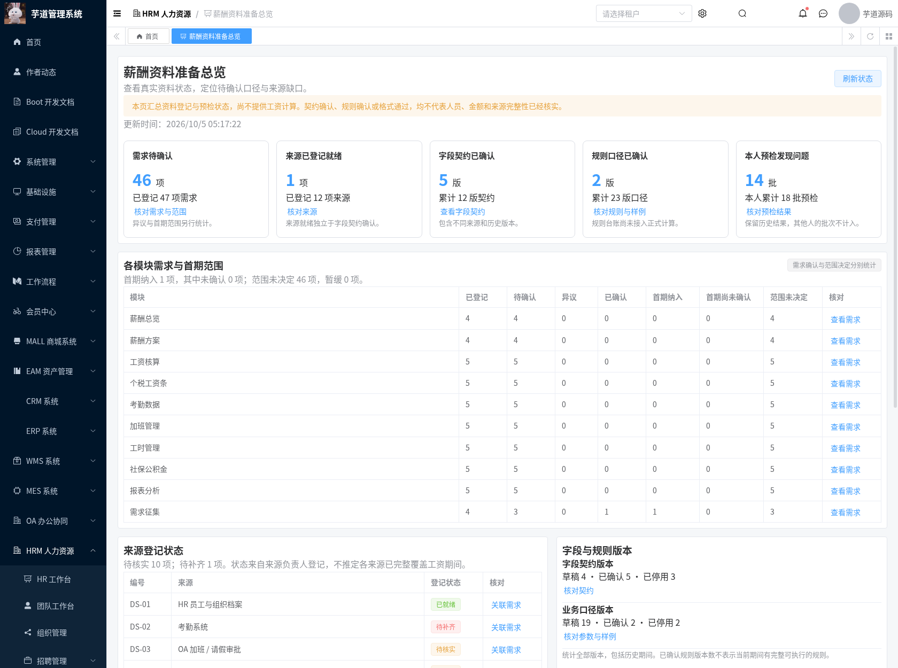
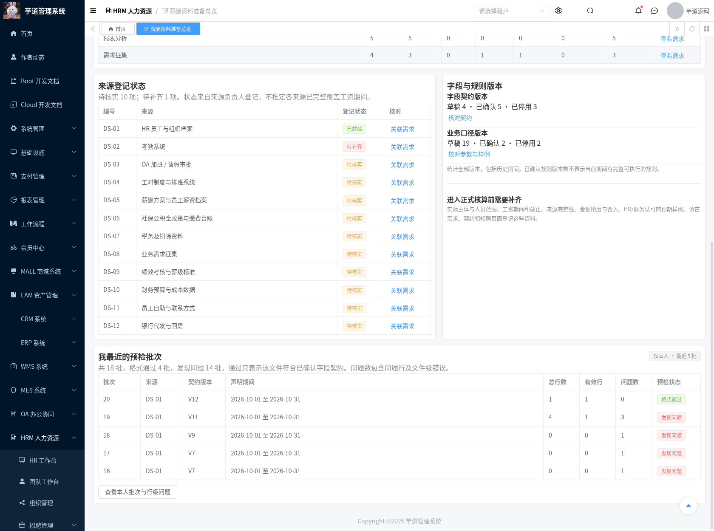
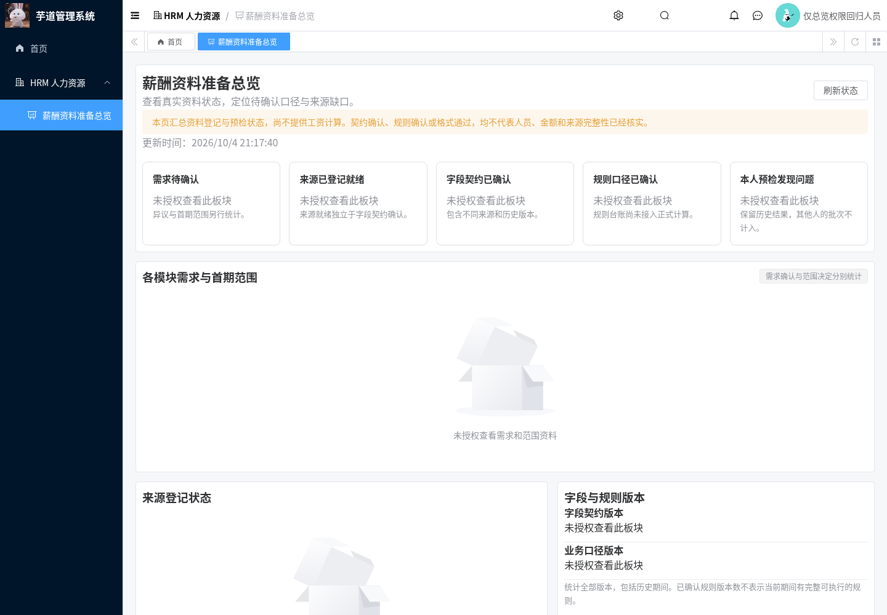
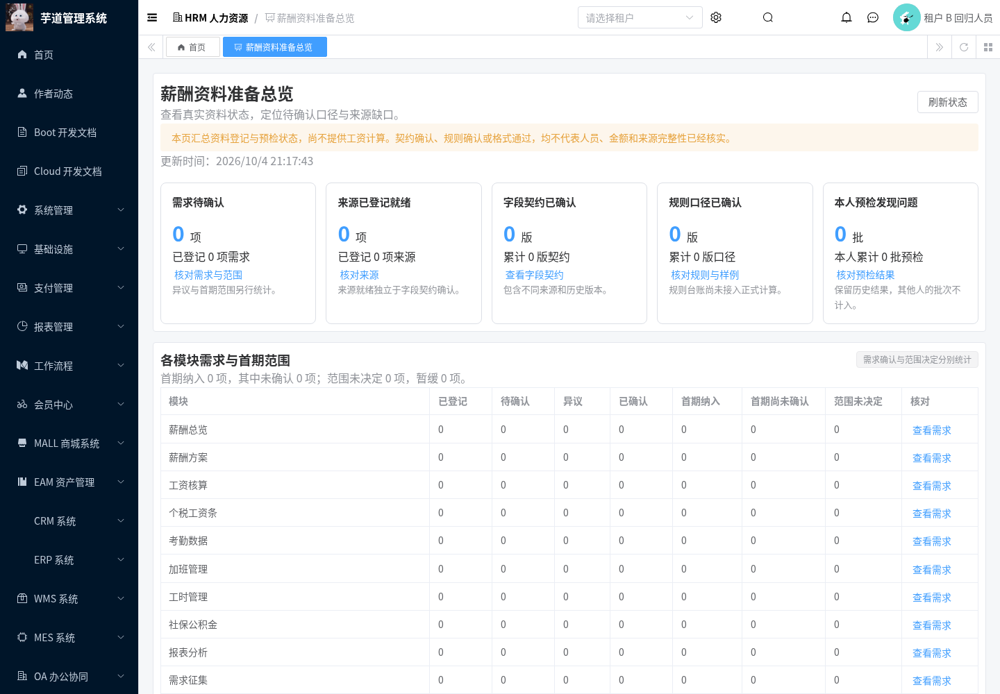
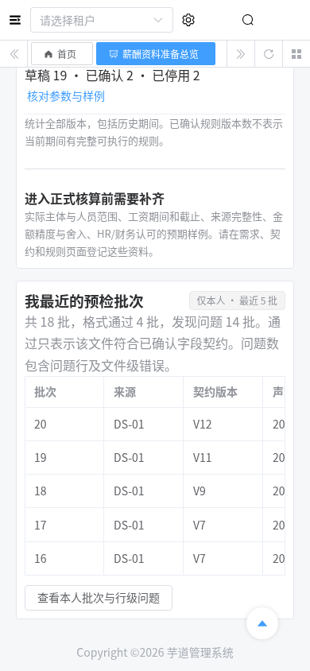

# 薪酬资料准备总览交付记录

日期：2026-10-04。需求、来源、字段契约、规则和预检结果此前需要逐页查询。本模块提供一个只读总览，从真实记录定位待确认资料、来源缺口和本人问题批次，并导航到已有维护页面。

## 功能与统计含义

页面 `/hrm/payroll-preparation`，接口 `GET /admin-api/hrm/payroll/preparation/summary`。沿用 HRM 的 Controller/Service/Mapper 和现有 Vue3 管理端，不新增业务表。读取一次总览不初始化目录、不确认来源、不生成评审或计算结果。

| 板块 | 实际统计与界限 |
| --- | --- |
| 需求及首期范围 | 当前租户登记数量、待确认/确认/异议、首期/暂缓/未决定；按 PRD 十模块汇总；首期未确认只统计首期纳入且尚未确认的需求 |
| 来源目录 | 来源登记的待核实/已就绪/待补齐及逐项状态；契约确认不自动改变来源就绪 |
| 字段契约 | 所有草稿、确认、停用版本，包含历史版本；版本数量不等于来源覆盖数量 |
| 规则台账 | 所有草稿、确认、停用版本；确认可能属于其他期间或合成样例，不表示当前期间具备完整可执行规则 |
| 本人批次 | 当前登录人全部预检批次的格式通过/发现问题数量，及按 ID 倒序的最近五批；显示契约版本、ISO 声明期间、有效行与问题数 |

问题数保留预检服务的定义：问题行与文件级错误均可计入，所以文件解析失败可能出现零数据行、一个问题。页面明确说明此含义，不将全局文件问题称为问题行。

需求模块、来源支持带过滤条件跳转到需求征集页；契约、规则和本人批次导航到已经实现的页面。刷新重新获取服务端数据，失败会清除旧状态并显示重试入口，不继续展示此前的数字。空租户显示零登记及具体空态，未授权板块显示“未授权”，两者分别处理。

这是 T-16/T-42 之前的资料核对视图，**不提供正式工资 KPI、核算可执行判断、员工期间资格、计算/审批/发放入口**。来源完整性、截止、真实人员/主体和计算门槛依赖后续业务模型，不能从几个确认数字推导出来。

## 权限与查询边界

新增页面权限 `hrm:payroll:preparation:query`，单独具备它只允许进入总览。服务端进一步核验原页面查询权限：

| 原有权限 | 总览可读取的板块 |
| --- | --- |
| `hrm:payroll:requirements:query` | 需求、首期范围及来源目录 |
| `hrm:payroll:intake:query` | 契约及本人的批次数/最近批次 |
| `hrm:payroll:rule:query` | 规则版本计数 |

未获原页面权限时相应查询不执行，计数与明细为 null，返回 `authorized=false`。前端隐藏这些板块的数字、表格和跳转。所有查询显式限定当前租户；批次数和最近记录进一步限定服务端登录人，管理员也只看本人批次。

只选择统计所需字段，不读取 CSV 行、文件名/哈希、人员或主体声明、工资金额、规则参数/业务样例、字段映射或评审证据。访问日志不记录总览响应。一个只读 REPEATABLE_READ 事务汇总已授权板块，避免多个查询混用不同业务读取快照。需求和来源列表采用受现有维护上限约束的元数据；契约、规则、全部批次使用 SQL 计数，最近批次 LIMIT 5，不读取全部大快照。

本模块保留既有权限边界，不宣称完成整个 HRM 薪资字段/部门/主体授权 T-07。页面权限迁移不自动给生产角色赋权。

## 检出、升级与运行

分支 `feat/hrm-payroll-preparation-overview` 基于 `feat/hrm-payroll-rule-ledger`，包含此前 PRD、原始 HTML 和四个交付模块。草稿 PR 尚未合并时，`master` 的 `git pull` 不会出现这些文件：

```bash
git fetch origin
git switch --track origin/feat/hrm-payroll-preparation-overview
```

先按 [启动基础](./hrm-foundation-setup.md)、[需求征集](./hrm-payroll-requirements-module.md)、[数据接入](./hrm-payroll-intake-module.md)、[规则台账](./hrm-payroll-rules-module.md) 初始化。已有四个模块的数据库仅需此菜单增量：

```bash
mysql --default-character-set=utf8mb4 -h localhost -u YOUR_USER -p YOUR_DATABASE \
  < sql/mysql/upgrade/20261004-hrm-payroll-preparation.sql
mvn -B -ntp -Phrm -pl yudao-server -am verify
python3 script/hrm/apply-vue3-overlay.py ../yudao-ui-admin-vue3
```

增量仅登记总览页面，重复执行不覆盖已配置名称和原业务记录。通过现有权限管理授权页面及所需原板块查询权限。回退恢复此前应用/前端并移除新增菜单授权，不删除原资料表或审计记录。

Vue3 目录是受控源码增量，完整项目基准、安装和启动说明见需求征集交付记录。本次完整前端 `/workspace/.cloud-setup/ruoyi-vue-pro/frontend`，前端 3000、后端 48081。原始业务 HTML 内容保持不变。

## 回归与可复现证据

```bash
bash script/hrm/verify-preparation-mysql.sh
python3 script/hrm/verify-preparation-api.py --output-dir /tmp/hrm-preparation
python3 script/hrm/verify-preparation-ui.py --output-dir /tmp/hrm-preparation
```

API/UI 脚本只读业务接口，不创建需求、契约、规则或批次。验证环境须预先具备合成资料与专用身份：租户 1 管理员和查询身份、无总览权限身份、仅总览权限身份，以及隔离空租户 999 身份。已有真实业务环境不满足固定验证前置条件时，应在独立验证库运行，而不是修改业务记录来凑样例。

API 从环境读取 `HRM_SMOKE_TOKEN`、`HRM_READER_TOKEN`、`HRM_UNGRANTED_TOKEN`、`HRM_TENANT_B_TOKEN`、`HRM_OVERVIEW_ONLY_TOKEN`；UI 额外需要管理员、租户 B、仅总览身份各自的 `_REFRESH_TOKEN`。不输出凭据。UI 需要 Python Playwright 和 Chromium。一次模拟失败仅用于错误恢复断言，所有保存截图均来自真实服务器成功响应。

| 检查 | 实测结果 |
| --- | --- |
| JDK 8 `-Phrm` reactor verify | 1504 项，0 失败、0 错误，24 项原有跳过 |
| HRM | 636 项执行通过，新增总览服务 9 项 |
| 实际 API / MySQL | 19 项通过；逐项与原接口核对计数、范围与确认独立、最近五批/本人隔离、租户和原权限边界 |
| Chromium | 12 项通过；真实计数、过滤导航、刷新与失败恢复、受限/空租户、内部滚动、390px 移动布局、无未捕获异常 |
| 原有基础 smoke | 13 项通过 |
| 独立 MySQL | 菜单重复执行、已配置名称保留、路由正确、业务/评审记录未变 |
| 完整前端 | vue-tsc 零错误；Vite 生产构建通过 |

结果 JSON 位于 [verification/hrm-payroll-preparation](./verification/hrm-payroll-preparation/)。截图采用隔离库中的合成回归资料；数字是该库真实状态，不代表用户的真实业务确认。管理端内部滚动由浏览器原生滚动后分别拍摄，不拼接或编辑图片。

## 实际截图











