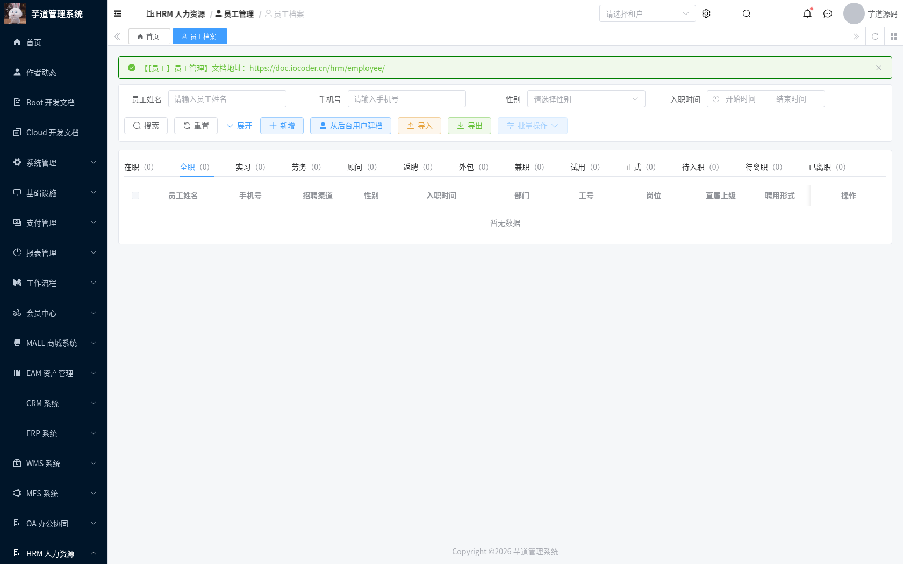
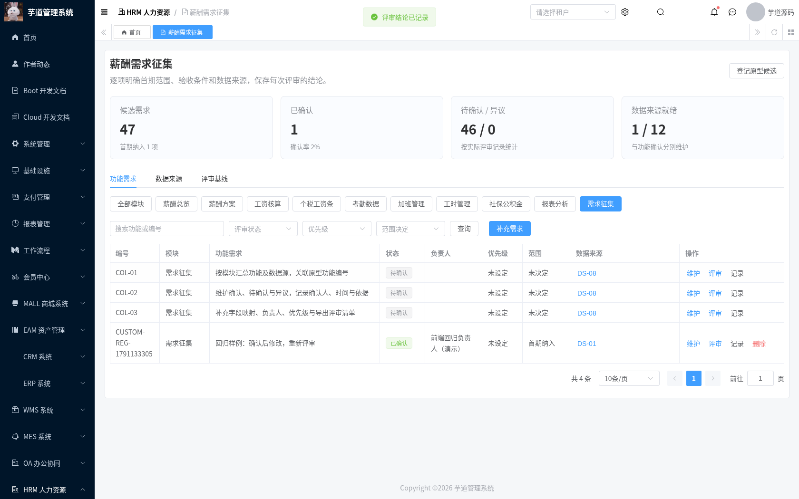
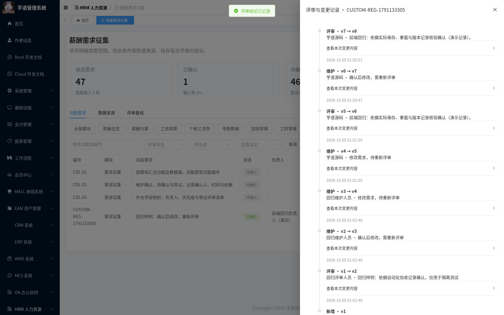
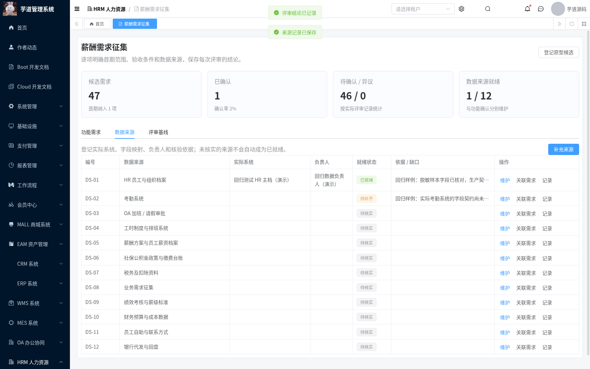
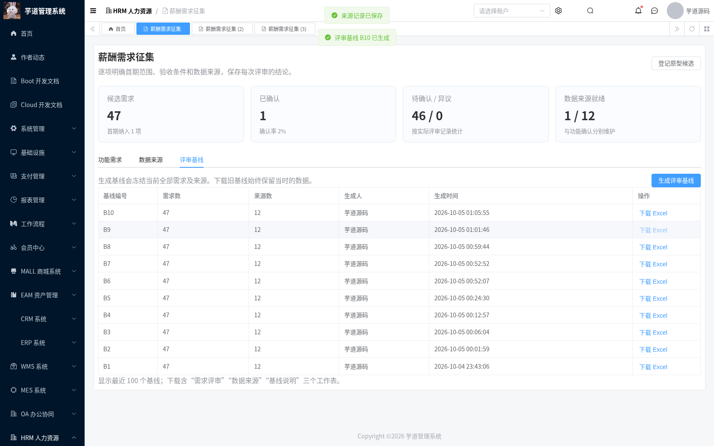
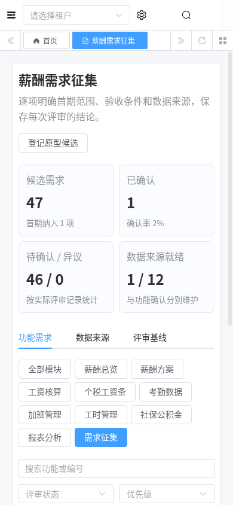
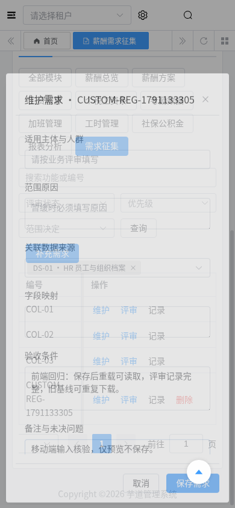

# 薪酬需求征集模块交付记录

日期：2026-10-04。模块基于 HRM/BPM 启动基础，完成需求目录、业务维护、评审记录、来源登记与不可变评审基线。后端使用现有 Java 8 / Spring Boot / MyBatis Plus 分层；前端使用 Vue 3 / TypeScript / Element Plus / Vite。

## 功能与边界

目录保留业务原型的 43 个功能点，另登记 COL-01～03，共 46 个候选需求、12 类来源。来源关联是待业务核实的候选映射。首次登记全部待确认，优先级为空、范围未决定、来源未核实；重复登记保留已有维护结果。原型的示例金额、进度和确认状态不作为业务结论。

征集页提供九个业务领域与征集总览的筛选入口、编号查询、负责人、优先级、范围决定、验收条件、字段映射、补充需求及评审。前端公共组件 `RequirementCollectionPanel.vue` 可用于后续业务页；当前通过独立征集菜单和 `?module=` 链接使用，并未把尚未实现的九个业务模块标为已完成。

功能状态为待确认、已确认、有异议。确认要求负责人、验收条件、来源关联和评审依据；异议要求处理负责人及依据。任何需求修改都会增加版本并重新进入待确认，清除当前确认标记，旧结论仍保存在变更记录中。操作者和时间由服务端登记。同版本并发保存只允许一个成功，过期版本返回错误，页面需重新读取。

数据就绪单独维护为未核实、已就绪、待补齐。“已就绪”要求实际系统、来源负责人、字段映射及核验依据；待补齐必须说明缺口。功能确认不会改变来源状态，也不会启用正式核算。需求可查看关联来源，来源可反查需求。

评审基线冻结生成时的完整需求及来源，旧基线下载不会读取当前修改结果。Excel 包含「需求评审」「数据来源」「基线说明」三个工作表，保留范围、状态、依据、版本和双向关联。列表只返回元数据，最多展示最近 100 个基线。单次基线上限为 500 个需求、100 类来源、8 MiB JSON；自定义条目预留完整内置目录的容量。

自定义需求编号以 `CUSTOM-` 开头，来源以 `DS-CUSTOM-` 开头。内置候选不可删除，应记录暂缓决定与原因。自定义需求软删除后仍可读取该租户的审计记录，编号不复用。

## 数据、接口与权限

迁移文件：[20261004-hrm-payroll-requirements.sql](../sql/mysql/upgrade/20261004-hrm-payroll-requirements.sql)。四张表均包含租户和软删除字段：

| 表 | 用途 |
| --- | --- |
| `hrm_payroll_requirement` | 候选需求与当前版本、范围、评审结论 |
| `hrm_payroll_source` | 来源契约概要与独立就绪状态 |
| `hrm_payroll_review` | 维护/评审/删除的前后快照、操作者、时间和依据 |
| `hrm_payroll_baseline` | 不可变导出快照与生成记录 |

需求、来源编号按租户唯一，删除后仍保留唯一约束。手写 ID 查询、加锁、历史及导出显式检查租户。更新、评审及删除处于事务中，并验证请求版本。

接口前缀为 `/admin-api/hrm/payroll/requirements`：`initialize`、`page/get/summary`、`create/update/delete/review`、`sources/list/create/update`、`history`、`baselines/create/list/export`。菜单路径为 `/hrm/payroll-requirements`，组件 `hrm/payroll/requirements/index`。

| 权限 | 作用 |
| --- | --- |
| `hrm:payroll:requirements:query` | 菜单、查询、来源与变更/基线列表 |
| `hrm:payroll:requirements:create` | 登记目录、补充需求 |
| `hrm:payroll:requirements:update` | 维护需求 |
| `hrm:payroll:requirements:delete` | 删除补充需求 |
| `hrm:payroll:requirements:review` | 记录评审结论 |
| `hrm:payroll:requirements:export` | 生成基线与下载 |
| `hrm:payroll:source:update` | 补充/维护来源 |

迁移只登记菜单和权限项，不自动给生产角色授权。角色需通过现有系统权限管理分配页面、父菜单与对应按钮。征集材料按租户共享给具有查询权限的用户，不能在该模块填写身份证、银行卡或个人工资明细；人员级薪资授权属于后续核算任务。

## 检出、迁移与前端交付

本批分支 `feat/hrm-payroll-requirements` 基于 `feat/hrm-payroll-foundation`。GitHub PR 尚未合并时，`master` 的 `git pull` 不会出现该分支文件：

```bash
git fetch origin
git switch --track origin/feat/hrm-payroll-requirements
```

已有基础库先应用上述增量 SQL；新库先按 [启动基础说明](./hrm-foundation-setup.md) 初始化 system/infra、HRM/BPM，再应用本迁移。主库初始化 SQL 含 DROP TABLE，仅用于新建数据库。增量迁移使用 `CREATE TABLE IF NOT EXISTS` 和幂等菜单登记，不会修补结构不一致的已有同名表。升级前备份并比对表结构。

```bash
mysql --default-character-set=utf8mb4 -h localhost -u YOUR_USER -p YOUR_DATABASE \
  < sql/mysql/upgrade/20261004-hrm-payroll-requirements.sql
mvn -B -ntp -Phrm -pl yudao-server -am verify
java -jar yudao-server/target/yudao-server-hrm.jar --spring.profiles.active=local
```

完整前端仍是独立项目，**本仓库的 `yudao-ui/yudao-ui-admin-vue3` 是受控增量目录，不能单独运行 pnpm install**。基准仓库为 `yudaocode/yudao-ui-admin-vue3`，固定提交 `0af03a93b6b6300f878e28add69b1c7a9f09ec34`。前端变更全部存放于本仓库增量目录及补丁，使用脚本应用；脚本会拒绝覆盖独立本地修改。

```bash
git clone https://github.com/yudaocode/yudao-ui-admin-vue3.git ../yudao-ui-admin-vue3
git -C ../yudao-ui-admin-vue3 checkout 0af03a93b6b6300f878e28add69b1c7a9f09ec34
python3 script/hrm/apply-vue3-overlay.py ../yudao-ui-admin-vue3
cd ../yudao-ui-admin-vue3
pnpm install --frozen-lockfile
pnpm ts:check
pnpm build:local
pnpm dev --host 0.0.0.0 --port 3000
```

实测工具链：Node 24.19.0、pnpm 11.19.0；`pnpm-workspace.yaml` 限定原生依赖构建脚本。按照完整前端的 `.env.local` 配置后端地址；使用同域开发代理时配置 `/admin-api` 到后端并将 `VITE_BASE_URL` 留空。此次云环境为前端 3000、后端 48081，完整运行目录 `/workspace/.cloud-setup/ruoyi-vue-pro/frontend`。连接参数只在验证环境保存，不提交凭据。

本次完整类型检查直接运行 `node --max-old-space-size=6144 node_modules/vue-tsc/bin/vue-tsc.js --noEmit --pretty false`，构建运行 `node --max-old-space-size=4096 node_modules/vite/bin/vite.js build --mode env.local`。完整项目的类型检查超过 4 GiB Node 堆上限；在 8 GiB 容器中暂时停止验证后端，使用 6 GiB 堆完成检查，再恢复同一已验证运行包。没有缩小检查文件范围或跳过类型错误。

为了使完整前端的回归可执行，兼容补丁修复现有页面缺失的 Element Plus 导入、财务枚举比较类型和收起菜单自动弹出问题；增量目录补齐 OA 考勤枚举，并将五个已有 MES 文件对齐固定前端和当前 MES API 的产品入库、SN 分组契约。未删除 MES 业务。云环境安装时把锁文件中不可访问的 npmmirror tarball 地址替换为 npmjs，保留版本与 integrity；该网络调整不是业务变更。

回退时先移除角色的新菜单授权，恢复上一应用与前端版本；四张新增表保留用于审计和后续恢复。需要清理时另行备份并确认数据保留要求，不能在常规回退中 DROP 有数据的表。

## 回归证据

本批在隔离 MySQL 8.0.46、独立 Redis 数据库和实际 Chromium 中验证，没有对生产库进行迁移或录入。

| 检查 | 结果 |
| --- | --- |
| JDK 8 `-Phrm` reactor verify | 1457 项，0 失败、0 错误；24 项为原有跳过项 |
| HRM 测试 | 589 项全部执行通过，其中新增征集服务 18 项 |
| MySQL 增量迁移 | 四表、租户、UTF8MB4、超 65,535 字节快照、重复迁移保留数据和七个权限菜单登记通过 |
| 实际 API / MySQL 回归 | 27 项通过：匿名/角色、跨租户详情/历史/导出、版本并发、确认失效、来源独立、冻结 Excel、删除留痕 |
| 原有基础 API smoke | 13 项通过 |
| Chromium 页面回归 | 12 项通过：真实数据、保存重载、评审、历史、来源缺口、反查与清除筛选、旧基线、失败重试、基础员工页、移动布局/表单、只读按钮 |
| 完整前端 | vue-tsc 零错误，Vite 构建通过 |

可复用脚本：[MySQL 回归](../script/hrm/verify-collection-mysql.sh)、[API 回归](../script/hrm/verify-collection-api.py)、[浏览器回归](../script/hrm/verify-collection-ui.py)。API 与浏览器脚本会写入回归样例，仅用于隔离验证库，需要显式传入 `--allow-test-fixtures`。浏览器脚本需要 Python Playwright 和已安装的 Chromium，不需要在线抓取业务数据。

```bash
bash script/hrm/verify-collection-mysql.sh
python3 script/hrm/verify-collection-api.py --allow-test-fixtures --output-dir /tmp/hrm-api
python3 script/hrm/verify-collection-ui.py --allow-test-fixtures \
  --fixture-file /tmp/hrm-api/hrm-collection-browser-fixture.json \
  --output-dir /tmp/hrm-browser
```

运行前，API 脚本需从隔离验证用户取得 `HRM_SMOKE_TOKEN`、`HRM_READER_TOKEN`、`HRM_EDITOR_TOKEN`、`HRM_REVIEWER_TOKEN`、`HRM_UNGRANTED_TOKEN`、`HRM_TENANT_B_TOKEN`。测试租户为 1 与 999；reader 仅查询，editor 查询/新增/修改/删除，reviewer 查询/评审，ungranted 无本模块权限，tenant B 仅具有自身租户权限。所有有菜单的测试角色还需 HRM 父菜单。先使用有权限的租户 1 用户登记目录；租户 B 不登记目录。浏览器脚本另需 `HRM_REFRESH_TOKEN` 和 `HRM_READER_REFRESH_TOKEN`，凭据使用环境变量传入，脚本不打印凭据。

重复运行 API 脚本会创建新的唯一编号样例与基线；若要复现截图数量，使用新验证库。浏览器脚本会修改该次 API 生成的样例，不修改原型候选的确认状态。两份脱敏结果文件存放于 [verification/hrm-payroll](./verification/hrm-payroll/)。

## 实际页面截图

下图使用登录后的真实页面和 API。验证库含 **46 个候选点 + 1 个回归样例**；已确认需求、已就绪来源及待补齐说明均为测试登记，尚未取得业务正式确认。基础员工页为空库列表，用于证明 HRM 集成入口可访问。

基础模块：



需求征集模块：













## 下一模块的输入

依赖路线图进入 T-13 人员/主体映射与 T-14 输入归集。主体、人员范围和工资周期会影响已有按年月工资表、唯一键及历史税务承接，不能从框架租户或演示数据推定。正式核算还需 HR/财务确认政策依据、规则有效期、来源字段和脱敏预期样例。业务可使用本模块记录负责人、范围、缺口和基线，完成 T-01～03 的决策；未决规则不以开发默认值替代。
