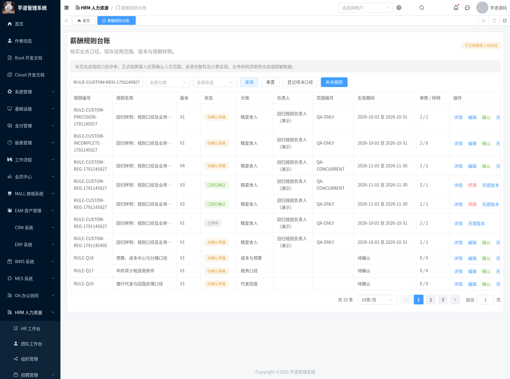
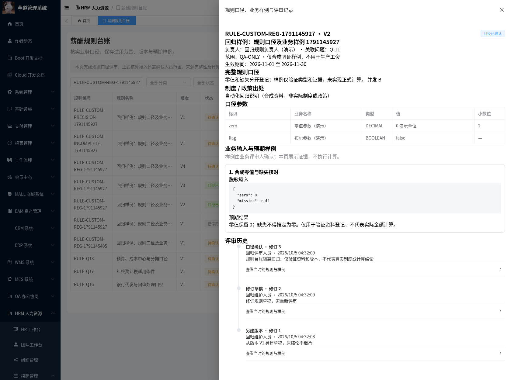
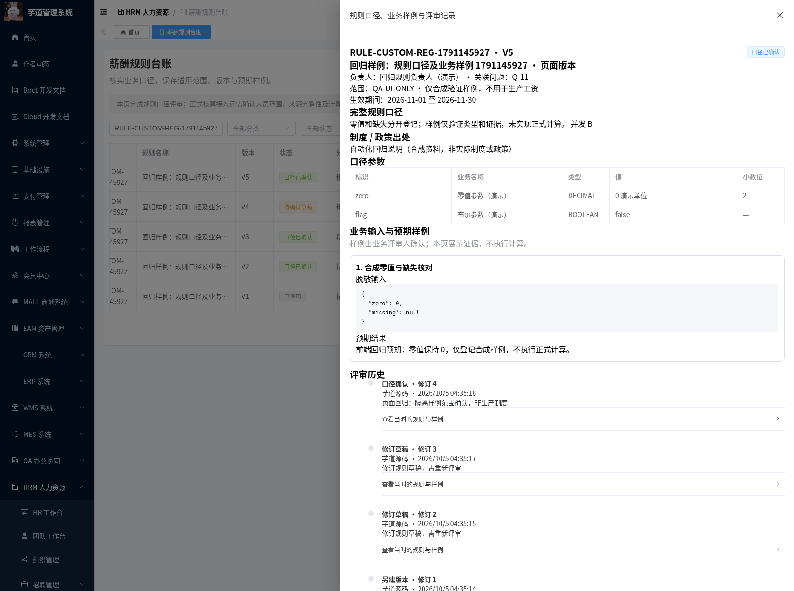
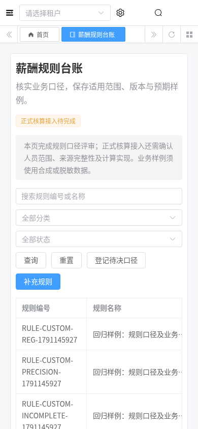
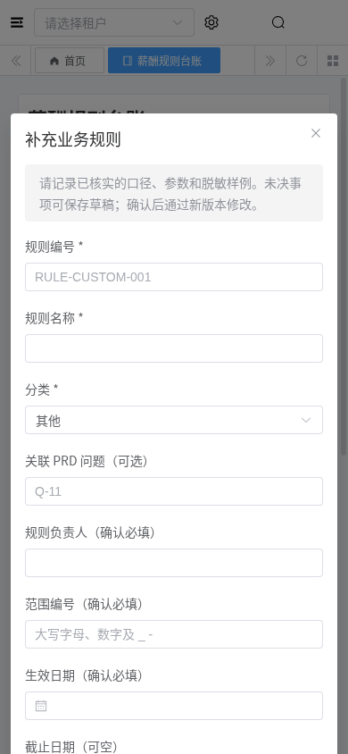

# 薪酬规则台账模块交付记录

日期：2026-10-04。规则、期间和业务预期值此前散落在 PRD 的未决问题中，无法区分草稿与评审结论。本模块将其登记为带版本、适用范围和有效期的台账，保留参数、业务样例及评审快照。沿用 Java 8 / Spring Boot / MyBatis Plus 和 Vue 3 / TypeScript / Element Plus / Vite。

## 功能与边界

覆盖路线图 T-02 的登记和评审工具。初始化仅登记 15 个候选问题的编号、标题和分类，均为草稿；不预置负责人、期间、倍率、税率、精度或预期金额。重复或并发初始化不会覆盖已填写资料。自定义规则使用 `RULE-CUSTOM-` 前缀，不能抢占 `RULE-Qxx` 编号。

状态为草稿、口径已确认和已停用。草稿可修改资料；代码与分类固定。确认要求负责人、范围编码、适用范围说明、生效起日、规则说明、制度出处、至少一个完整业务样例及评审依据。生效止日可留空，表示未指定结束日。已确认和已停用版本不可编辑；复制后产生新的草稿，保留资料但清除旧评审人、时间及结论。停用须填写依据，历史版本和审计记录保留。

同一租户、规则代码、范围编码的有效确认版本不得有重叠有效期，区间包含起止日；无结束日的区间也参与冲突校验。不同范围编码可独立登记。首版本行作为并发锁，保证并发版本号连续分配、并发重叠确认仅一个成功。所有修订和评审携带 revision，拒绝过期页面覆盖。范围编码只是资料分组键，**不等同于法人主体、员工计薪资格或薪资授权范围**。

参数最多 32 个，支持文本、整数、小数、布尔和日期；键唯一。整数、小数确认前须填写单位，小数精度由录入人明确指定。采用 BigInteger / BigDecimal 校验和规范化，保留显式零值与 `false`，拒绝指数、公式、超精度或超小数位值，不自动舍入。技术上限为 18 位有效数值、小数位 0–8；不是业务默认精度。日期校验真实日历并以 ISO 字符串输出。

业务样例最多 20 个，包含标题、JSON 对象输入与文字预期结果。输入限制长度与嵌套深度，预期结果须由业务人员填写。本模块**不执行公式、不验证预期金额、不将确认后的资料自动写入现有工资或个税计算配置**。确认表示资料通过授权人员评审，不代表计算程序已实现。样例应使用脱敏或合成资料；完整 T-02 仍需要真实业务结论。

## 数据与权限

迁移：[20261004-hrm-payroll-rules.sql](../sql/mysql/upgrade/20261004-hrm-payroll-rules.sql)，依赖 HRM 基础和需求征集迁移。新增 `hrm_payroll_rule`，租户、代码、规则版本唯一；参数与样例使用 MEDIUMTEXT。评审沿用 `hrm_payroll_review`，对象类型为 `rule`，记录服务端操作者、时间、理由及前后快照。

接口前缀 `/admin-api/hrm/payroll/rules`，提供 `initialize`、`page`、`get`、`create`、`new-version`、`update`、`review` 和 `history`。列表只返回元数据和参数/样例数量，详情返回完整资料。列表、ID 查询、锁、修订、版本分配、评审及历史同时核验当前租户。页面、详情和变更接口关闭普通访问日志的资料参数/响应记录。

| 权限 | 功能 |
| --- | --- |
| `hrm:payroll:rule:query` | 列表、详情及评审历史 |
| `hrm:payroll:rule:maintain` | 初始化候选、新建、草稿维护和复制版本 |
| `hrm:payroll:rule:review` | 确认和停用，必须提供依据 |

规则资料在租户内共享给具有查询权限的人员，不按作者私有隔离。迁移登记页面及两个按钮权限，不自动给生产角色赋权。维护与评审角色还需要查询权限才能在页面读取资料。菜单为 `/hrm/payroll-rules`，组件为 `hrm/payroll/rules/index`。本模块不替代 T-07 的整个 HRM 员工、部门或敏感薪资字段授权。

## 检出、升级与运行

分支 `feat/hrm-payroll-rule-ledger` 基于 `feat/hrm-payroll-intake`，包含此前 PRD、原始 HTML 和三个已交付模块。PR 尚未合并时，仅在 `master` 执行 `git pull` 不会出现这些文件：

```bash
git fetch origin
git switch --track origin/feat/hrm-payroll-rule-ledger
```

已有前三模块的数据库应用此增量即可；新库先按 [启动基础](./hrm-foundation-setup.md) 及 [需求征集](./hrm-payroll-requirements-module.md)、[数据接入](./hrm-payroll-intake-module.md) 初始化。不要对已有库执行带 DROP TABLE 的主库初始化 SQL。

```bash
mysql --default-character-set=utf8mb4 -h localhost -u YOUR_USER -p YOUR_DATABASE \
  < sql/mysql/upgrade/20261004-hrm-payroll-rules.sql
mvn -B -ntp -Phrm -pl yudao-server -am verify
java -jar yudao-server/target/yudao-server-hrm.jar --spring.profiles.active=local
python3 script/hrm/apply-vue3-overlay.py ../yudao-ui-admin-vue3
```

前端使用已固定提交的完整 Vue3 项目，基准、安装及代理配置见需求征集交付记录；本仓库 Vue3 目录是受控增量，不能单独安装启动。本次完整运行目录 `/workspace/.cloud-setup/ruoyi-vue-pro/frontend`，前端 3000、后端 48081。验证采用隔离 MySQL/Redis 和合成资料，未迁移生产数据。

回退恢复此前应用、前端及角色权限配置，保留规则表与评审记录以便恢复历史。重复迁移保留已有记录；同名表已存在时须先比对结构，迁移不会自动修复差异。

## 可复现验证

```bash
bash script/hrm/verify-rules-mysql.sh
python3 script/hrm/verify-rules-api.py --allow-test-fixtures --output-dir /tmp/hrm-rules
python3 script/hrm/verify-rules-ui.py --allow-test-fixtures \
  --fixture-file /tmp/hrm-rules/hrm-rule-browser-fixture.json \
  --output-dir /tmp/hrm-rules
```

API 与 UI 脚本只用于隔离数据库，会创建独立 `RULE-CUSTOM-REG-*` 合成资料并走真实评审。API 从环境读取 `HRM_SMOKE_TOKEN`、`HRM_READER_TOKEN`、`HRM_EDITOR_TOKEN`、`HRM_REVIEWER_TOKEN`、`HRM_UNGRANTED_TOKEN` 和 `HRM_TENANT_B_TOKEN`，不输出凭据。UI 额外需要 `HRM_REFRESH_TOKEN`、`HRM_READER_REFRESH_TOKEN`、Python Playwright 及 Chromium。

隔离身份：租户 1 的 reader 仅查询；editor 查询/维护；reviewer 查询/评审；无授权身份不赋权；租户 999 身份有自身租户权限。通过现有权限管理配置角色，产品迁移不添加测试身份。重复执行检查会保留此前合成版本和审计资料。UI 截图中的确认状态记录拍摄时状态，随后回归还会停用合成版本验证历史保留。

| 检查 | 实测结果 |
| --- | --- |
| JDK 8 `-Phrm` reactor verify | 1495 项，0 失败、0 错误；24 项为原有跳过项 |
| HRM | 627 项全部执行通过，新增规则服务 14 项 |
| MySQL 8.0.46 隔离迁移 | 重复执行、保留已有记录、三个权限项、租户/版本唯一约束、Unicode MEDIUMTEXT 通过 |
| 实际 API / MySQL | 34 项通过，含并发创建/修订/版本/确认、有效期重叠、权限/租户隔离、旧计算配置不变 |
| 原有基础 smoke | 13 项通过 |
| Chromium | 10 项通过，含编辑/复制、必填依据、冲突拦截、冻结业务样例、停用历史、只读权限及 390px 移动布局 |
| 完整前端 | vue-tsc 零错误；Vite 生产构建通过 |

实库回归发现租户 SQL 解析器对 `ORDER BY ... LIMIT ... FOR UPDATE` 的重组不兼容 MySQL。现已改为用首版本唯一键直接定位并加锁，避免排序/限量子句；未修改框架租户拦截器，并发接口回归及完整后端测试已重新通过。复制版本同时明确清除旧确认字段，避免携带上一版本结论。

结果在 [verification/hrm-payroll-rules](./verification/hrm-payroll-rules/)，原始浏览器截图在 [assets/hrm-payroll-rules](./assets/hrm-payroll-rules/)。后续正式人员模型与核算仍依赖主体/人员范围、工资期间与截止、金额精度/舍入及 HR/财务认可的样例；未以合成数据替代这些决定。

## 实际页面截图










