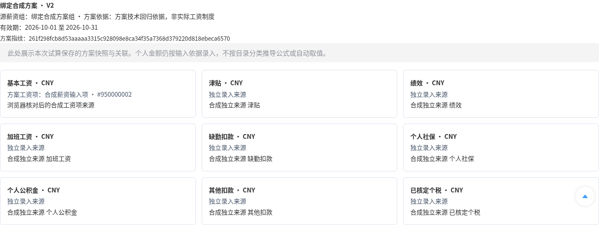
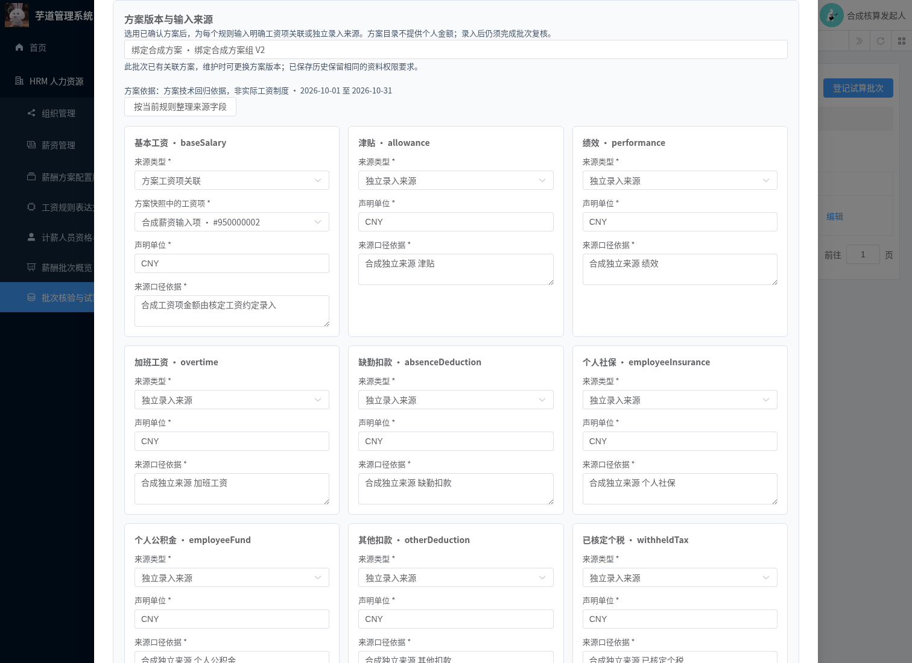
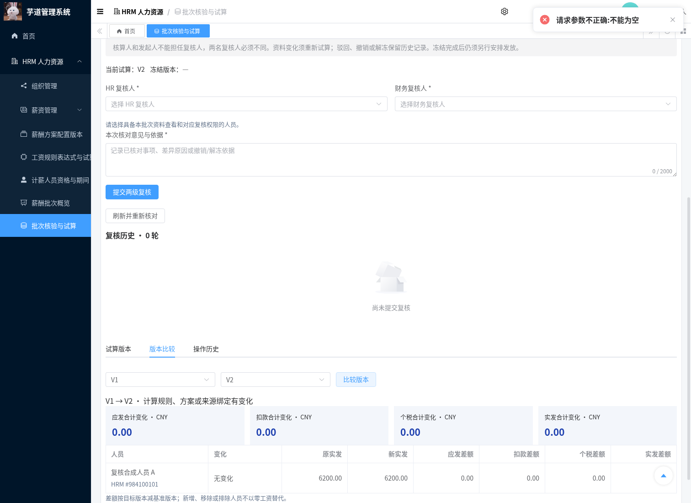
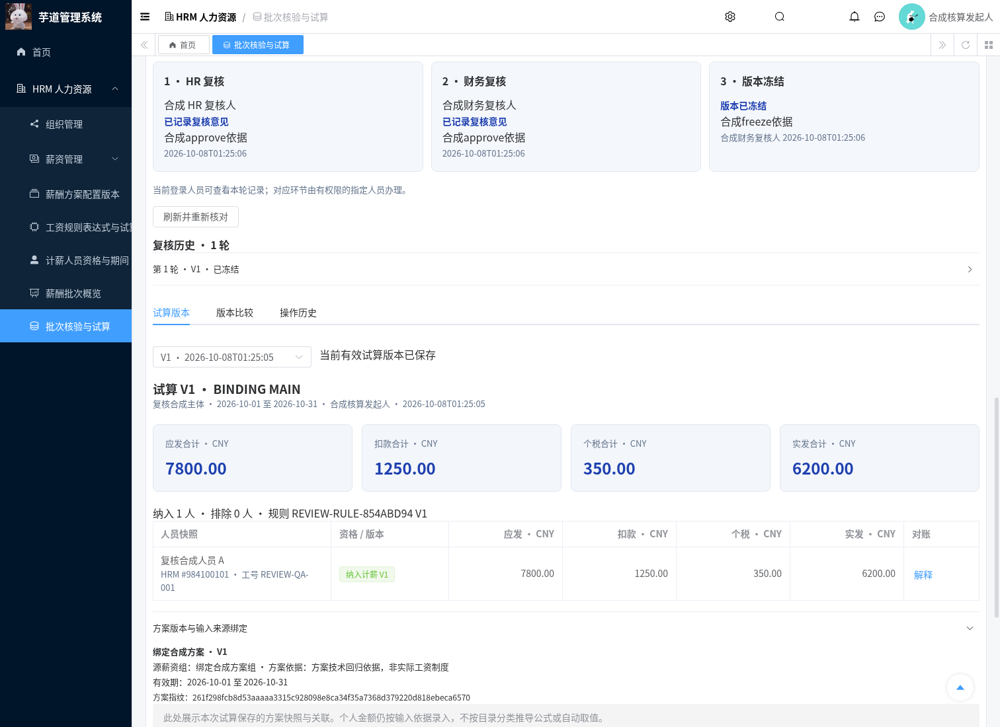
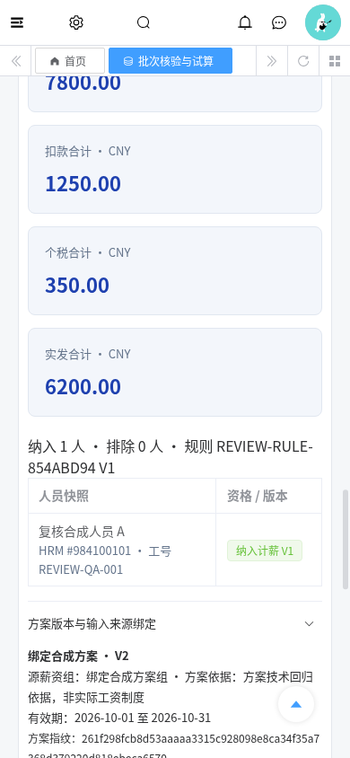

# 薪酬方案、工资项与试算版本绑定交付记录

日期：2026-10-08。本模块接入已确认方案和规则版本，将明确的工资项/独立输入来源随试算保存，避免后来目录或批次草稿改变覆盖历史核对依据。沿用已有 HRM 批次页面 `/hrm/payroll-trial-batches`、方案版本、规则版本和试算版本，未新增第二套审批台账。

## 实际行为与 PRD 覆盖

| 能力 | 行为 |
| --- | --- |
| 选用方案 | 批次可选一个已确认方案版本；不填写仍为原有独立输入批次，升级不会自动补选 |
| 完整期间 | 方案和规则各自须单个版本覆盖批次两端；规则声明范围编号须等于批次主体编号 |
| 明确关联 | 每个规则输入恰有一项来源；方案工资项或独立录入，均需单位和口径依据；至少关联一个启用工资项，同一项不能重复关联 |
| 单位和输出 | 工资项关联限 CNY/DECIMAL/2 位输入；其他声明单位必须与规则一致；规则样例通过，四个金额角色为不同的 CNY/2 位输出 |
| 个人输入 | 仍逐人明确录入金额与个人依据；来源关联不抓取个人工资、不将空值填零、不根据目录分类推导公式 |
| 保存和变更 | 方案快照、完整来源关联、规则及人员输入随不可变试算保存；草稿改关联使当前版本失效，重算生成新版本 |
| 停用和历史 | 停用阻断新执行、复核通过和冻结；旧版本快照、金额和解释仍可查；旧执行请求重放只返回原结果 |
| 差异 | 即使金额相同，更换方案或输入来源依据也显示规则/方案/来源绑定变化；个人金额差异另行展示 |

对应 Q-25/Q-26、T-17/T-20 的明确选版与输入绑定部分，补充行业惯例 v0.5。工资项目录为租户共用，不是源组专属项目；方案快照不包含历史薪资组人员名单。本模块不使用当前 `employee_ids` 或部门猜测员工归属，由批次负责人、口径依据及两级复核明确声明适用；已确认人员资格仍独立校验。方案原始税务配置只保留资料快照，不按标志生成税额。正式工资约定、职级薪档调整、考勤/加班/工时/缴费输入自动映射与累计个税仍待后续模块。

## 权限、历史与锁定

关联方案的批次额外要求 `hrm:payroll:scheme:query`、`hrm:salary:group:query`、`hrm:salary:option:query`、`hrm:salary:tax-rule:query`，沿用批次四项核心查询与独立维护/执行/复核授权。列表、概览数量、真实待办、金额、历史试算、对比和复核记录均保持相同的资料门槛，并继续校验整批历史/当前人员范围。已绑定的批次不能清空关联，以免原方案快照从历史入口泄露；原独立输入批次没有新增源配置查询前置条件。

发起复核前核对两名实际复核人也有全部关联资料查询权限。权限回收后查询和操作立即受门槛限制，不因已保存执行/审批回执绕过授权。全部方案选版及工资项目读取显式限定租户，跨租户 ID 请求不能获得源快照。

执行和审批/冻结先锁批次，再锁薪资组（包括软删除后的保留锁）、所选方案，再按原流程锁规则系列、资格系列和人员主档。与方案评审使用同一锁顺序；锁定后重新核对选版、来源和结果，稳定业务清单包含方案快照与输入关联，工作流修订/状态不影响同一业务依据。后续修改原始薪资组、工资项或计税源配置不覆盖已确认快照；停用所选版本会阻断继续处理。

方案抓取/评审时间新增定点 ISO 日期反序列化，确保保存后的快照与实时选版可比较，不将 ISO 时间误读成 1970 年。所有批次 GET 继续只读，不隐式修复流程状态；工资金额/政策资料沿用访问日志屏蔽配置。

## 升级、启动与回退

分支 `feat/hrm-payroll-scheme-bindings` 基于 `feat/hrm-payroll-overview` 的 `773c7a68abc86c6c46bbb4f43873236110cfdff8`。草稿 PR 未合并到 master，检出增量分支才能看到新增文件：

```bash
git fetch origin
git switch --track origin/feat/hrm-payroll-scheme-bindings
```

按前置[概览模块](./hrm-payroll-overview-module.md)、[复核冻结](./hrm-payroll-review-freeze-module.md)、[试算批次](./hrm-payroll-trial-module.md)和[方案版本](./hrm-payroll-scheme-module.md)准备环境。数据库增量仅增加可空 `scheme_id`，既有 JSON 和记录保持原值，重复执行保留已选版本，不授予生产角色、不初始化实际方案或输入。

```bash
mysql --default-character-set=utf8mb4 -h localhost -u YOUR_USER -p YOUR_DATABASE \
  < sql/mysql/upgrade/20261008-hrm-payroll-trial-scheme-binding.sql
mvn -B -ntp -Phrm -pl yudao-server -am verify -DskipTests=false -Dmaven.test.skip=false
python3 script/hrm/apply-vue3-overlay.py ../yudao-ui-admin-vue3
```

完整前端固定 `yudaocode/yudao-ui-admin-vue3@0af03a93b6b6300f878e28add69b1c7a9f09ec34`，含 MES，运行副本 `/workspace/.cloud-setup/ruoyi-vue-pro/frontend`，端口 3000；JDK8 后端 48081，隔离 MySQL 库 `hrm_payroll_collection_20261004b`。本仓库 Vue3 子目录是受控 overlay，不能单独安装启动。

回退不得将含方案关联的批次交给旧版服务继续操作，因为旧服务不识别新增资料权限及选版约束。保留新增列、历史及审计，先限制方案关联批次访问，再恢复应用；旧独立输入批次可按原契约使用。未执行生产升级、付款、外部投递或 PR 合并；上传原始 HTML 内容保持不变。

## 回归复跑

```bash
bash script/hrm/verify-binding-mysql.sh
python3 script/hrm/verify-binding-api.py --allow-test-fixtures --output-dir /tmp/hrm-bindings
python3 script/hrm/verify-binding-ui.py --allow-test-fixtures \
  --fixture-file /tmp/hrm-bindings/hrm-binding-browser-fixture.json --output-dir /tmp/hrm-bindings-ui
```

真实 API 脚本沿用前置概览及两级复核的 loopback、隔离库前缀、显式测试授权与环境令牌保护，先运行完整前置回归。合成身份 fixture 为 `binding-role-fixtures.sql`，仅对预建的 QA 角色增加四项查询；只读负例不获这些权限，非指派 HR 负例缺计税查询。源计税规则/工资项使用前置方案验证的 950000001/950000002，另建 `creator=binding-verification` 的合成薪资组与方案；模拟原始目录更改后恢复，不更改真实业务配置。

输入令牌与刷新令牌继续使用 `HRM_SMOKE_TOKEN`、`HRM_UNGRANTED_TOKEN`、`HRM_TENANT_B_TOKEN` 及 `HRM_REVIEW_{MAKER,HR,FINANCE,READER,...}_TOKEN`；浏览器需要 MAKER/READER 的刷新令牌。环境连接、认证资料与完整日志均不提交。验证报告与原始浏览器截图位于 `docs/assets/hrm-payroll-scheme-binding/`，截图使用真实 Chromium 与数据库返回，未编辑或拼接。

## 本次已完成验证

| 检查 | 实测结果 |
| --- | --- |
| JDK8 全 reactor verify | 1,784 项报告，0 失败/错误，24 项既有跳过，173 个测试套件 |
| HRM / BPM | HRM 909 项全部执行；BPM 63 项含 6 项既有跳过；新增方案绑定 23 项全部执行 |
| 完整前端 | 固定完整 Vue3 + overlay，vue-tsc 零错误，含 MES 的 Vite 生产构建通过 |
| 真实 API/BPM | 本模块 37 项、前置复核 55 项和概览 30 项均通过；真实选版清单通过 HR→财务→冻结，停用阻断审批/冻结，7 张既有业务表校验值一致 |
| Chromium | 12 项通过，原始截图 12 张；新来源登记、失效/重算、历史对比、缺权限、停用以及 390px 布局，无未捕获页面异常 |
| MySQL 8 迁移 | 重复应用保留选版、原有独立批次和输入 JSON；没有新工资表或角色授权 |

前端首次与后端回归同时构建因 8 GiB 环境内存不足终止；暂停演示服务，分别完成完整类型检查与生产构建后均成功，随后恢复 3000/48081 服务。远端 CI 将另行核验本提交，不用前置 PR 的结果替代。

## 实际截图











所有证据的 SHA-256 和前置 CI 记录见[核验清单](./assets/hrm-payroll-scheme-binding/verification-manifest.json)。其中前置 CI 仅属于概览模块提交，不表示本模块已获得远端 CI 成功结论。
