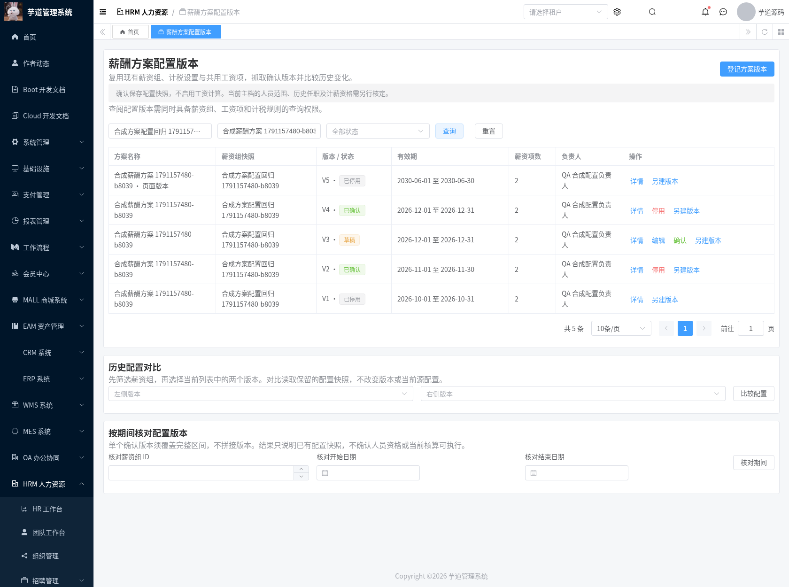
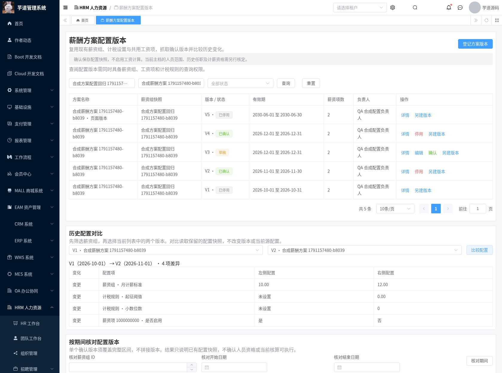
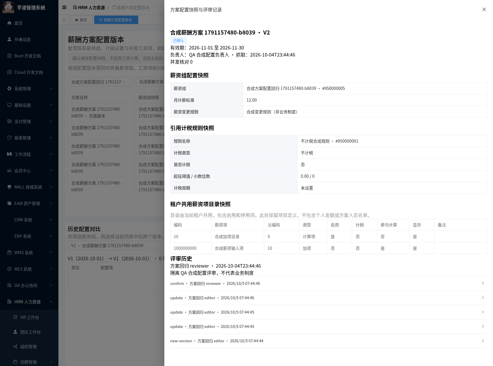
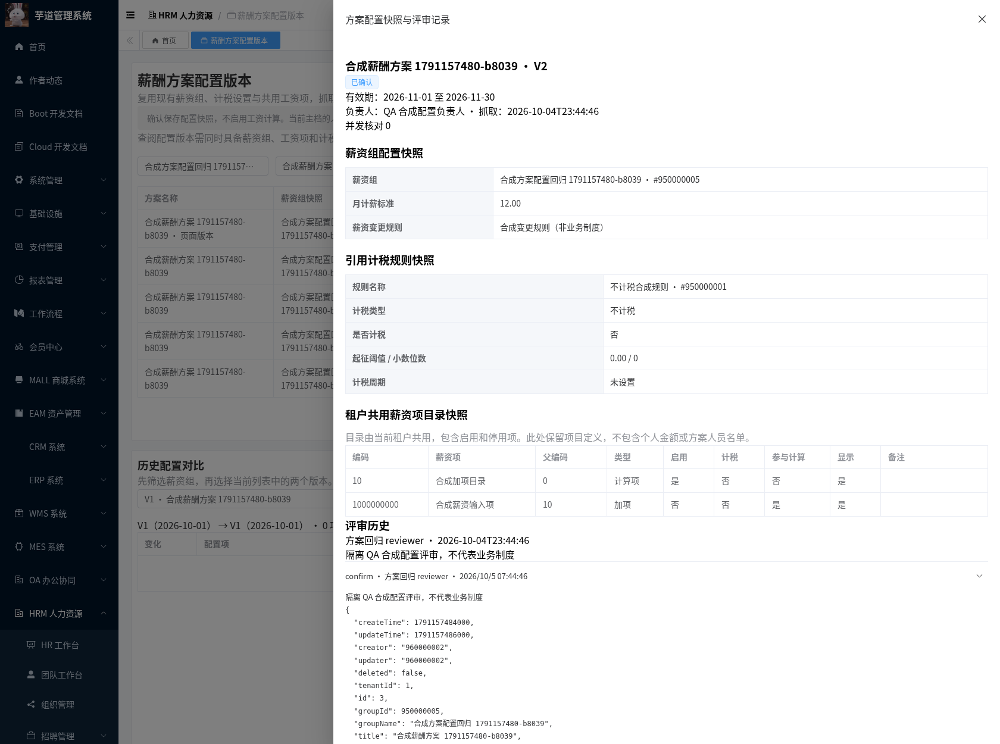
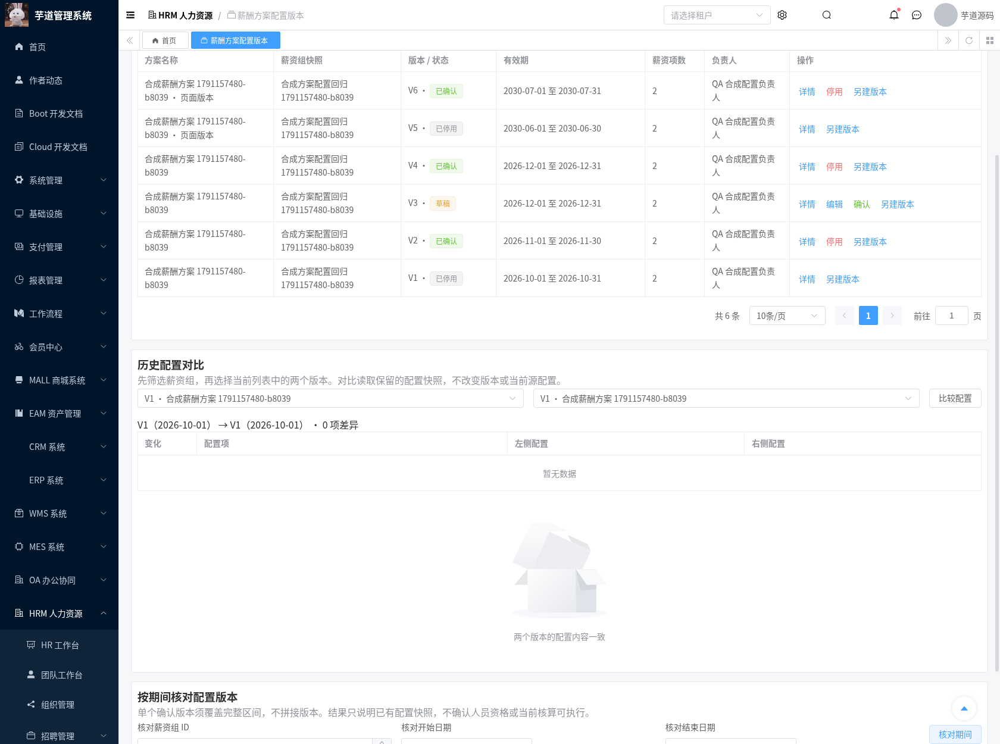
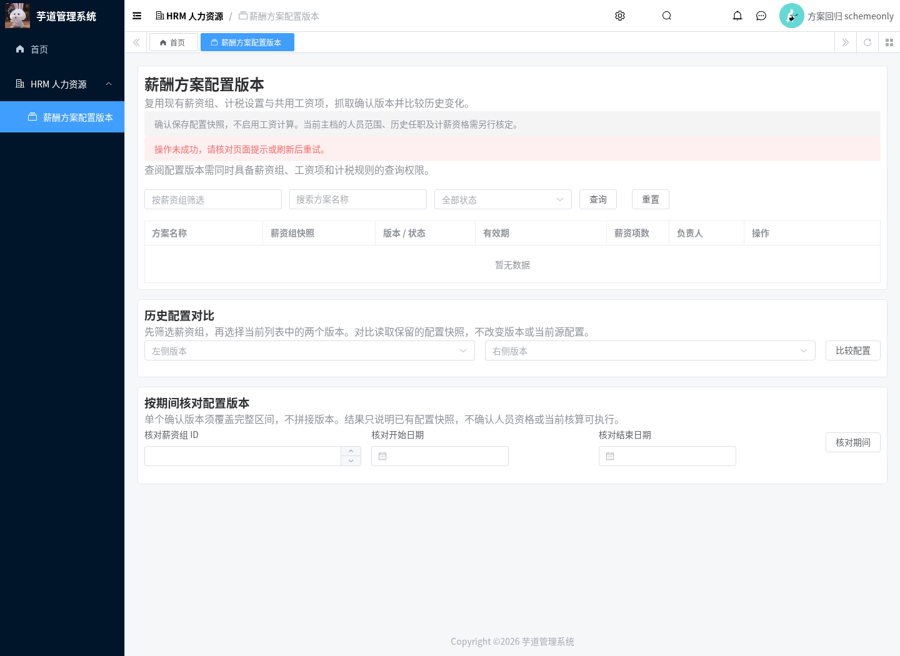
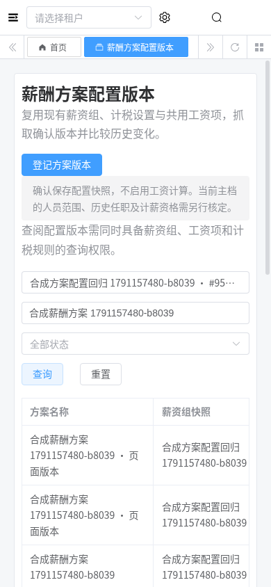

# 薪酬方案配置版本交付记录

日期：2026-10-04。现有薪资组、计税设置和工资项可被直接修改，缺少独立保留的配置版本。本模块抓取这些配置，登记负责人、依据及有效期，经评审保留快照；后续修改源配置不会覆盖已确认的版本。

## 功能及适用边界

页面 `/hrm/payroll-schemes`，沿用 HRM Controller/Service/Mapper、现有薪资配置及资料评审表，新增一张 `hrm_payroll_scheme_version` 表。前端位于受控 Vue3 增量目录。本模块交付 T-17、PLAN-04 的配置版本工具部分。

| 能力 | 实际行为 |
| --- | --- |
| 源配置选择 | 仅返回当前租户的薪资组 ID、名称；不读取人员或部门名单 |
| 配置抓取 | 保留薪资组的月计薪标准、变更规则、引用计税规则，以及租户共用工资项目录，包括启用和停用项 |
| 草稿 | 名称必填；负责人、配置依据、有效期可待补齐；源薪资组固定；维护时重新抓取配置 |
| 确认 | 必填负责人、配置依据、生效开始及评审证据；核对源配置指纹及结构合法性；同组确认版本的有效期不能重叠 |
| 另建版本 | 继承所选版本的登记信息，抓取当前源配置；分配递增版本号，独立评审，不继承旧确认结论 |
| 停用及历史 | 已确认或停用版本不可编辑；停用保留配置及审计，没有删除接口 |
| 对比 | 比较同组两个保留快照，按中文字段名称展示新增、移除及变更；零值、缺失值和布尔“否”分别呈现 |
| 期间核对 | 单个已确认版本须完整覆盖声明区间；不拼接相邻版本，停用版本不参与匹配 |

工资项目录在现有 HRM 中由租户共用，并不是薪资组独立配置。本模块明确保留这一关系，不伪造按组项目归属。引用的计税设置保留现有字段和明确的空值，不填入开发默认阈值、税务年度或舍入策略。月计薪标准同样取源配置原值，不表示 HR/财务已认可其业务口径。

快照不包含人员名单、工资档案、员工金额、适用法人或历史任职；也不包含可执行公式或完整的税务政策计算规则。确认表示配置资料经授权评审，不会启用工资计算、更新现有薪资组或税务配置，也不影响付款和工资条状态。正式适用范围、期间资格、核算选版及引擎仍依赖 Q-01/Q-02、规则样例和后续集成，未将完整 T-17、T-07 或工资核算标为完成。

## 完整性、有效期与并发

快照按稳定字段和工资项编码/ID 排序形成 SHA-256 指纹；抓取时间单独记录，不参与指纹。保存时支持客户端已核对指纹校验；确认时重新读取当前源配置，薪资组、计税设置或共用工资项变化均阻止旧草稿确认，需编辑并重新抓取。

结构检查复用现有计税规则验证，检查月计薪标准、变更规则、计税引用、项目编码/类型/标志及父级缺失或循环。问题可保留在草稿中，但不能确认。它不替代业务制度、人员资格或预期金额验证。

有效期使用闭区间；结束可明确留空表示未指定结束，次日衔接允许。技术日期范围为 MySQL 支持的 1000～9999 年，不据此规定工资周期。首次登记、版本分配及确认均先锁定同组源行，版本使用租户/组/版本唯一索引；修订号防止旧页面覆盖，并在同组锁下检查确认期间重叠。源组软删除后历史仍可查询、对比及停用，不能再抓取或另建版本。

受当前租户 SQL 解析器影响，加锁目录查询不使用 `ORDER BY`，读取后在 Java 中按稳定键排序；避免解析器把 `FOR UPDATE` 移到排序前导致真实 MySQL 执行失败。未修改框架。目录超过 1000 项时要求先核对规模；薪资组选择超过 200 项时要求按名称缩小检索。

## 权限与租户

新增 `hrm:payroll:scheme:query`、`:maintain`、`:review`；所有服务入口还要求现有 `hrm:salary:group:query`、`hrm:salary:option:query`、`hrm:salary:tax-rule:query` 三项查询权限，包括已保存的快照、历史、对比和期间核对，避免借新接口读取未获授权的源配置。

薪资组、计税规则和工资项目录查询显式限定物理 `tenant_id`；版本和审计按租户限定，跨租户按 ID 请求、总数、编辑、评审及复制均受限。查询页面不含人员或薪资结果，因此本次未扩展员工数据权限。确认人、时间、租户、状态、版本与快照由服务端决定，忽略客户端伪造字段。含配置资料的接口关闭请求/响应访问日志；复验实例关闭 DAL 的 DEBUG 参数日志。

## 检出、升级与回退

分支 `feat/hrm-payroll-scheme-versions` 基于 `feat/hrm-payroll-employee-mapping`，包含此前文档、原始 HTML 和六个已交付模块。草稿 PR 未合并时，`master` 上的 `git pull` 不会得到这些新增文件：

```bash
git fetch origin
git switch --track origin/feat/hrm-payroll-scheme-versions
```

按此前 [启动基础](./hrm-foundation-setup.md)、[需求征集](./hrm-payroll-requirements-module.md)、[数据接入](./hrm-payroll-intake-module.md)、[规则台账](./hrm-payroll-rules-module.md)、[准备总览](./hrm-payroll-preparation-module.md) 和 [人员映射](./hrm-payroll-identity-module.md) 记录准备环境。已有这些模块的数据库执行本次增量：

```bash
mysql --default-character-set=utf8mb4 -h localhost -u YOUR_USER -p YOUR_DATABASE \
  < sql/mysql/upgrade/20261004-hrm-payroll-scheme-versions.sql
mvn -B -ntp -Phrm -pl yudao-server -am verify
python3 script/hrm/apply-vue3-overlay.py ../yudao-ui-admin-vue3
```

迁移不修改既有薪资配置、不初始化业务政策或人员、不授予生产角色权限。回退保留版本及评审表，恢复此前应用/前端并移除新增菜单授权；此前计算服务未引用本表，不需要撤销已有工资数据。没有执行生产升级或合并 PR。

完整前端基准 `yudaocode/yudao-ui-admin-vue3@0af03a93b6b6300f878e28add69b1c7a9f09ec34`，检出/安装步骤见需求征集记录。运行副本 `/workspace/.cloud-setup/ruoyi-vue-pro/frontend` 使用 Vue3、TypeScript、Element Plus、Vite，端口 3000；JDK8 后端 48081，隔离 MySQL 库 `hrm_payroll_collection_20261004b`。本仓库的 `yudao-ui/yudao-ui-admin-vue3` 为受控增量，不能单独安装启动。原始 HTML 内容保持不变。

## 回归复验

```bash
bash script/hrm/verify-scheme-mysql.sh
python3 script/hrm/verify-scheme-api.py --allow-test-fixtures --output-dir /tmp/hrm-schemes
python3 script/hrm/verify-scheme-ui.py --allow-test-fixtures \
  --fixture-file /tmp/hrm-schemes/hrm-scheme-ui-fixture.json --output-dir /tmp/hrm-schemes-ui
```

API/UI 脚本用于预建合成身份和配置的隔离 QA 库；API 要求数据库名称以 `hrm_payroll_collection_` 开头，并显式开启测试资料操作。独立 MySQL 脚本新建网络隔离容器，检查迁移重复执行、三项权限、已有快照保留、租户/组/版本唯一约束及大段中文/emoji JSON。

合成源设置为：租户 1 的计税规则 950000001，类型为不计税、阈值和小数位数为空；工资项 950000001/950000002，编码 10/1000000000，后者父编码 10，两项启用，均标记 `creator=scheme-verification`。租户 999 使用独立规则、项目及薪资组 950000003。每次 API 回归另建合成源组，月计薪标准 10.00；仅对该组及上述固定合成规则/项目模拟变更为 12.00、阈值 0.00、小数位数 0、项目停用，最后恢复这些源设置。合成数值不是业务政策。测试会保留新增版本和审计，既有工资档案、核算和发送记录的校验值前后一致。

身份通过现有权限系统配置：租户 1 的只读、维护、评审角色分别拥有方案查询、查询/维护、查询/评审及三项源查询权限；方案查询单独角色和缺计税查询的角色用于验证阻断；另有无授权身份及租户 999 身份。合成评审身份为用户 960000003、昵称 `方案回归 reviewer`。生产迁移不包含这些测试身份。

凭据从环境读取，不提交或输出：API 需要 `HRM_SMOKE_TOKEN`、`HRM_UNGRANTED_TOKEN`、`HRM_TENANT_B_TOKEN` 和 `HRM_SCHEME_{READER,EDITOR,REVIEWER,SCHEMEONLY,PARTIAL}_TOKEN`；UI 额外使用管理员、只读及方案单独角色的刷新 token。截图来自真实 MySQL API、真实 Chromium 操作和合成 QA 资料，未编辑、拼接或模拟页面数据。后续回归会停用部分拍摄时已确认的合成版本。

实测结果及原始截图分别位于 `verification/hrm-payroll-schemes/`、`assets/hrm-payroll-schemes/`。

| 检查 | 实测结果 |
| --- | --- |
| JDK8 `-Phrm` reactor verify | 1543 项，0 失败、0 错误，24 项原有跳过 |
| HRM | 675 项执行通过；新增方案版本 19 项 |
| 真实 API/MySQL | 41 项通过，涵盖源配置变化、并发、权限、租户、历史及期间 |
| Chromium | 14 项通过，含新版本、重新抓取、期间冲突、评审/停用、对比、权限及 390px 布局；无未捕获页面异常 |
| 原有基础 smoke | 13 项通过 |
| 独立 MySQL | 重复迁移、权限、历史保留、唯一约束及 Unicode MEDIUMTEXT 通过 |
| 完整前端 | vue-tsc 零错误，Vite 生产构建通过 |

## 实际截图














