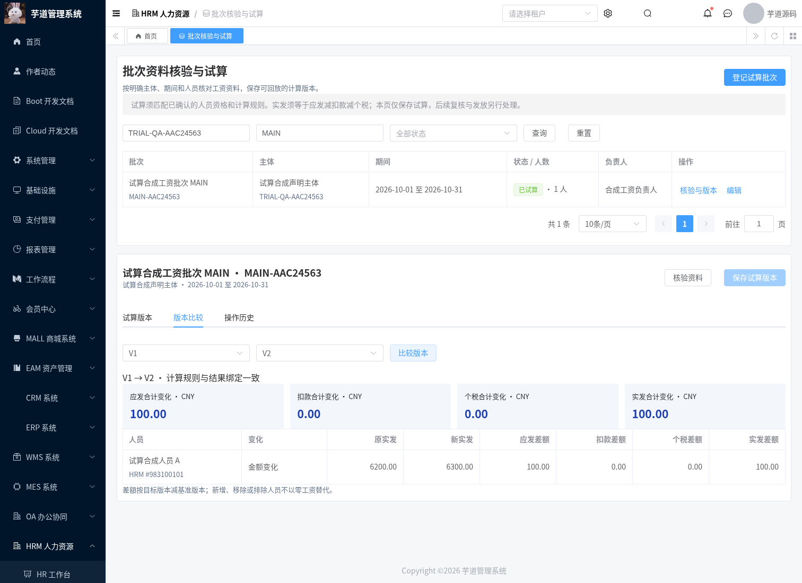
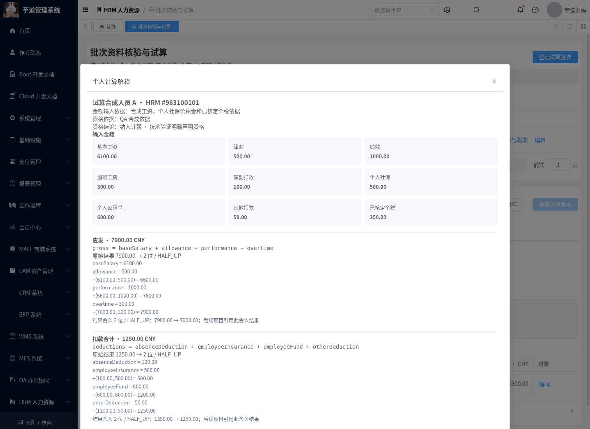

# 批次资料核验与版本化试算

2026-10-07，基于现有 Yudao HRM、规则表达式与人员资格模块实施。对应 T-13/T-16/T-20/T-38/T-41 的首期试算能力；复核冻结、来源契约自动映射、方案项目绑定、累计税、付款和工资条发布仍需后续模块。

## 已实现行为

- 批次登记明确主体、期间、人员清单、所选计算规则、负责人及口径依据。自然月从月初至月末，自定义期间最多包含 366 天；每批最多 100 人。编号、主体编号和期间构成固定业务身份，输入与名称可修改。
- 所有人员使用租户内 HRM ID，工号不作为唯一身份；服务端抓取姓名、工号、部门、用户与人员指纹。可显式刷新档案并重新核对资格。输入金额使用十进制字符串；空值不代替零。
- 核验已确认规则、已确认资格、完整期间、档案指纹、输入来源、变量精度、四个金额角色与个人金额平衡。角色绑定四个不同的 CNY/2 位结果；实发精确等于应发减扣款减个税，合计由个人结果相加。首期常规工资不接受负数，调整业务另行接入。
- 明确排除的人员保留资格依据、不生成零工资、不计入合计。缺资格、规则或来源是阻断；全部人员被排除时不生成空试算版本。
- 提供可编辑常规工资规则模板：基本工资、津贴、绩效、加班工资、缺勤扣款、个人社保、个人公积金、其他扣款、已核定个税。CNY/2 位/HALF_UP，附两组合成对账样例；载入不自动保存或确认真实制度。个税金额由有依据的输入提供，本模块不把缺累计资料计算成零税额。
- 核验返回来源指纹。执行在事务内锁定批次、规则系列、资格系列和按 ID 排序的人员，重新检查资料与修订；改变的来源不能通过旧核验结果执行。相同请求编号返回原结果，重复并发请求只生成一个版本；改变内容后复用编号报冲突。
- 每个试算版本保存批次口径、个人输入/依据、人员及资格快照、规则定义/指纹、逐项解释、舍入过程和金额合计。修改草稿清空当前有效试算指针，保留最新历史指针与全部旧版本；历史按 ID 回放。
- 同一批次版本可对比合计与个人金额、输入、人员新增/移除、资格及来源变化；金额差额为目标减基准，新增/移除或排除人员不按零工资替代。

## 权限与日志

读取须同时具备 `hrm:payroll:trial:query`、`hrm:payroll:calculation:query`、`hrm:payroll:eligibility:query` 与 `hrm:employee:query`。维护另需 `hrm:payroll:trial:maintain`，执行另需 `hrm:payroll:trial:execute`；接口与服务均检查。菜单迁移不向现有角色自动授予权限。

部门/本人范围同时检查历史抓取组织与当前人员组织。批次保留所有历史涉及人员的足迹：即使从当前草稿移除某人，读取批次、合计、旧版本、比较和操作历史仍须有权查看此人的抓取及当前归属。无部门/用户、人员删除或移动不会通过 SQL 空值漏出批次。全部范围可在主档删除后回放既有历史。操作历史的快照可含个人金额，使用同一批次完整范围保护；分页与版本列表省略原始配置/结果。

所有新接口关闭 API 请求和响应正文记录，避免把薪酬输入、结果或来源依据写入通用日志。业务变更在 `hrm_payroll_review` 保存 `trial-batch` 审计记录。

## 部署与验证

新增 [MySQL 迁移](../sql/mysql/upgrade/20261007-hrm-payroll-trial-batches.sql)：批次、永久人员足迹、不可变试算三个表，三项菜单权限。按现有人员资格和规则迁移后执行；迁移可重复，不修改旧工资月账、社保月账或工资条，不插入生产演示资料。

前端是 Vue 3 + TypeScript + Element Plus，覆盖源码在 `yudao-ui/yudao-ui-admin-vue3/src/views/hrm/payroll/trial/`；完整工程由既有固定 Vue3 基线与 overlay 组合，使用已有 CI。

回归命令：

```bash
mvn -B -ntp -Phrm -pl yudao-server -am verify -DskipTests=false -Dmaven.test.skip=false
bash script/hrm/verify-trial-mysql.sh
# 真实 API/UI 脚本只接受明确允许的隔离 QA 资料，认证从环境变量读取。
python3 script/hrm/verify-trial-api.py --allow-test-fixtures --output-dir /tmp/hrm-trial-api
python3 script/hrm/verify-trial-ui.py --allow-test-fixtures --fixture-file /tmp/hrm-trial-api/hrm-trial-browser-fixture.json --output-dir /tmp/hrm-trial-ui
```

真实环境的认证、人员、主体、规则和金额由业务管理员配置。QA 使用独立合成资料及十种权限身份，凭据不提交。已完成验证：

| 验证范围 | 结果 |
| --- | --- |
| HRM 专项新增回归 | 32 项执行，零失败/错误/跳过 |
| 完整后端构建 | 1,682 项报告，零失败/错误，保留其他模块既有 24 项跳过；HRM 814 项全执行 |
| 完整 Vue3 + MES | 固定基线、冻结依赖的生产构建及全量类型检查通过 |
| MySQL 8.0.46 | 隔离容器验证重复迁移、三项权限、租户/版本/请求唯一性、金额文本与 Unicode 保留 |
| 真实试算 API | 52 项通过，包含十种权限、历史足迹、精确金额、并发重试、来源变化与七张旧账表校验值 |
| 既有规则 API | 56 项回归通过 |
| 真实浏览器 | 18 项通过，包含录入/试算、历史、解释、差异、延迟响应、响应丢失重试、只读和移动端 |

证据位于 [验证目录](./verification/hrm-payroll-trial/)，11 张浏览器原始截图位于 [截图目录](./assets/hrm-payroll-trial/)。所有金额均是明确标注的合成 QA 资料，未执行真实付款或发布员工工资条。





2026-10-08 补充：T-39 的输入/规则/结果快照、版本重算和比较也由本模块部分覆盖；后续复核与冻结已在[独立模块](./hrm-payroll-review-freeze-module.md)接入，详见该模块的版本边界和回归证据。
